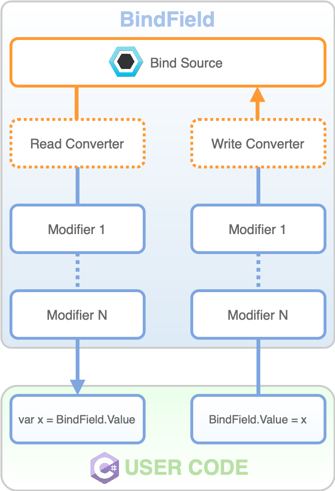

BindingSystem 中最重要的类之一是 Bind\<T> 类。该类通过绑定机制封装了 T 类型，提供了序列化绑定信息所需的必要功能。此外，它还包含用于存储绑定信息的 BindData 结构。  

Bind\<T> 类支持不同深度的绑定路径。例如，可以将 float 类型的字段绑定到 Transform 对象的 "position.x" 路径，这样在运行时，该字段将自动获取 Transform 的 position 属性的 x 分量值。  

使用这个类会带来稍高的性能，但代价是灵活性降低，因为这需要编写代码，因此无法应用于第三方脚本。

当从绑定的 source 读取数据，或者向 source 写入数据时，Bind\<T> 有一个内部 data pipeline。



有一些 Bind\<T> class 的变体可用：

- ReadOnlyBind\<T>：允许对 bound value 的 read-only 访问。
- WriteOnlyBind\<T>：允许对 bound value 的 write-only 访问。
- BindDataFor\<T>：没有直接的 value field，只能 bind 到其他 sources。

这些 classes 在需要时可以隐式地转换为 inner T 类型。

要定义一个新的 Bind\<T>，简单地添加一个 field 或 property，如下所示：

```C#
class MyMonoBehaviour : MonoBehaviour
{
    public Bind<float> myBoundFloat;
    public Bind<float> myBoundAndInitializedFloat = 3.14f.Bind();
}
```

上面的代码会让 user 直接在 Unity 的 Inspector 中绑定属性，不需要点击字段将其转换为 Bind 属性，它们本身直接就是 Bind 属性。


Bind\<T> 免去了手动在 Inspector 将 field 转换为 Bind 属性的需要，但也强制限制了这个属性只能是 Bind 属性。

从用法上，类似 SOA 的 FloatVariable。

从功能上而言，类似 Unity 的 UnityEvent，用于程序之间的解耦，并在 Inspector 中注入依赖。

Bind\<T> 类型的能力在于它的 drawer，它允许使用一个直观的 UI 快速简洁地完成绑定过程。

# Binding with code

可以在 Inspector 中完成绑定，也可以在 code 中手动完成绑定。为此，只需要简单调用 Bind\<T> 构造函数，并传递它要绑定的 object 和 path：

```C#
void Start()
{
    Object target = GameObject.Find("Sphere").transform;
    myBoundFloat = new Bind<float>(target, "position.x");
}
```

当访问 Bind\<T> 的值时，简单使用 .Value 属性，或者在读取时，之间用 Bind\<T> 变量本身，转换运算符会自动使用其值。

```C#
void Update()
{
    float value = myBoundFloat; // Here the implicit conversion is applied
    value *= 2;
    myBoundAndInitializedFloat.Value = value;
}
```

Bind\<T> 类和它的变体（除了 WriteOnlyBind\<T>）可以通知 users 值发生了变化，通过 ValueChanged event：

```C#
void Start()
{
    myBoundFloat.ValueChanged += (oldValue, newValue) => Debug.Log("New Value is: " + newValue);
}
```

注意：由于安全限制，当底层 value 被改变时，ValueChanged 不会立即调用。所有这些事件会在同一帧的多个 point 被处理。

对于更专业的用户，可以使用内部的 BindData 结构来创建自定义的 Bind 类。BindData 存储了访问绑定值所需的所有信息，以及转换器和修饰器的参数。
