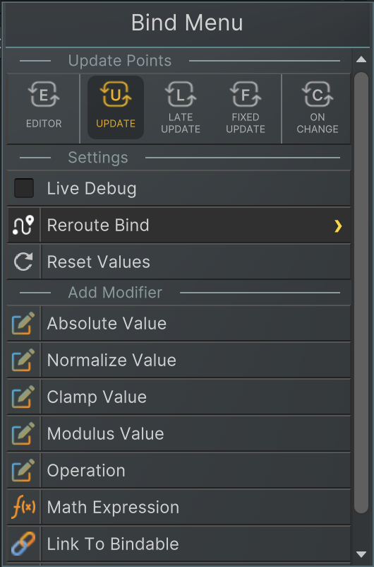
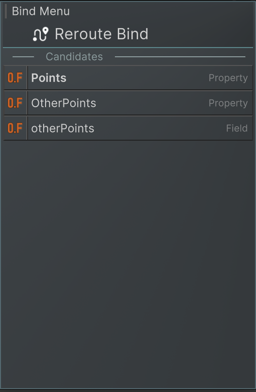
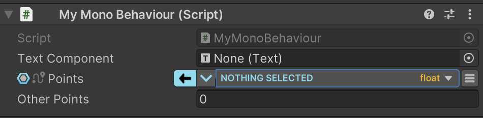
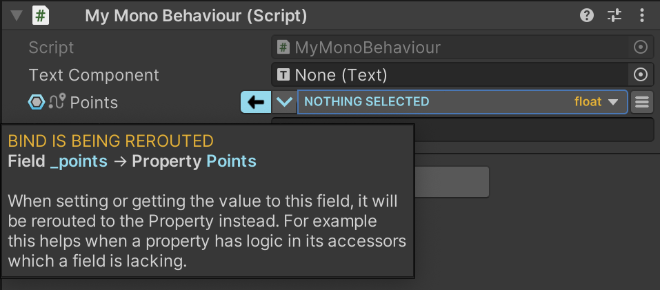
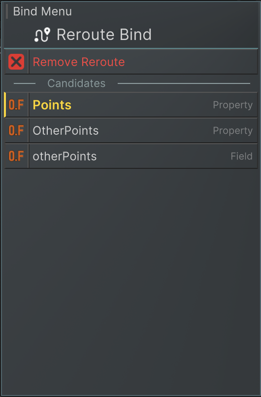

有时对象的序列化字段仅用于保存初始状态或存储内部状态，修改这些字段不会对逻辑产生任何影响。在大多数此类情况下，这些字段通常配有对应的属性，且逻辑变更往往是在属性的 setter 中触发的。这种情况下，绑定属性而非字段会更加合理。

例如有以下的 object：
```C#
public class MyMonoBehaviour : MonoBehaviour
{
    [SerializeField]
    private Text _textComponent;
    
    [SerializeField]
    private float _points;
    
    public float Points {
        get => _points;
        set
        {
            _points = Mathf.Clamp(value, 0, 100);
            _textComponent.text = _points.ToString();
        }
    }
    
    public Text TextComponent {
        get => _textComponent;
        set
        {
            _textComponent = value;
            if(_textComponent != null) 
            {
                _textComponent.text = _points.ToString();
            }
        }
    }
}
```

如果此时绑定的是 _points 字段，那么在修改它的值时，显示积分的文本不会更新——因为文本赋值逻辑是在其属性的 setter 中执行的。这种情况下，应该将绑定从字段 _points 改为属性 Points，这样才能在修改值时正确触发更新逻辑。

# Reroute fields through UI

当打开一个 bound field 的 Bind 菜单，如果有 reroute 它的选项，就会出现 Reroute Bind 选项。



选择该选项后，系统会显示可重定向的目标候选列表。其中最佳候选项（最优匹配）将以加粗形式优先显示。每个候选项右侧都会标注其成员类型。在此特定示例中，为了提供更多候选选项，额外添加了一对字段和属性。



一旦完成重定向设置，字段标签附近将显示一个路由符号，用于标识该字段已被重定向。当鼠标悬停在该图标上时，工具提示会显示更多相关信息。





在对字段进行重定向时，重定向是按类型注册的，而不是按对象注册的。这意味着对于拥有该特定字段的所有对象，只需注册一次重定向即可。在上述示例中，MyMonoBehaviour 类型的所有对象，其 _points 字段都会被重定向。

要移除字段的重定向，只需打开绑定菜单，再次导航至"重定向绑定"选项，即可看到移除重定向的选项。



# Reroute fields with coding

要在 code 中 reroute 一个 field，添加下面的代码行：

```C#
BindSystem.RerouteBoundFieldOf<MyMonoBehaviour>("_points", "Points");
```

这行代码会在系统中注册一条新的重定向记录，并确保在启用该字段的绑定时，将其绑定替换为对应属性的绑定。

确保在开启此 object 的任何 bind field 之前，先执行上面的代码，以保证其正常工作。
