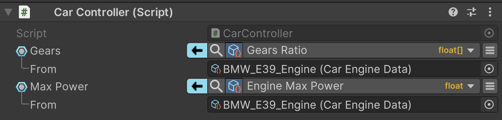

默认情况下，系统会根据每个绑定字段指定的更新时机（可在绑定菜单中配置）来更新这些字段。但有时需要手动控制何时更新绑定以及更新哪些绑定。

在早期版本中，这可以通过以下两种方式实现：要么手动添加 Bind\<T> 字段并在代码中操作它们，要么挂钩到 UnityEvent 并让其触发绑定更新。

从 2.4.0 版本开始，新增了第三种实现方式——这是一种基于代码的方法，能更轻松地控制绑定更新。

# 用法

若要控制某个对象的绑定，该对象需要实现 IBindController 接口。该接口本身不需要实现任何方法，仅作为类的标记使用。一旦对象实现了此接口，便可使用一系列扩展方法：

- UpdateAllBinds()：更新所有相关绑定——包括该对象作为绑定源的绑定，以及它作为绑定目标的绑定。
- UpdateBind(string memberPath)：只更新涉及某个特定成员 path（field 或 property）的 bindings，无论 object 是 source，target，还是二者都有。
- PauseAllBinds()：暂停和此 object 相关的所有 bindings，无论它是 bindings 的 source 或 target。
- ResumeAllBinds()：恢复之前暂停的 bindings。
- PauseBind(string memberPath)：只暂停和 object 和特定 member（field 或 property）path 相关的 bindings。
- ResumeBind(string memberPath)：恢复与 object 和特定 member（field 或 property）path 相关的之前被暂停的 bindings。

需要牢记的关键点是（目前）系统不会区分对象在绑定中是作为源还是目标。这样就无需进行微观管理，也让更新操作更容易实现。

若要在同一对象内部调用这些方法，需在方法调用前加上 this 运算符。例如：this.UpdateAllBinds()。

```C#
public class CarEngineData : ScriptableObject, IBindController
{
    public float load;
    public float engineMaxPower;
    public float[] gearsRatio;

    public void RecomputeData()
    {
        // Heavy computation logic to recalculate car data

        this.UpdateAllBinds();  // <-- NOTE: 'this' operator is mandatory!
    }
    
    //... Other methods and properties related to car data
}
```

```C#
public class CarController : MonoBehaviour
{
    public float[] gears;
    public float maxPower;
    // ... Other properties related to car controller
}
```

现在 CarController 可以绑定它的字段到 CarEngineData 中的字段：



在这种情况下，字段（CarController 的档位和最大功率）只会在调用 CarEngineData 上的 RecomputeData() 方法时更新其值。
