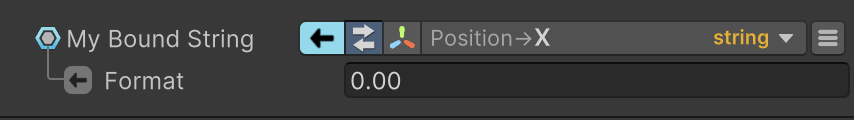

转换器用于将一种类型转换为另一种类型，有时还会附带额外参数。例如，可以使用给定格式将值转换为字符串。

BindingSystem 在代码中提供了实现转换器的示例，便于理解并扩展此功能。

转换器主要有两种类型：安全转换器（Safe）和不安全转换器（Unsafe）。后者在转换过程中可能失败，并导致整个数据读取管道失效。



要添加一个新的 converter，只需要实现 IConverter\<TFrom, TTo> 接口就可以了。

```C#
public class MyConverter : IConverter<bool, string>
{
    public string Id => "My Converter";
    public string Description => "Transforms a bool into Valid or Invalid string";
    public bool IsSafe => true; // The conversion will always succeed
    public string Convert(bool value)
    {
        return value ? "Valid" : "Invalid";
    }
    public object Convert(object value) => Convert(value is bool bValue ? bValue : false);
}
```

如果 converter 需要有关于 bind source 和 path 的信息，还需要实现 IContextConverter 接口。

系统会自动识别新的 converter，并将它添加到 converters list 中。要避免自动注册新的 converter，在 class 上添加 [HideMember] 属性。

Converter 必须有一个无参构造器。

当有多个 converters 时，系统可以让你选择使用哪个 converter。
