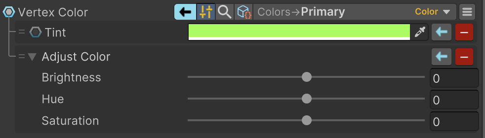
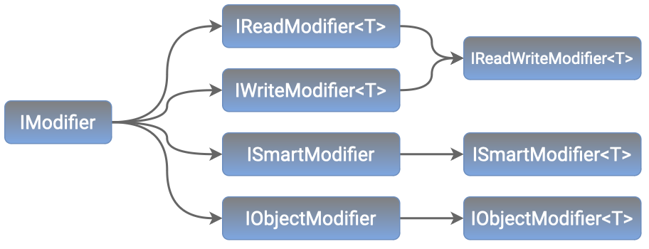

修饰器允许你在值被请求者设置或获取之前对其进行修改。修饰器为操控绑定值提供了灵活性。与转换器类似，修饰器也相对容易实现和扩展。

Modifiers 不能改变输出值的类型，最多是输入值的继承类型（兼容）。



要添加一个 modifier，实现 IReadWriteModifier\<T> 接口就可以：

```C#
public class MyModifier : IReadWriteModifier<bool>
{
    public string Id => "Invert";
    public string ShortDataDescription => "[Invert X]";
    public BindMode ModifyMode => BindMode.ReadWrite;
    public object Modify(BindMode modifyMode, object value) => !((bool)value); // This is the fallback method
    public bool ModifyRead(in bool value) => !value; // Used when reading a value from source
    public bool ModifyWrite(in bool value) => !value; // Used when writing a value to source
}
```

IReadWriteModifier\<T> 接口同时实现了 IReadModifier\<T> 和 IWriteModifer\<T>。如果你需要单向的 modifier，只需要使用其中一个。



ISmartModifier 可以获取当前所附加的绑定字段，而其泛型版本还能够强制将某个值推送到数据管道中——即使当时并没有对该值的请求。

IObjectModifier 是专门为处理非值类型而设计的。对于那些打算修改实例值及其继承类型的修饰器，建议实现此接口（或其泛型版本）。

系统会自动识别新添加的修饰器，并使其在绑定菜单中可用。若要避免新修饰器自动注册，可在该类上方添加 [HideMember] 特性标记。

Modifier 必须有一个无参构造器。

对于新的数值修饰器，我们建议通过继承 NumericModifier 来简化开发。该基类仅需实现一个简单的 Modify(double) 方法，若需要还可选择性实现 Modify(long) 方法，即可覆盖所有数值类型的修饰场景。

大多数修饰器的代码都是公开的，这样就可以随心所欲地修改它们。
