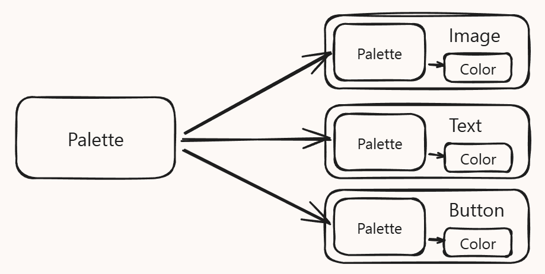

BindingSystem2 是一个强健的 Unity 插件，为应用程序提供了通用的数据绑定 value binding。

高级特性：

- 快速数据绑定

  立即连接 serialized values 到任何 Unity property，即使是非 serialized 的属性，直接在 Unity Editor 完成，无需任何代码操作。

- 两种绑定方式：直接在检视面板（Inspector）中为任何对象绑定兼容的字段（甚至可以绑定到Unity自身的组件），或者将脚本中的字段转换为可绑定版本以获得最佳性能。

  对于现实开发而言，开发效率才是至关重要，是首位的，那些不起眼的性能提升（却需要很多 code 工作）实际会拖累开发。

  迅速迭代，构建原型，验证想法玩法才是最重要的。只要确定了玩法，性能改善在之后很好完成。

  因此只要是能提升迭代速度，能快速验证想法的插件，都是好插件，都是必需品。如果性能真成问题，即使后面基于已经验证的想法玩法，重新自己实现一个高性能的版本，都不是问题。

  在开发阶段，快速迭代快速验证是核心，不要关注性能。性能是最后一步。任何项目都是一遍一遍的迭代过程。性能提升是最后一遍的迭代。

- 非破坏性绑定 Non-Destructive Bind：绑定任何兼容 field，而不修改它的内部数据，并且不会修改它的代码结构

- 选择加入设计：一旦更改为可绑定值，可以自行决定是否绑定该值，还是仅使用其原始值，而无需更改代码。

- 直观的设置：用户界面是友好且非侵入的。因为它有一个可搜索的下拉菜单，用于高效地进行绑定配置。

- 实时调试：使用 Live Debug 和 error visualizations 定位和解决问题，深入理解运行时的数据流。

- Custom Extensibility：系统可以很容易地扩展新的 converter，modifiers，和 value providers，以向系统添加更多的新能力

- Optimized Performance：整个系统架构的构建旨在提供高性能操作、优化的反射以及方法生成，并且几乎不产生内存分配。

# 为什么使用 BindingSystem

Binding System 的主要哲学，很大程度上借鉴了依赖注入的范式，但存在一些关键差异。

下面是一些显著适用于 Binding System 的用例场景。

## 代码模块化

例如，你可以定义一个 physics door，它既作为门发挥作用，也会对物理事件做出响应。这扇门有一些参数，这些参数既用于设置，也用于控制门的运作。按照典型的编程方式，要控制这扇门，你需要把它添加到另一个控制器组件中，并以某种方式将其传递给这个控制器。这创建了一个直接依赖：

现在，只要门的逻辑需要稍作修改，就有可能需要同时修改两个文件，这就带来了风险。

使用 BindingSystem 后，门的所有参数都可以设为可绑定的，而这些参数的值可以来自许多不同的来源。这样就无需再使用控制器组件，让门成为一个自包含的模块，不依赖其他代码。此外，这还带来一个额外的好处：由于在运行时你可以手动或自动调整参数来改变门的行为，测试时可以将门独立出来进行测试，测试完成后，再将正确的绑定应用到正确的位置即可。

在上面的例子中，Lever（操纵杆）、Slider（滑块）和UI按钮同样可以是自包含的，并提供一些输出参数，这样它们就能保持独立，且无需关心自己会被用在什么地方——无论是用来开门，还是降低生命值条。

典型的是 Character Controller 或 NavmeshAgent，它们都是通过暴露的数据属性与外界交互，要控制它们的运行，就修改暴露的数据属性。

## 数据流转发

有时需要将组件A的某些数据传递给组件B。为此，你要么修改组件A，将组件B添加为其输出；要么修改组件B，将组件A添加为其输入；或者创建第三个组件，作为它们之间的桥梁。这在一开始看起来很简单，但如果你需要将数据从A发送到C、D、E、F等更多组件时，会发生什么呢？（这里其实 Binding System 就作为了桥梁 Controller，只是它是通用的，不需要为每个具体的组件 A B C 等重新编写）。

使用 Binding System 可以避免这种情况，而无需修改任何组件。关键在于，A 必须将其输出参数设为可绑定的。接下来只需将这个参数绑定到 B 的输入值（无论是字段、属性还是方法）。这样，每当 A 的输出参数值发生变化时，B 就会立即收到更新。

## 混合数据收集

使用 BindingSystem，你可以有一个 objects 列表，它们具有相同的类型，但是数据来自不同的来源。

这样对外因此数据的来源，提供统一接口。

## 多重控制的 Values

有时需要通过多个控件来修改同一个值。例如，通过UI滑块、输入框和物理摇杆共同调节玩家的最大速度。要实现这一功能，就需要创建一个专门的系统来处理所有这些来源的输入和调整，并将最终正确的数值应用到最大速度变量上。

而 BindingSystem，它本身就是这样的通用桥梁系统。使用 BindingSystem 时，只需添加一个多绑定修饰器，将这些输入源全部绑定到最大值输入参数上，其余工作将由系统自动处理。

## Scriptable Object Architecture

BindingSystem2 可以很容易地适配 Scriptable Object Architecture Paradigm（SOAP），甚至增强了它的某些方面。

以动态调色板为例，典型的实现方式是创建一些组件，这些组件从调色板获取颜色并将其应用到某些图形元素上。调色板通常以 Scriptable Object 的形式存储。现在需要将这个对象作为参数提供给上述组件。这里我们立刻遇到了一个问题：每个组件都对调色板存在硬引用，这后续可能导致维护噩梦。有人可能会通过访问全局调色板来"缓解"这个问题，但即便这种做法也存在隐患，因为它本质上是个披着羊皮的"单例"。

另一个问题是，如果我的组件在特定区域根本不需要调色板怎么办？情况会变得更加复杂且难以维护。这时候 Binding System 就能发挥关键作用。使用 Binding System 后，每个组件都不再需要直接处理调色板，它们只需要确保颜色值始终可用即可，完全不需要关心这个值是从哪里来的。

除此之外，Binding System 第二版支持在编辑时修改数值，这意味着调色板示例可以在设计阶段直接使用，而且调色板的任何改动都会自动应用到所有启用了编辑器实时更新选项的绑定字段上。

因为这个系统非常通用，还有更多诸如此类的应用，尤其是在要给动态环境中。

要学习 BindingSystem2 的哲学。将游戏对象、功能设计为自包含的模块（不依赖任何外部组件，如果需要，反向注入依赖），暴露提供的属性和需要的接口。然后设计通用的组织系统（例如消息总线），组装这些模块，构成最终的游戏。
