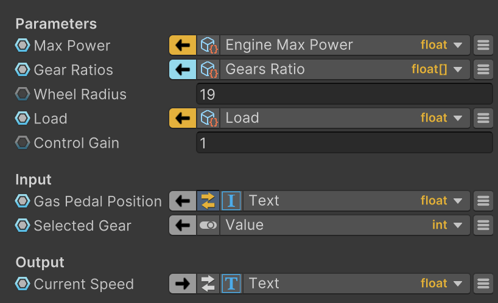
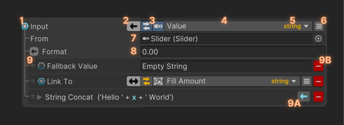
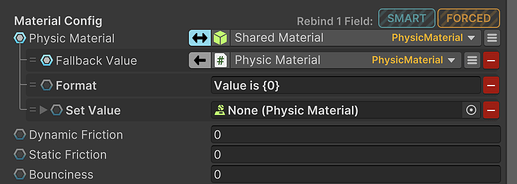
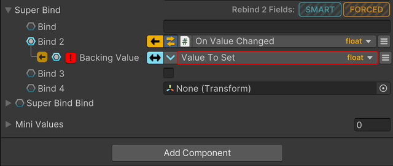

Binding System UI（精简UI）是一套基于 UI Toolkit 构建的现代化绑定字段绘制器 drawer。它简洁紧凑且可自定义，其设计理念是尽可能在 Unity 检视面板的一行空间内展示最多的绑定字段控制选项和信息。此外，它还具备一些附加功能，例如组重新绑定等。

下面是 Bound Field 绘制器的详细结构视图:

1. Bind Toggle：field/property 是否被绑定，还是使用 direct value
2. Bind Mode：只是 bind 的方向。可以是 read-only（数据流向自己），write-only（数据流向对方），或者 read-write（数据双向绑定）。当按住 CTRL 并点击，toggle Live Debug
3. Field Toggles：这些 toggles 因此或显示 secondary 字段
4. Bind Path：绑定的 path。使用和 raw path 不同的格式。按住 CTRL 并点击，会打开一个 popup 窗口。当在 Inspector 中没有足够的空间时非常有用
5. Type：要绑定的 field/property 的类型
6. Bind Menu：展开一个专门用于 field/property 的菜单。在这里可以添加新的 modifier 和其他选项，还有可以开启诸如 Live Debug 这些选项
7. Source：获取 values 的数据源
8. Converter：当使用一个 converter 时，这行就会出现。如果 icon 是灰色的，意味着 conversion 是安全的，否则是橙色的，转换可能失败，因为类型不完全兼容
9. Modifiers：modifiers 列表。注意：modifier 的顺序非常重要。每个 modifier 可以通过拖拽改变其 order。
   - 9A. Modifier Mode：modifier 何时被使用，在 read 时，在 write 时，或者 read/write 都使用
   - 9B. Delete：从列表中移除这个 modifier

下面是它的一些功能：

- 拖放 objects 来改变 source 和 path：

  不需要展开 Source Field 来改变 source，只需要拖放新的 source object 到 path field，然后 path popup 会自动显示，或者如果新的 object 和当前 path 兼容，会只替换当前的 source object

- 折叠或展开附加字段

  Converters，Modifiers，Source Field 在不操作上可以折叠，来节省 Inspector 空间。"is expanded" 信息被序列化，并且会随着 bind field 持久化。

- 快捷操作，按住 CTRL 并点击：

  - 对 BindMode，这会触发开关 LiveDebug
  - 对 Source Field，这会 ping object
  - 对 Bind Path，这会在 popup 窗口中 打开 bind field drawer

- Compact Modifiers

  一些 modifiers 仅有一个字段，仅对一个字段创建 foldout，对空间是种浪费。这个字段可以被直接渲染而不是显示 foldout。添加 [OneLineModiifer] 属性到 modifier class 定义，它将如下渲染：

  

- Advanced Tooltips

  Tooltips 已大幅改进，可以包含动态数据，例如当 LiveDebug 处于激活状态时，字段中存在的错误信息。通过使用不同颜色，进一步增强了工具提示的某些方面的表现力。

  

- Bind Groups of fields

  Group 可以通过标题（Headers）或可折叠区域（Foldouts）来形成，例如复杂类型或数组。

  目前有两种方式可以对绑定字段 group 进行重新绑定。

  - SMART：只会替换那些路径与拖入对象兼容的绑定字段。
  - FORCED：替换全部绑定字段，无视 path 的兼容性
