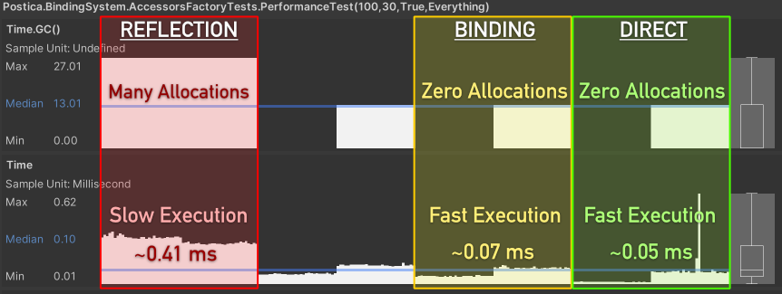

绑定系统在保持灵活性的同时提供了卓越的性能。以下是在未进行额外优化的情况下的一些性能基准测试数据。

上图中，"Reflection"指的是通过代码反射来获取和设置值。相比Mono中的相同逻辑，IL2CPP能提升反射操作的性能。"Binding"部分指的是绑定系统访问值的方式，而"Direct"则是指在代码中直接访问数据。

平均而言，在使用IL2CPP后端时，绑定系统的速度仅比直接访问值慢约1.5倍；而在Mono环境下，这一差距仅为约1.4倍。

任何领域的技术选型都不是唯某方面论，都是权衡利弊的结果（在成本、速度、性能等等方面综合取舍）。同样在游戏开发中也是，不能唯性能论，还要考虑迭代速度、可维护程度等等。例如对体量很小、对性能要求不是很高的游戏，努力提升的性能可能没有意义，即使用较慢的方式实现，对游戏而言也足够快了，微小的性能提升（花费很大努力）的边际收益变得很低。此种情况，快速开发快速迭代才是最需要专注的。

测试是在一台高端笔记本电脑上进行的。所有测试都可以在Unity Test Runner中运行。在上述测试中，每次测量大约执行了~2.2K次数据操作（100次迭代 × 22次数据操作）。部分数据操作并不简单，有些涉及结构体赋值，另一些则执行中间检索操作。这样做是为了尽可能模拟真实使用场景。

该绑定系统的核心实现了一系列智能优化方案，在保证稳态零内存分配的前提下，尽可能提升运行性能。所有其他功能都构建于这一核心基础之上。当使用多重修饰器和复杂转换器时，可能会因缓存未命中和函数调用开销导致轻微性能下降，但在大多数情况下，这种由修饰器和转换器引起的性能损耗可以忽略不计。
