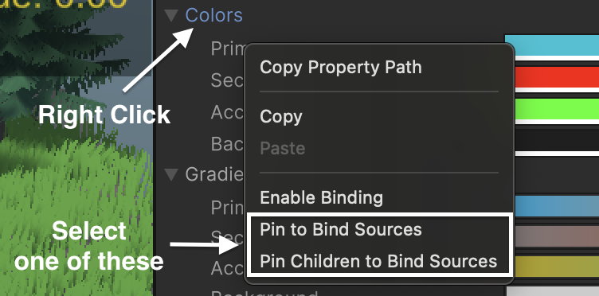
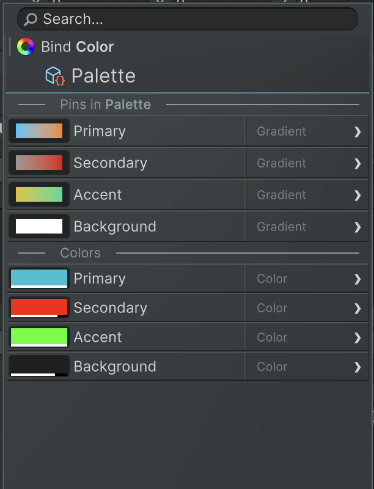
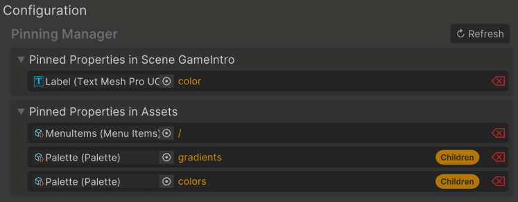

要加速 binding setup 过程，system 提供了一个 pinning 机制，它存储直接可用的 fields 和 objects。

有 3 个类型的 pinning：

- Pin 整个 objects：这些对象在绑定时会显示其所有组件和字段以供选择。
- Pin 当个 fields：这些对象会出现在绑定菜单中，并显示其后续的深层路径。
- Pin field children

  绑定的属性本身也可以是 object，可以继续绑定到它的属性上，这个过程可以递归，形成一个完整的绑定路径 obj.attr1.attr2.attr3

  此时不会显示 pinned 的字段，而是会显示其子级字段。当存在某个字段的子级经常发生变化时（定义修改），这种处理方式就很有用。比如一个结构体，其中的字段可能在开发过程中发生变动。

要 pin 一个字段，右键点击它，然后选择一个 Pin 命令：

Pinning 在 Bind Menu 中提供两级数值预览功能。这意味着任意路径及其下一级子路径的数值会直接显示在绑定菜单里。

要 pin 一个 object，右键点击 object，并选择 "Binding -> Pin to Bind Sources"。

所有 Pinned values 可以在 Binding Settings 看见。在那里，pinned values 还可以被移除。

