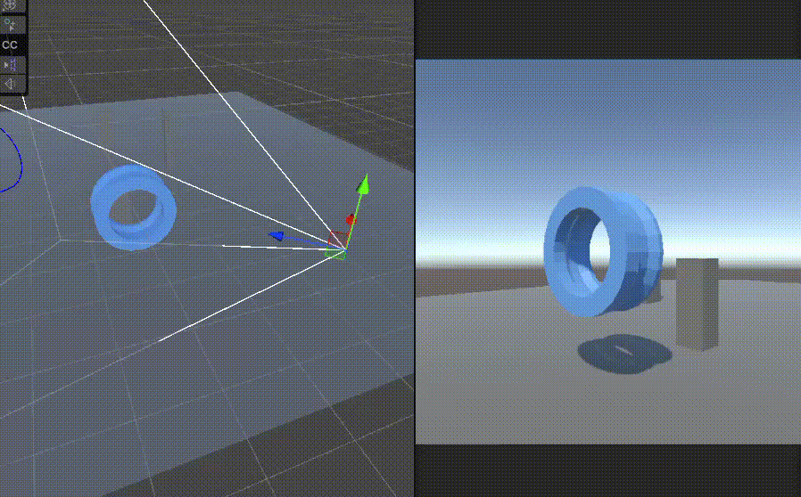

使用 blending properties 来指定 Cinemachine Brain 组件如何在 CinemachineCamera 之间执行混合过渡。

Cinemachine 混合并不是淡入淡出、擦除或溶解效果。相反，Cinemachine Brain 会对 Unity 相机从一个 CinemachineCamera 到另一个 CinemachineCamera 的位置、旋转以及其他设置进行平滑动画过渡（即平滑插值 position，rotation，Lens 等相机属性）。

如需在特定的 CinemachineCamera 之间进行混合，使用 Cinemachine Brain 组件中的“自定义混合(Custom Blends)”列表。如需为没有自定义混合的 CinemachineCamera 之间指定混合方式，请使用 Cinemachine Brain 中的“默认混合(Default Blend)”属性。

“From”和“To”设置是基于名称而非引用的。这意味着Cinemachine通过将相机名称与这些设置进行匹配来查找相机。它们并未链接到具体的游戏对象(GameObject)。您可以使用内置的下拉菜单从当前场景中选择一个CinemachineCamera，或者直接在文本框中输入名称。如果输入的名称与当前场景中的任何CinemachineCamera都不匹配，该字段将以黄色高亮显示。

使用保留名 \*\*ANY CAMEEA\*\* 指定 blend from 或 to 的任何 Cinemachine Camera。

当 Cinemachine 开始从一个 CinemachineCamera 过渡到另一个时，它将在该资源中查找与即将发生的过渡相匹配的条目，并应用相应的混合定义。

- 如果没有找到匹配项，则将应用 CinemachineBrain 的 DefaultBlend 设置。
- 如果 Custom Blends 资源中有多个条目与即将发生的过渡相匹配，Cinemachine 会选择特异性最强的那一个。例如，当从 vcam1 混合到 vcam2 时，如果自定义混合资源中包含一个 vcam1-to-AnyCamera 的条目，以及另一个 vcam1-to-vcam2 的条目，那么将应用 vcam1-to-vcam2 这个条目。  
- 如果 Custom Blends 资源中有多个条目与即将发生的过渡具有相同强度的特异性，则将应用最先找到的那个条目。

# Blend 哪些参数

混合 CC 就是混合 Transform 和 Lens 参数，Transform 包括 Position 和 Rotation，Lens 参数根据相机类型不同有不同的参数，但是它们都是数值类型（float），就是简单地插值变换 float 而已。

物理相机镜头参数包括：

 

正交相机镜头参数包括：

 

透视相机镜头参数包括：

注意相机模式也是可以混合的，即从 Physics 到 Perspective，或从 Perspective 到 OrthoGraphic。但是：

- 要混合相机模式，必须在 Cinemachine Brain 中开启 Lends Mode Overrides 选项
- 混合时切换相机模式，会突变，而不是平滑变换

因此通常应该避免混合相机模式，只在相同模式相机之间切换，而且通常游戏不会混合使用不同模式的相机，只会使用一种类型的相机，例如 2D 游戏就固定使用 OrthoGraphic 相机，3D 游戏固定使用 Physical 相机或 Perspective 相机。

如下图所示，在 orthographic 相机和 perspective 相机之间切换时，会有画面突变：

 

即使两个相机在相同的位置也是如此：

 

在两个 perspective 相机或两个 orthographic 相机之前切换就可以平滑过渡：

 

# 怎样混合

如前所述，混合本质就是在数值类型的相机参数（Transform，Lens）之前插值而已，因此所谓混合就是在一定时间段内指定数值变换曲线，就像 DOTween 的 Ease 曲线一样（Linear，EaseIn，EaseOut，EaseInOut 等等），还可以自定义 Ease 曲线。而 GitHub 上的 Unity-EasingAnimationCurve 包提供了主流的 32 中 Ease 曲线，例如：

 

每种曲线无论中间怎样变换，起点必须是 (0, 0)，终点是 (1, 1)。(0, 0) 代表混合开始的 Camera 的状态，(1, 1) 代表了混合结束的 Camera 的状态。每个 Ease 还指定一个 duration 时间，定义多长时间完成过渡。

还有一种特殊的混合，就是 Cut，它不指定 duration 时间，它也没有过渡，而是直接切换。

## 怎样指定混合

Camera Brain 的 Default Blend 指定了任何两个 Cinemachine 的默认混合方式（Cut 还是 Ease，以及 Ease 的时间）。

Custom Blends 可以指定一个自定义 Blend Settings。Settings 为一个列表，其中每个 entry 指定一对 Cinemachine 的名字（注意是按名字指定，而不是按引用指定），然后指定这两个 Cinemachine 的混合方式。
