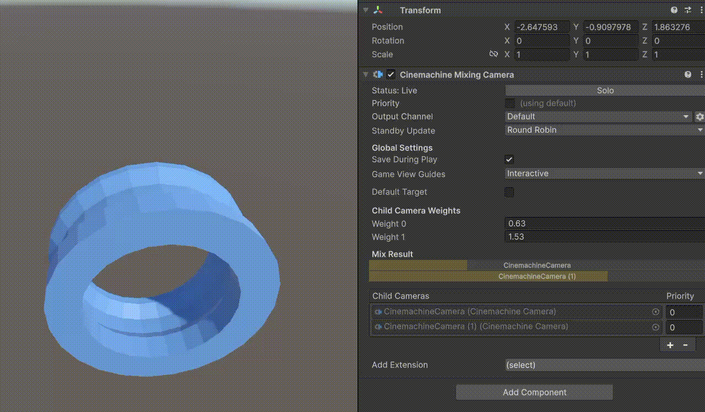

Mixing Camera 组件使用它的 Child CC 的加权平均值，计算 Unity Camera 的 **position** 和其他属性。因为这些属性都是简单的数值，就像 CC blend 时插值一样，加权平均也是简单的对数值进行，然后设置到 Unity Camera 上而已。

Mixing Camera 最多可以有 8 个 child CC。在 Mixing Camera 组件中，这些 Child CC 是固定的 Slot（槽位），而不是动态的数组列表。

Mixing Cameras 使用这个方法来支持 Timeline 的加权动画。Timeline 不能对 array elements 进行动画，因此 Cinemachine 提供了这种方式来支持简易的数组 CC。

注意每个 CC 的权重是可以改变和动画的，这也是 Mixing Camera 的主要使用方式，就是改变或动画 Child CC 的权重，它并不关心每个 Child CC 的具体设置，这是由开发者自己编辑的。

GameObject > Cinemachine > Mixing Camera 菜单会创建一个默认带两个 CC 的 Mixing Camera。

如图所示，通过改变权重值，最终 UnityCamera 的镜头就会在两个 CC 之前进行 Blend，与 CC 切换时的 Blend 效果一样，不同的是后者只能发生在 CC 切换时，而这个混合可以在运行时一直存在。

权重值不限制在 0-1 之间，类似 Flexbox 的 flex-grow，权重值是相对的。调整 CC 的权重值，每个 CC 的权重就会此消彼长，画面也就在不同的 CC 之间平滑过渡。

