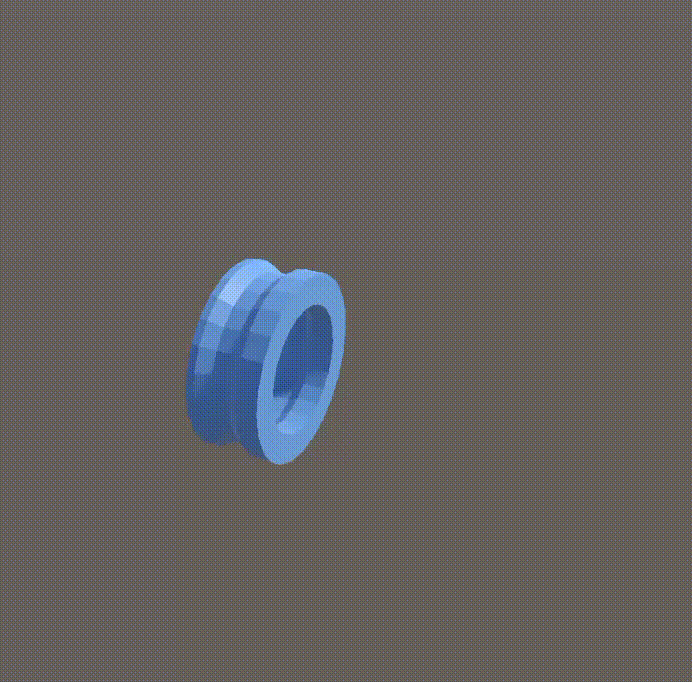

If enabled, a default target will be available.  It will be used
        /// if a child rig needs a target and doesn't specify one itself.<

BlendSettings 和 CinemachineBrain 的 BlendSettings 一样，可见就是将手动进行的 CC 切换定义到一个序列中，每次自动进行，仅此而已。

Instructions 指定了 CC 切换的序列，不限制为 8 个（Mixing Camera）。

下面显示了序列的切换效果，第一个 CC 持续 1s 后切换到第二个 CC。注意这里开启了 Loop 选项。

注意开启 Loop 时，最后一个 CC 到第一个 CC 没有 Blend 选项。

无论是其他相机切换到这个 SequencerCamera，还是 Loop 重新回到第一相机，都会执行第一个相机的 Blend。

注意默认第一个相机的 Blend in 是 cut，这意味着无论是其他相机切换到这个 SequencerCamera，还是 SequencerCamera 自身循环回到第一个子相机，都会突变到第一个子相机。上面的 loop 看起来平滑是因为已经将第一个子相机的 Blend in 改为了 Ease In，时长 0.5s。

SequencerCamera 可以作为简单的 Timeline 使用，如果 Timeline 只是简单的相机切换的话。

Default Target：如果开启并且 child CC 没有为其自己指定 Tracking Target 的话，使用这个 Target 作为 default。
