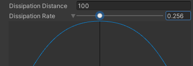
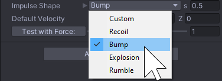
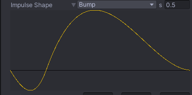
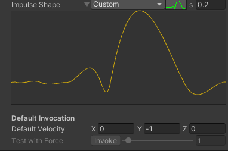
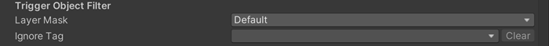
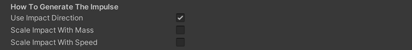

对于基于碰撞产生的脉冲，将 CinemachineCollisionImpulseSource 组件附加到带有 Collider 或 Collider2D 组件的游戏对象上。当其他物体与该游戏对象发生碰撞或进入其触发器区域时，CinemachineCollisionImpulseSource 便会生成一个脉冲。

选择想要触发 impulses 的 GameObject，在 Inspector 中添加 Cinemachine Collision Impulse Source。

默认情况下，脉冲源会影响范围内的所有脉冲接收器，但你可以通过通道筛选功能配置特定脉冲源只对部分脉冲接收器生效。

# 属性

## Impulse Channel

脉冲接收器通过通道机制对脉冲进行筛选，以控制自身对哪些脉冲源作出响应。通道的工作原理与 Camara Layers 类似，但二者相互独立。以下属性用于配置碰撞脉冲源发送脉冲信号时使用的通道。

- Impulse Channel

  在下拉菜单中选择一个或多个 channels。点击 Edit 来修改现有 channels 或添加新的 channels。

## Impulse Type

可以根据需求选择不同的复杂度级别。更改脉冲类型后，系统会相应提供 range、dissipation衰减），propagation speed 等控制参数。

- Impulse Type

  - Uniform：脉冲以无限速度传播，无论接收器在空间中的位置如何，所有接收器都会同步且以相同方式感知到该脉冲。
  - Dissipating：脉冲强度随距离增加而衰减。距离脉冲源较远的接收器将感知到比近处接收器更弱的信号。
  - Propagating：脉冲信号不仅会逐渐衰减，还会以有限速度从源点向外传播。距离较远的接收器感知到脉冲的时间会晚于距离较近的接收器。

- Dissipation Distance

  此设置用于定义脉冲的衰减距离。超出该距离范围后，脉冲将无法被感知。

- Propagation Speed

  此参数以米/秒为单位定义脉冲信号从源点向外传播的速度。默认值343对应声波在空气中的传播速度。

- Dissipation Rate

  此参数定义脉冲在衰减距离内的衰减速率。如下图所示，展开曲线图可查看信号强度随衰减半径变化的示意图：原点位于X轴中心，移动滑块将调整蓝色曲线形态。

  

## Impulse Shape

此参数用于定义确定信号形态的曲线，以及该曲线发射经过的时间。

- Predefined Impulse Shape

  可以从预定义 Shapes：Recoil，Bump，Explosion，或 Rumble 中选择一个。

  s(seconds) 字段设置 impulse 的 duration。

  

- Custom Impulse Shape

  你可绘制自定义脉冲形态（动画曲线）。从下拉菜单选择"Custom"选项后点击绿色图标，即可弹出如下所示的编辑器界面。

  

- Default Velocity

  指示 impulse 默认在空间中的方向。

- Test with Force

  （运行状态下）允许在检视面板中触发默认脉冲，并通过指定的力度乘数预览其视觉效果。

## Trigger Object Filter

以下属性用于筛选可通过碰撞或进入触发器区域触发脉冲的游戏对象。

位于 Layer Mask 指定 layer 中的游戏对象默认会触发脉冲，但若其带有忽略标签值则除外。

- Layer Mask

  位于这些 Layer 中、且带有刚体组件的对象，若与脉冲源发生碰撞或进入其触发器区域，便会触发该源广播脉冲信号。

- Ignore Tag

  带有这个 tag 的 GameObjects 不会产生一个 impulse，即使它们在 Layer Mask 指定的 layer 中。

## How to Generate The Impulse

脉冲由具有特定撞击质量、以特定撞击速度运动的物体在碰撞位置触发。

Unity 会动态计算触发脉冲的刚体（Rigidbody 或 Rigidbody 2D）组件的质量与速度。"脉冲生成方式"属性组用于控制刚体质量与速度如何影响脉冲信号的强度与方向。

- Use Impact Direction

  启用此设置时，脉冲信号将根据撞击速度方向进行旋转适配。例如：若原始信号为垂直振动但撞击方向为水平，启用此属性可使最终脉冲信号转为水平振动。

  禁用时，无论撞击方向如何，脉冲信号将始终保持原始方向。

- Scale Impact With Mass

  启用此设置时，系统将根据碰撞游戏对象的质量动态调节脉冲信号的振幅。相关质量值取自包含脉冲源组件的游戏对象及其碰撞对象的刚体组件参数。

  禁用时，系统将使用恒定质量值1进行计算。

- Scale Impact With Speed

  启用此设置时，脉冲信号的振幅将随撞击速度按比例缩放。运动速度越快的游戏对象具有越大的动量，因此产生的脉冲信号也越强。

  禁用时，系统将忽略碰撞对象的速度参数。