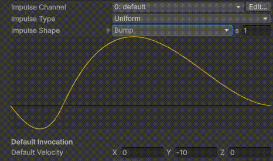
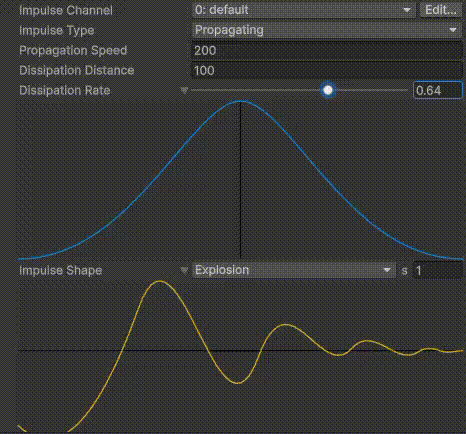
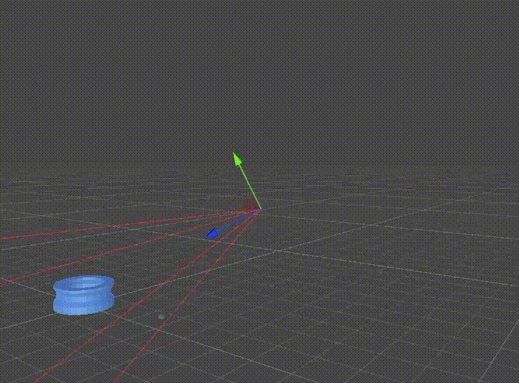
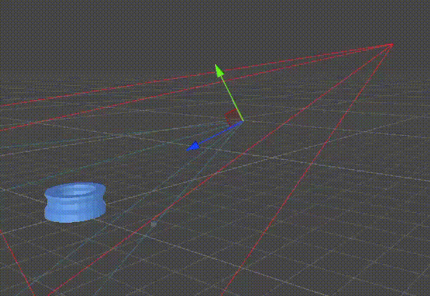
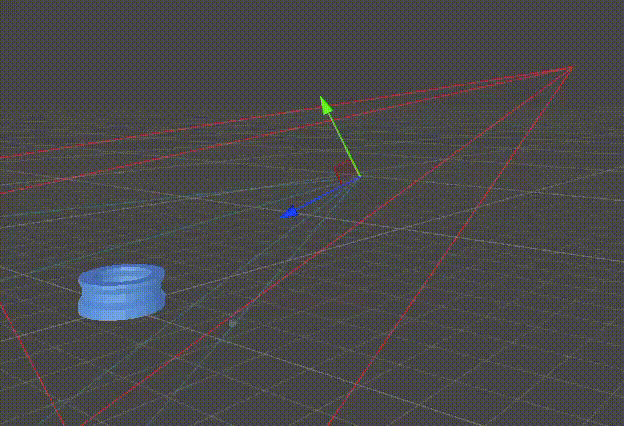

Cinemachine Impulse 用于生成和管理响应游戏事件的摄像机震动效果。

例如，当某个游戏对象与另一个发生碰撞，或场景中的某个物体发生爆炸时，你可以使用 Impulse 让 CinemachineCamera 产生震动效果。

Impulse 有两个部分：

- Impulse Source

  一个在空间中某点发出信号并向外传播的组件，类似于声波或冲击波。这种 emission 由游戏中的事件触发。

  该信号由一个方向和一个描述信号强度随时间变化的曲线组成。这两者共同有效地定义了沿指定轴向、持续指定时间的震动效果。这种震动从原点向外传播，当它到达某个 Impulse Listener 所在的位置时，该监听器可以对其作出响应。

- Impulse Listener

  一个 Cinemachine 扩展组件，允许 CinemachineCamera “感知” 到一个震动信号，并通过震动来对此作出反应。

  从单个“脉冲”的角度来理解会很有帮助。一个脉冲指的是 Impulse Source 单次发出信号的事件。场景中的碰撞和事件会触发脉冲，Impulse Source 生成脉冲，而 Impulse Listener 则对这些脉冲作出反应。

要在场景中设置和使用 Impulse：

- 向一个或多个你想要触发 camera shake 的 GameObjects 添加 Cinemachine Impulse Source 或 Cinemachine Collision Impulse Source 组件
- 向一个或多个 CinemachineCameras 添加一个 CinemachineImpulse Listener 扩展，这样它们就可以检测并响应 impulses 了

和 Audio 一样，Impulse 也通过两个参与者角色完成：Source 和 Listener。Source 负责发出信号，Listener 负责接收并播放信号。

# 工作原理

Dissipation：耗散损耗

Propagation：传播

Impulse 脉冲本质是 Source 向 Listener 传递一个 Vector3（信号），无论它的值是什么，Listener 收到这个信号后就按照这个信号基于初始位置进行位移（震动）。

信号的传播是以球状方式向外扩散的，信号本身是一个 Vector3 的数据，并且它在传播过程中会因为时间和距离发生变化。Source 以球状方式向空间发出一个 Vector3 数据的信号，Listener 收到信号后直接按照这个 Vector3 进行位移。

Impulse 中的 Velocity 既包含了震动的方向，有包含了震动的强度。例如 (0, 1, 0) 表示 Listener 向上移动 1 个单位，(1, 1, 0) 表示 Listener 在 XY 平面分别沿 X 移动 1 个单位，沿着 Y 移动 1 个单位。

信号总是一个 Vector3 的数据，但是 API 中 GenerateImpulseWithForce(float force) 和 GenerateImpulseWithForce() 并没有指定方向，这是因为它们默认使用 Inspector 上指定的 Default Velocity。

- GenerateImpulseWithForce(float force)

  使用 Inspector 指定的 Default Velocity，并将模长乘以这个 force（缩放强度），作为最终传播的信号。

- GenerateImpulseWithForce() 等价于 GenerateImpulseWithForce(1f).

Listener 解释信号（Vector3）有两种方式：

- 在世界空间中解释：Listener 在世界空间中按照 Vector3 移动
- 在相机空间中解释：Listener 在相机空间（也即是 CC 自身）中按照 Vector3 移动

如下图所示，初始 Velocity 被设置为 (0, -10, 0)，信号解释空间为世界坐标系。绿色的长方体的长度为 10，可见 CC 向下移动了 10 个单位。

然后 Velocity 被设置为 (-10, -10, 0)，CC 在 XY 平面上移动了 (-10, -10) 个单位

然后信号解释空间改为相机空间，Velocity 被设置为 (0, -10, 0)，CC 开始沿着 CC 本地坐标系的 Y 轴移动。

 

信号发送过程中会因为时间和距离衰减。随时间衰减由 Impulse Shape 曲线控制，随距离衰减由 Dissipation Rate 曲线控制。

Source 每次发送信号不是瞬时发送一个信号，而是在一段时间内持续发送信号。这个持续时间由 Impulse Shape 的 duration 控制。在这段时间内发送的信号也不是常量，而是变量，被 Impulse Shape Curve 控制，Curve 定义 Duration 时间内信号强度的变化（相对于初始 Velocity）。Curve 就是普通的 Animation Curve 曲线。Cinemachine 内置了一些常用的曲线，也可以自定义编辑。Listener 也随时间收到这些变化的信号，然后根据这些变化的 Vector3 移动，就产生了震动，这称为主脉冲 primary Impulse。

注意内置的 Impulse Curve 有一些初始信号是负值，也就是 Listener 初始会像负方向移动，如果 Velocity 也是负值，负负得正，Listener 就可以向正方形移动。

Source 发射脉冲信号有 3 种类型：

- Uniform：信号被 Listener 瞬时接收，不会随距离衰减，基本就是 Listener 实时复制 Source 发出的信号
- Dissipation：信号被 Listener 瞬间接收，但会随着 Listener 和 Source 距离进行衰减，信号衰减程度由 Dissipation Distance 和 Dissipation Rate 决定。

   

  - Dissipation Distance：信号传播的最大距离，超过这个距离，Listener 不会收到信号
  - Dissipation Rate：在信号传播范围内，按照这个 curve 进行衰减。
  
    Curve 不是 Animation Curve，而是一个由 rate 控制的二次下降曲线。也就是信号总是沿着距离变远而单调衰减，不会像 Impulse Shape 一样存在震动的情况。

    衰减曲线在 Inspector 中显示为两边对称的，是为表明信号是向四周以相同方式传播的（球状传播）

  如下图所示，Listener 距离 Source 的距离不同，震动的强度也不同。

   

  使用两个 Listener 更明显，两个 Listener 到 Source 的远近不同，震动强度也是近大远小。

   

- Propagation：信号随按一定速度传播，Listener 不会瞬间收到信号，到 Source 距离不同的 Listener 收到信号的先后也不一样。按距离的衰减已经由 Dissipation 定义了，可以看到 Propagtion 模式也有 Dissipation Distance 和 Dissipation Rate 两个参数。Propagation 只定义信号传播的速度，默认 343 m/s，即音速。内部可以理解为 Source 发出信号后，Listener 立即收到，但是 Listener 会根据到 Source 的距离和 Propagation Speed 计算信号生效的时间，然后使用这个延迟时间创建一个 delay 的 action。

  如图所示，两个到 Source 距离不同的 Listener 收到信号是一先一后。

   

Source 的 User 2D Distance 选项在计算 Source-Listener 距离时，忽略 Z 轴，这可以用于 2D 游戏。

另外当 Listener 收到信号时，还可以在收到 Source 的首个震动信号上再叠加次级噪声（也是随时间的震动）。次级噪声的使用和 Noise 模块一样。

## CinemachineCollisionImpulseSource

以上是通用脉冲信号的原理。Cinemachine 还为一个常用情景提供了预制方案，即 CinemachineCollisionImpulseSource. 它用于碰撞体发生碰撞时，碰撞体作为 Impulse Source 向周围发送脉冲信号。

它可以基于 Layer 和 Tag 过滤，和哪些碰撞体接触才发射信号。

它传递的信号（Vector3）不是常量指定，而是它在发生碰撞时的真实震动信号传递给 Listener，也就是 Listener 会按照碰撞体的真实震动而震动。

它的信号强度还可以按照其质量、碰撞速度进行缩放。
