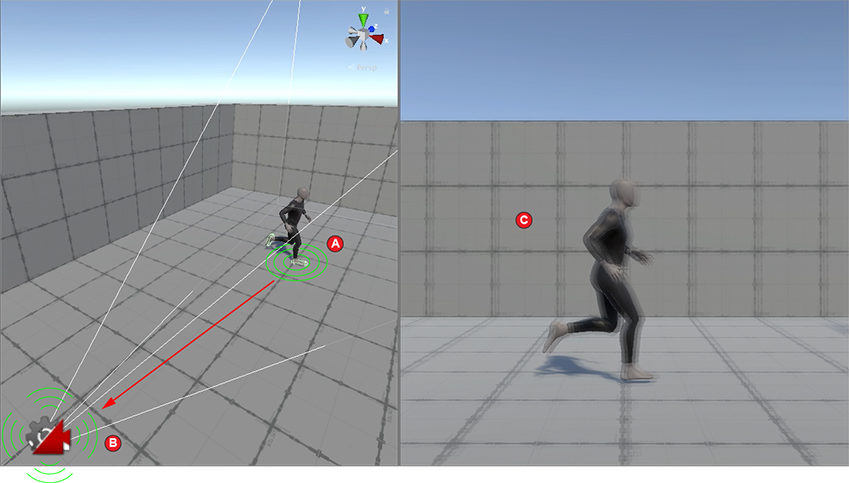

脉冲信号与脉冲源本身并不直接产生作用效果，没有 Impulse Listener 不会发生任何失去。

脉冲监听器是 Cinemachine 的一个扩展功能，它使Cinemachine虚拟摄像机能够“感知”脉冲振动信号并作出响应。

Cinemachine 内置的默认实现方式是将接收到的信号直接应用于监听器的变换位置，使其随信号产生震动效果。此外，还可指定次级响应——通常表现为所有位置和旋转轴向上的随机振动——从而为监听器的运动赋予个性特征。这类似于将监听器置于弹簧支架上，然后通过脉冲信号进行触发：除了冲击本身产生的推力外，弹簧还会引发随机抖动。

当为 Cinemachine Camera 添加 Impulse Listener 扩展时，Camera 便会根据脉冲源发出的信号产生震动响应。最简单的应用场景是，脉冲监听器将信号直接映射到 Camera 的 transform 上，使其产生抖动效果。

如下图所示，角色脚部被设置为脉冲源。当双脚与地面碰撞时（A），会生成脉冲信号。Camera 作为脉冲监听器，通过震动（B）对脉冲作出反应，最终导致游戏视图中的画面产生抖动（C）。

在实际拍摄中，不同摄像机的固定稳固程度存在差异，稳固性较低的设备往往会产生更明显的晃动。脉冲监听器的增益属性正是通过放大或衰减脉冲振动信号来模拟这一特性：数值设置越高，摄像机产生的晃动幅度就越大。

你可以创建自己的 Impulse Listener 来以任何想要的方式解释 vibration signals。

要为不是 CinemachineCameras 的 GameObjects 添加监听 impulse 的能力，可以使用 CinemachineExternalImpulseListener behaviour。

默认，一个 Impulse Listener 响应范围内的每个 Impulse Source，但是可以使用 Channel Filtering 让 Listener 只响应部分 Impulse Source。

# 属性

- Apply After

  何时应用 Impact 响应。默认是在 Noise 阶段之后。如果需要影响 extension 效果的顺序，修改这个值。

  - Body：第一阶段：在空间中定位 camera（Position Control）
  - Aim：第二阶段，将 camera 瞄向 target（Rotation Control）
  - Finalize：后处理修正阶段。在所有的类型的 virtual camera 上调用，在 pipeline 完成后
  - Noise：最后的 pipeline 阶段：应用噪声（这是单独完成的，在 CameraState 的 Correction channel。

- Channel Mask

  CinemachineBrain 和 CinemachineCamera 使用 Channel Mask 进行过滤，ImpulseSource 和 ImpulseListener 也是用 Channel Mask 进行过滤。但是两个 Channel Mask 是两个独立的系统，相互之间没有关系。Brain 和 Camera 的 Channel Mask 是单独定义的枚举，而 Impulse 的 ChannelMask 只是一个简单的 int. 前者定义了 16 个枚举值，因此最多只能用 16 个 channel，后者 int 最多可以使用 32 个通道。

  两个 Channel Mask 都可以指定一个 Channel Name Asset，其中就是一个 string 数组，用于给每个 channel 指定一个名字。它们只是简单 string[]，因此编辑的时候可以指定任意多个，但运行时系统只会使用其定义范围的哪些，Brain 16 个，Impulse 32 个。

  为这两个 Channel Mask 指定名字的 Asset（ScriptableObject）的类型也不一样，一个是 CinemachineChannelsName，一个是 CinemachineImpulseChannels。因此它们不可能通用。

  Inspector 中每次显示 Brain 的 Channel Mask 或者 Impulse 的 Channel Mask 时，会使用 AssetDatabase.Find() 查找指定类型的资源文件，找到第一个就返回（就使用它，然后将它记录在 static 变量中，这样后面就不会继续查找了）。因此无论是哪个 Channel Mask 系统，全局都只需要一个命名资源文件，后面其他的 Brain/Camera，ImpulseSource/ImpulseListener 都使用这个全局的命名文件。

  另外在 Inspector 中显示枚举值时，下拉菜单中开头还会出现两个额外的值：Nothing 和 Everything。Nothing 用于取消所有的选择的 Channels，或者手动取消所有选择的 Channels 时，会自动勾选 Nothing。Everything 用于勾选全部的 Channels，或者手动选择了全部的 Channels，还会自动勾选 Everything。

- Gain

  此数值决定了接收到的脉冲信号在触发反应时的放大倍数。它作为一个简单的乘数作用于输入信号，默认值为1。

- Use 2D Distance

  启用此设置后，在计算摄像机与脉冲源的距离时将忽略Z轴。此属性适用于2D游戏。

- Use Camera Space

  此选项将脉冲信号解析为 camera 局部空间坐标而非世界坐标系。例如当脉冲Y轴产生振动时，监听器将沿其自身局部坐标系的Y轴进行上下运动。

  在 Camera Space 处理脉冲信号。

- Reaction Settings

  允许设置由脉冲信号触发的次级噪声。通过选择噪声预设并调整振幅与频率增益进行微调。持续时间用于设置次级噪声的淡出时长（时间为近似值），该值会根据脉冲强度自动按比例调整。

  监听器会将原始脉冲信号与反应信号叠加，并作用于其附着的对象（可以是摄像机、虚拟摄像机或其他任意对象）。通过编写自定义监听器，能够以非标准方式应用信号（例如将Z轴运动转换为焦距变化）。

  - Secondary Noise：用于指定一个 Noise Profile
  - Amplitude Gain：全局缩放 Noise 的振幅
  - Frequency Gain：全局缩放 Noise 的频率
  - Duration：噪声持续时间

  

