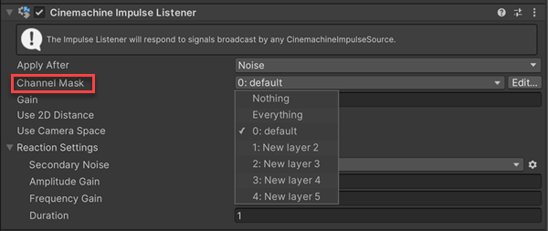

Filter 可精确控制脉冲源生成脉冲的方式与时机。Cinemachine脉冲系统支持两种过滤机制：

- 通过通道过滤功能，可以设置脉冲监听器仅对特定脉冲源作出响应，并忽略其他脉冲源。
- 通过触发器对象过滤功能（适用于碰撞脉冲源），可设置为仅特定游戏对象能触发脉冲。

# Filtering with channels

默认情况下，所有脉冲监听器会对范围内的每个脉冲源作出反应。通过通道机制，可以更精确地控制脉冲监听器对哪些脉冲源作出响应。要设置通道过滤，需要完成三个步骤：

1. 配置通道
2. 设置脉冲源在一个或多个通道上广播
3. 设置脉冲监听器监听一个或多个通道

当脉冲监听器监听特定通道时，它只会对在该通道上广播的脉冲源作出反应。

# Adding channels

CinemachineImpulseChannels脚本用于在场景中创建通道。该脚本默认包含一个通道，您可根据需要添加新通道，最多可支持31个通道。

要添加新的 channels：

- Inspect CinemachineImpulseChannels（Impulse Channel > Edit）脚本

  - 在 Cinemachine Impulse Listener inspector 中，导航到 Channel Mask 下拉菜单，并点击 Edit 按钮
  - 在 Cinemachine Impulse Source 或 Cinemachine Collision Impulse Source 的 inspector 中，导航到 Impulse Channel 下拉菜单，点击 Edit 按钮

- 展开 Impulse Channels 属性组，设置 Size 属性为你想要的 channel 数量。每个 channel 会出现一个新的 entry

- 重命名新的 channels

# Setting Listen / Broadcast Channels

设置好 channels 之后，需要定义你的 Impulse Listener 和 Impulse Sources 如何使用它们。

- Inspect 每个 Impulse Listener，从 Channel Mask 下拉菜单中选择你响应监听的 channels

  

- Inspect 每个 Impulse Source 或 Collision Impulse Source，选择你想要广播的 channels

  

# Filtering with layers and tags

可利用Unity的 Layers 与 Tags 系统，指定哪些游戏对象在与碰撞脉冲源发生碰撞或进入触发器区域时会触发脉冲，这称为触发器对象过滤。

Cinemachine Collision Impulse 组件提供两个触发器对象过滤属性：

- Layer Mask

  下拉菜单列出场景中的所有 Layers。当选择一个或多个 Layer 后，位于这些 layer 中的游戏对象与脉冲源碰撞时将触发脉冲，而其他 layer 中的碰撞事件将被忽略。

- Ignore Tag

  下拉菜单列出场景中的所有标签。当指定某个标签后，即使带有该标签的游戏对象处于 layer mask 所选的 layer 中，其与脉冲源的碰撞也不会触发脉冲。

例如，假设场景中有一个大型动物穿行森林，需要让摄像机在动物与大树碰撞时震动，但碰到树苗时不触发。  

- 方案一：将动物设置为碰撞脉冲源，把所有大树分配到独立 layer 中，并通过 layer mask 选择该 layer。  

- 方案二：若所有树木（大树与树苗）已处于同一 layer，可为树苗分配特定 tag，并通过忽略 tag 将其排除。
