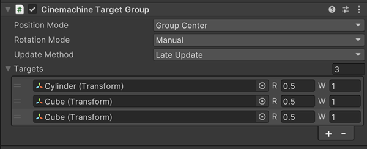

Cinemachine Target Group 将多个游戏对象视为单一追踪目标。

Position Control 和 Rotation Control 既可以以当个 Transform 为 target，也可以以 Target Group 作为 Target。这类行为需要获知 target 尺寸信息，例如 Group Framing 扩展组件。

要创建一个 Target Group，为一个空 GameObject 添加 CinemachineTargetGroup 组件。

要创建一个带 Target Group 的 CinemachineCamera，选择 GameObject > Cinemachine > Target Group Camera。Unity 会向场景中添加一个新的 CinemachineCamera 和 Target Group。CinemachineCamera 中的 Follow 和 Look At targets 引用新的 Target Group。

要将一个现有 CinemachineCamera target 转换为一个 target group：从 Cinemachine Camera 的 Inspector 中的 Tracking Target field 的弹出菜单中选择 Convert to TargetGroup。

要填充一个 Target Group：

- 在 Hierarchy 中，选择新的 Target Group object
- 在 Inspector 中，点击 + 号添加新的 item 到 group 中
- 在新的 item 中，指定一个 GameObject，然后编辑 Weight 和 Radius 属性
- 重复上面两个步骤，添加更多的 GameObjects

- Position Mode：如何计算 Target Group 的 position，作为这个整体 target 的 position

  - Group Center：使用 Target Group 中所有 items 的 AABB（axis-aligned bounding box）的中心
  - Group Average：使用 Target Group 中所有 items 的平均位置

- Rotation Mode：如何计算 Target Group 的 rotation，作为这个整体 target 的 rotation

  - Manual：使用 Target Group Game Object 自己的 transform 的 Rotation 属性。这是建议设置
  - Group Average：使用 TargetGroup 中所有 items 的加权平均 orientation

- Update Method：何时更新 Target Group 的 transform

  - Update
  - Fixed Update
  - Latge Update

- Targets：target GameObjects 列表

  - Weight：item 的权重，不可以为负数
  - Radius：item 的半径，用于计算 AABB。不可以为负数

