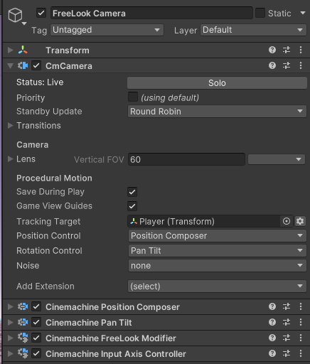

在Cinemachine 3.0中，FreeLook相机不再像早期版本那样作为一个独立的类存在。取而代之的是，通过为CinemachineCamera配置适当的行为组件来实现FreeLook相机的功能。

FreeLook是一种CinemachineCamera，它会追踪一个GameObject目标并允许用户控制相机的观察角度。本质上，它是一个能够根据用户输入围绕目标进行轨道运动的相机。实现这种相机功能有几种不同的方式，每种方式都有其独特的行为风格和特性。具体选择哪种实现方式，将取决于您目标的运动方式以及您期望获得的特定相机行为。仔细思考您希望相机如何运作是个很好的练习——因为不存在放之四海而皆准的解决方案。

选择 Cinemachine > FreeLook Camera 菜单，这会默认创建带有以下组件的 CinemachineCamera：

Orbital Follow 提供了轨道运动功能，而 Rotation Composer 确保相机无论处于什么位置都能始终看向目标。用户输入由输入轴控制器(Input Axis Controller)组件提供，通过该组件的设置，您可以将相机角度映射到任何您喜欢的输入控制方式，并调整其响应灵敏度。

Cinemachine Free Look Modifier行为的用途是允许您根据相机的垂直视角来调整某些设置。例如，您可以根据是从顶部还是底部观察，设置不同的镜头参数。该组件提供了多种不同的可能性，当然，您也完全可以自行定制并添加新的修改器。

另一种代替版本，时可将 Position Control 更改为 Position Composer，将 Rotation Control 更改为 Pan Tilt 来实现，具体如下：

在这种情况下，Pan Tilt 负责设置观察角度，而 Position Composer 则定位相机，确保目标在屏幕上处于合适的位置。

# Cinemachine FreeLook Modifier

该组件旨在添加到设置为FreeLook模式的CinemachineCamera上。虽然不是必需组件（没有它FreeLook也能正常工作），但它可以为相机体验增添更多丰富性。

它允许您根据相机在其定义轨道的顶部、中部或底部位置，来调整某些设置（例如镜头、噪点、阻尼、构图或相机距离）。默认情况下，相机设置在整个轨道过程中保持不变。而使用FreeLook Modifier，您可以改变这一行为。

该行为持有一个设置修改器列表，您可以添加任何可用的修改器。您也可以创建自己的修改器，它们会自动被添加到该列表中。

当您添加一个修改器时，它会显示顶部(Top)和底部(Bottom)设置的输入项。 targeted behaviour 中的设置决定了轨道中部(Middle)的值，这里不会重复显示。

举个例子，如果CinemachineCamera的镜头视野(FOV)为60，您添加了一个镜头修改器 lens modifier 后，可以将顶部设置为70以获得更宽的视角，底部设置为55以获得稍紧的镜头。这样当用户在轨道中上下移动相机时，视野范围(FOV)就会从底部的55平滑过渡到中部的60，再到顶部的70。

