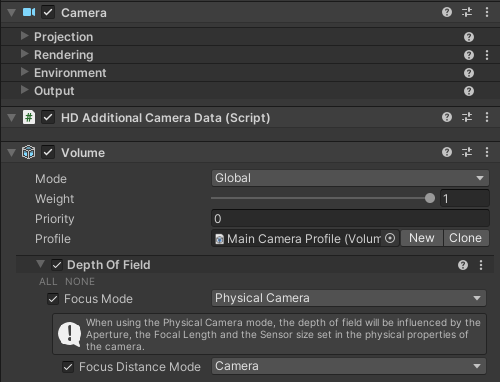

此CinemachineCamera扩展功能用于驱动 camera 的 focusDistance 属性。它既可用于将焦点锁定在特定物体上，也可在HDRP中自动检测摄像机前方物体并进行对焦。

需注意：对焦距离属性仅对物理摄像机有效，且必须安装相应的后期处理组件才能产生可见效果。

截至目前，仅HDRP（高清渲染管线）提供对摄像机对焦距离 focusDistance 的即装即用支持。在HDRP中：

- 创建一个包含 Depth Of Field override 的 active Volume
- 在 DepthOfField override 中，激活 Focus Mode，将其设置为 Physical Camera
- 在 DepthOfField override 中，激活 Focus Distance Mode，并设置为 Camera

