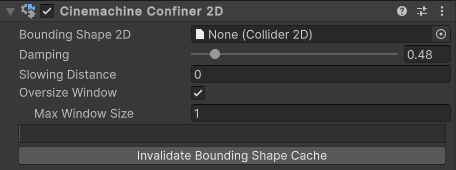

当角色和物体在复杂场景中移动时，场景中的障碍物有时会出现在相机与目标之间。同样，你可能需要将相机移动到场景中某个已被其他游戏对象占据的位置。针对这些情况，Cinemachine 提供了相应的扩展组件来处理这些问题：

- Cinemachine Deoccluder
- Cinemachine Confiner
- Cinemachine Confiner2D

# Cinemachine Deoccluder

Cinemachine Deoccluder 是 CinemachineCamera 的一个扩展组件。它对 CinemachineCamera 的**最终位置进行后处理**，尝试保持与相机 Look At 目标的视线畅通。其实现方式是通过**远离那些遮挡视线的游戏对象**来进行位置调整。

添加一个 Cinemachine Deoccluder 扩展到 CC，可以执行以下任务：

- 将 camera 推离遮挡视野的障碍物
- 当障碍物出现在CC 和 Look At target 中间时，将 camera 放在障碍物前面
- 评估拍摄质量。拍摄质量是衡量 CinemachineCamera 与其理想位置之间的距离、相机与目标之间的距离，以及阻挡目标视线的障碍物的综合指标。其他模块（包括 Clear Shot）会使用拍摄质量这一数据

Deoccluder 使用物理射线投射器（Physics Raycaster）。因此，Cinemachine Deoccluder 要求潜在的障碍物必须具有碰撞体（Collider）体积。这一要求会带来一定的性能开销。如果您的游戏中这种开销过高，建议考虑采用其他方式实现类似功能。

- Collide Against

  Cinemachine Deoccluder 将这些 layers 中的 GameObjects 视为潜在可能的 obstacles，忽略其他 layers 中的 GameObject。

- Minimum Distance From Target

  忽略小于这个 distance（从 target pivot point 开始）的 obstacles。

- Avoid Obstacles

  启用后，当目标被障碍物遮挡时，Deoccluder 会在场景中移动相机。

  可以通过调整"距离限制(Distance Limit)"、"相机半径(Camera Radius)"、"策略(Strategy)"、"平滑时间(Smoothing Time)"、"最小遮挡时间(Minimum Occlusion Time)"、"阻尼(Damping)"和"遮挡时阻尼(DampingWhenOccluded)"等属性来控制避障方式。

  如果禁用该功能，Cinemachine Deoccluder 仍会根据障碍物评估拍摄质量，但不会主动移动相机来改善拍摄效果。

- Distance Limit

  检查该相机与目标之间视线是否畅通时的最大射线检测距离。

  输入0表示使用当前与目标的实际距离。

  该选项在勾选"避免障碍物(Avoid Obstacles)"时可用。

- Camera Raidus

  与任何障碍物要保持的距离。为获得最佳效果，建议尽量保持较小数值。如果由于相机视野(FOV)过大而看到障碍物内部，请适当增大该值。该选项在勾选"避免障碍物(Avoid Obstacles)"时可用。

- Strategy

  Deoccluder 尝试保持目标可见性的方式。该选项在勾选"避免障碍物(Avoid Obstacles)"时可用。

  - Pull Camera Forward：沿着 Z 轴向前移动 camera，直到它运动到距离 target 最近的 obstacle 的前面。
  - Preserve Camera Height：移动 camera 到另一个 POV（point of view），同时尝试保持 camera 的初始高度。
  - Preserve Camera Distance：移动 camera 到另一个 POV（point of view），同时尝试保持 camera 与 target 的初始距离。

- Smoothing Time

  相机保持在距目标最近位置的最短持续时间（以秒为单位）。

  在障碍物较多的环境中，可通过此设置减少不必要的相机移动。

  该选项在勾选"避免障碍物(Avoid Obstacles)"时可用。

- Damping

  障碍物消失后，相机恢复到正常位置的速度。

  数值越小，相机响应越灵敏；数值越大，相机响应越迟缓。

  该选项在勾选"避免障碍物(Avoid Obstacles)"时可用。

- Damping When Occluded

  相机躲避障碍物时的移动速度。

  数值越小，相机响应越灵敏；数值越大，相机响应越迟缓。

  该选项在勾选"避免障碍物(Avoid Obstacles)"时可用。

- Transparent Layers

  这些 layers 的 Objects 从不会被认为阻挡 target 的视野。

- Minimum Occlusion Time

  不采取任何动作，直到 occulsion 已经持续了最短这个时间。

- Maximum Effort

  要处理的 Obstacle hits 的数量上限。

  数量越大，性能影响越大。绝大多数情况下，4 个已经足够了。

- Ignore Tag

  带有这个 tag 的 obstacles 会被忽略。建议将这个值设置为 target 的 tag。

- Shot Quality Evaluation

  如果开启，当 target 越靠近一个最优位置，就为 shots 赋予一个更高的 score。

  - Optimal Distance：当目标与相机的距离接近此数值时，镜头将获得最大的画质提升。
  - Near Limit：当目标距离小于最佳距离时，画质提升效果会逐渐减弱。当达到此近距离限制时，将不再提升画质。
  - Far Limit：当目标距离大于最佳距离时，画质提升效果会逐渐减弱。当达到此远距离限制时，将不再提升画质。
  - Max Quality Boost：这是当目标处于最佳距离时给予的画质提升幅度。该数值表示在默认画质基础上增加的比例。例如，当该值为0.5时，镜头画质将乘以1.5倍。

# Cinemachine Confiner 3D

使用 Cinemachine Confiner 3D 扩展来限制 camera 的 position 到一个 volume 中。

Camera 的 3D 位置被限制在一个 Colume 中。

- Bounding Volume：容纳 Camera 的 3D volume。
- Slowing Distance：边界体积边缘处的减速区域大小。当相机朝边界移动且进入该距离范围内时，相机会逐渐减速直至到达边界。

# Cinemachine Confiner 2D

使用 Cinemachine Confiner 2D 扩展组件可以将相机的位置限制在某个范围内，确保屏幕边缘始终位于由 2D 多边形定义的形状内。该功能适用于正交相机或透视相机，前提是相机的前向向量必须与边界形状的法线平行（也就是说，相机必须正对多边形，而不能以倾斜角度观察它）。

在对相机进行限制时，Cinemachine Confiner 2D 会考虑相机在多边形平面上的视野尺寸及其宽高比。基于这些信息以及输入的多边形，它会计算出一个更小的（次要）多边形，并将相机的变换约束在该多边形内。由于计算这个次要多边形会消耗较多资源，因此应仅在绝对必要时才执行此操作。

需要重新计算、缓存次要多边形的必要使用场景包括：

- 当 input polygon 的 points 发生改变
- 当 input polygon 时非一致缩放的

如果 input polygon 进行一致直缩放、位移、旋转，cache 保持有效。

当 Cinemachine 相机镜头的正交尺寸（Orthographic Size）或视野范围（Field of View）发生变化时，出于效率考虑，Cinemachine 不会自动调整 Confiner（限制器）。如需调整 Confiner，请通过脚本调用 InvalidateLensCache() 方法。

# Oversize Windows

如果多边形的某些部分过小，无法完全容纳相机窗口，且启用了 Oversize Window（放大窗口）选项，Cinemachine 会为这些区域计算一个多边形骨架。这是一个没有面积的形状，用作当相机被限制在该形状区域时放置相机的位置。

骨架计算是缓存计算过程中最耗费资源的环节，因此建议谨慎调整相关参数：

- 为优化骨架计算，请将 Max Window Size（最大窗口尺寸）属性设置为预期相机窗口可能达到的最大尺寸。对于超过该尺寸的窗口，Cinemachine 将不会花费时间计算其骨架。

# Efficiency

相比修改单个 Confiner2D 的输入边界形状，使用多个具有不同输入边界形状的 Cinemachine 相机并在它们之间进行混合要高效得多，因为计算限制器形状的初始成本较高。

# Remarks

有几种方法可以为 CinemachineConfiner2D 设置 Composite Collider 2D。我们推荐使用以下结构：

1. 创建一个游戏对象（GameObject），并为其添加 Composite Collider 2D 组件。  
2. 在 Composite Collider 2D 组件中，将 Is Trigger 设为 true，将 Geometry Type 设为 Polygons。  
3. 当添加了 Composite Collider 2D 组件后，Unity 会自动为游戏对象添加一个 Rigidbody 2D 组件。将该 Rigidbody 2D 的 Body Type 设为 Static。  
4. 添加一个或多个子游戏对象（GameObject）。这些子游戏对象将用于存放 Composite Collider 2D 的 Collider2D 组件。  
5. 为这些子游戏对象添加 Collider2D 组件。并将这些 Collider2D 组件上的 Composite Operation 属性设为 Merge。

当为 Bounding Shape 2D 分配包含 Collider2D 的游戏对象时，Unity 将选择最上层的 Collider2D。

- Bounding Shape 2D

  设置你想要限制 camera viewport 的 shape。

- Damping

  在转角处应用阻尼以避免画面跳跃。数值越大，过渡越平缓。

- Slowing Distance

  边界形状边缘处的减速区域大小。当相机朝边界移动且进入该距离范围内时，相机会逐渐减速直至到达边界。

- Max Window Size

  为优化计算和内存性能，请将此值设置为相机预期拥有的最大视野尺寸。当视锥体尺寸超过该值时，Confiner 2D 将不会计算对应的多边形缓存。这里指的是限制平面处视锥体在世界单位中的尺寸（对于正交相机，该值即为正交尺寸）。若设置为 0，则 Cinemachine 将忽略此参数，并为所有可能的窗口尺寸计算多边形缓存。

