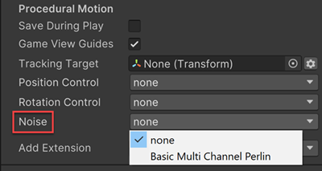
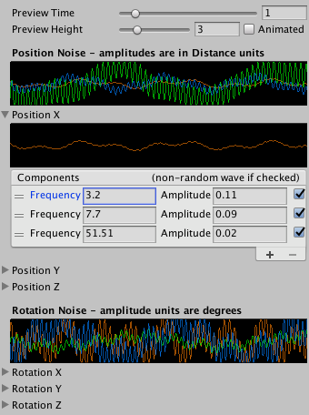

在 CinemachineCamera 中使用 Noise 行为来模拟摄像机抖动。

Cinemachine 包含一个 Basic Multi Channel Perlin 组件，该组件可为摄像机的运动添加 Perlin 噪声。Perlin 噪声是一种计算具有自然特性的伪随机运动的技术。

Basic Multi Channel Perlin 组件应用一个噪声配置文件。噪声配置文件是一个资源，用于定义噪声随时间变化的行为。Cinemachine 包含一些预设的噪声配置文件资源，你可以编辑这些预设并创建自己的噪声配置文件。

要应用噪声：

- 选择 CinemachineCamera GameObject
- 在 Inspector 的 Noise 中选择 Basic Multi Channel Perlin。这会为 CC 添加一个 noise behaviour
- 在 noise behaviour 的 Noise Profile 中，选择一个现有的 profile asset，或者创建新的 profile
- 使用 Amplitude Gain 和 Frequency Gain 来精细调整 noise

属性：

- Noise Profile：要使用 noise profile
- Amplitude Gain

  应用到 **噪声配置文件中定义的振幅** 的增益值。使用 1 表示采用噪声配置文件中定义的振幅。将其设置为 0 将静音噪声。
  
  提示：动画化此属性可以逐渐增强或减弱噪声效果。

- Frequency Gain

  应用到 **噪声配置文件中定义的频率** 的倍增系数。使用 1 表示采用噪声配置文件中定义的原始频率。使用更大的数值会使摄像机抖动得更快。
  
  提示：动画化此属性可以实现噪声效果的渐强渐弱过渡。

- Pivot Offset

  当旋转摄像机时，在应用旋转噪声的同时，将摄像机的枢轴点沿指定的X、Y和Z方向偏移相应的距离。这会产生与旋转噪声相对应的位置变化。

# Noise Profiles

噪声配置文件是一种资产，它定义了用于摄像机噪声的过程化曲线。Basic Multi Channel Perlin 组件将噪声配置文件应用于摄像机的运动。Cinemachine 在计算出摄像机的位置之后应用噪声运动。这样，摄像机噪声不会影响后续更新中摄像机运动的计算。

Cinemachine 包含一些预定义的配置文件资源。在 Noise 组件中选择一个预定义的噪声配置文件。通过在 Project 窗口中选择 Create > Cinemachine > NoiseSettings 来创建您自己的噪声配置文件资源。

Inspector 中的属性会显示 graphs，以可视化方式呈现噪声配置文件的效果。位置和旋转分别包含X、Y和Z三个轴向，每个轴向都可以包含多个 layer。

为了实现逼真的程序化噪声效果，请谨慎选择频率和振幅，以确保获得既有趣味性又不会明显重复的噪声特性。最具说服力的摄像机抖动通常使用旋转噪声，因为这是摄像机瞄准的方向。手持摄像师在操作时往往会产生更多的旋转抖动而非位置抖动。在设定好旋转噪声后，再添加位置噪声。

令人信服的噪声配置文件通常会将低频、中频和高频混合在一起（傅里叶变换，每个频率都是一个柏林噪声，甚至可以一个柏林噪声，然后通过变频，变成 3 个低频、中频、高频的噪声，然后混合在一起，类似于分形）。在创建新的噪声配置文件时，建议为每个轴向都设置这三层不同频率的噪声。

关于振幅设置：对于广角镜头，建议使用较大的振幅值以产生明显的抖动效果；而对于长焦镜头，则应使用较小的振幅值，因为较窄的视场角会放大抖动效果。

在频率设置方面：典型的低频范围是0.1-0.5赫兹，中频范围是0.8-1.5赫兹，高频范围是3-4赫兹。最高可用频率取决于游戏的帧率——通常游戏运行在30或60赫兹。超过游戏帧率的噪声频率会落在奈奎斯特频率的临界点之外，也就是说这些高频噪声将无法被直接追踪呈现。

举例说明：如果游戏以60帧/秒运行，而你设置的频率达到100赫兹，就会产生卡顿的摄像机噪声效果。这是因为游戏引擎无法渲染移动速度超过帧率的运动。

属性：

- Preview Time：在 Inspector 中显示 graph 的时长（秒）。该属性仅用于检查器中的编辑操作，不会影响你正在编辑的噪声配置文件资源的内容。

- Preview Height：Inspector 中噪声配置文件 graph 的垂直高度。该属性用于编辑噪声配置文件，但不会影响噪声配置文件资源本身。

- Animated：勾选此项可在 graph 中显示噪声配置文件的动态示例演示。该属性仅用于编辑噪声配置文件，不会对噪声配置文件资源本身产生影响。

- Position Noise：用于 camera 运动的所有 axes 的所有 noise layers 的图形化表示。

- Position X/Y/Z：每个 axis（X/Y/Z）的噪声 layers，这些 layers 将作用于摄像机运动。每个 axis 都有其对应层级的图形化显示界面。每个噪声层级都包含频率（Frequency）、振幅（Amplitude）以及可选的柏林噪声（Perlin noise）参数。点击"+"或"-"按钮可分别添加或删除层级（傅里叶变换复合低频、中频、高频的噪声）。

  - Frequency：noise layer 波形的频率，单位赫兹 HZ（每秒次数）
  - Amplitude：noise layer 波形的振幅，单位 m
  - Non-random wave if checked：勾选此项将从噪声 layer 中移除柏林噪声。
  
    若未启用柏林噪声，Cinemachine 将使用常规正弦波。取消勾选则会为该 layer 应用柏林噪声，在保持选定数值附近范围的同时，对频率和振幅都进行随机化处理。

- Rotation Noise：相机旋转时所有轴上所有噪声层的图形化表示。

- Rotation X/Y/Z：用于相机旋转的每个轴上的噪声 layers。每个层都有频率、振幅和可选的柏林噪声属性。点击 + 或 - 分别用于添加和移除层。

  - Frequency：noise layer 波形的频率，单位赫兹 HZ（每秒次数）
  - Amplitude：noise layer 波形的振幅，单位度（角度）
  - Non-random wave if checked：勾选此项将从噪声 layer 中移除柏林噪声。

    若未启用柏林噪声，Cinemachine 将使用常规正弦波。

    取消勾选以包含随机的柏林噪声变化，在保持所选数值邻近范围内的同时，随机化频率和振幅。

所有类型的噪声都是 2D 屏幕上无限延展的，在 2D 空间中任何一点取值都可以。沿着 2D 空间的任何一条直线经过的噪声数据也是一维噪声。在 2D 空间的任何一个位置 (x, y) 取值一个 square [(x, y)， (x + 1, y + 1)] 都可以得到一个不同的 0-1 矩形的噪声数据。0-1 矩形的噪声数据上下、左右边缘不是无缝衔接、可循环的，想要得到连续的噪声数据，就继续连续向外取值即可（因为噪声是 2D 空间无限延伸的，它是由数学公式定义的）。

没有函数启动相机随噪声运动，Basic Multi Channel Perlin 组件挂载到 CC 后，运行时就开始每时每刻在以定义到噪声震动相机（Update），要关闭震动只需要 disable Basic Multi Channel Perlin 组件。

另外调整 Amplitude Gain 可以整体调整噪声运动的强度，设置为 0 同样有效关闭噪声运动（尽管实际仍然在进行计算）。调整 Frequency Gain 可以整体调整噪声运动的频率，是震动更快、更慢的进行。通过这两个参数使得无需修改 Noise Profile，就可以调整强度和频率。
