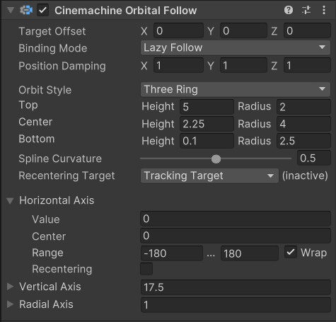
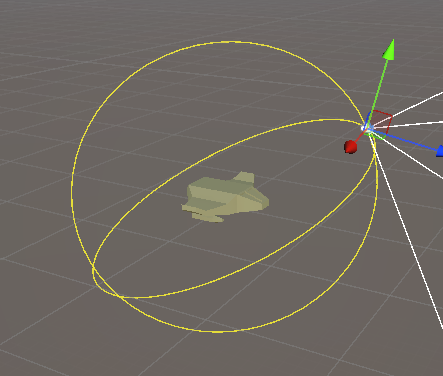
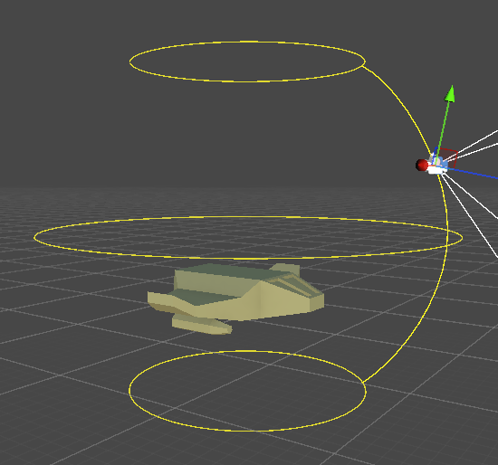
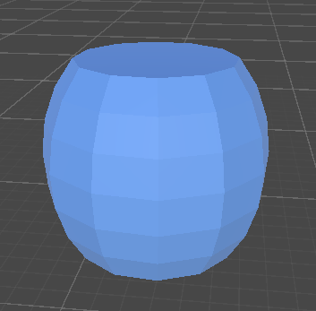
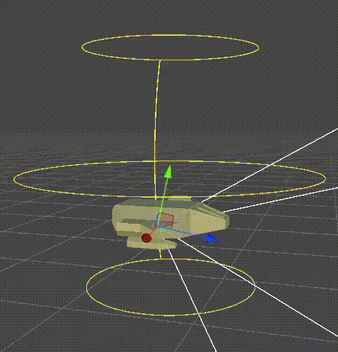
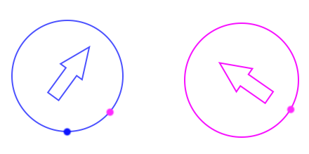

此 CinemachineCamera Position Control 行为会根据 CinemachineCamera 的追踪目标以可变关系移动Unity相机。

若添加 Cinemachine 输入轴控制器行为，相机位置可由玩家输入驱动，从而允许玩家动态控制相机相对于目标的位置。

Orbital Follow 以两种方式操作：

- Sphere：在此模式下，相机会被定位在围绕目标的一个球面上的任意一点
- ThreeRig：在此模式下，相机会被定位在由围绕目标的三条圆形轨道所定义的样条线拉伸而成的曲面上的任意位置。

相机在该曲面上的精确位置由轨道跟随组件中的三个轴向值决定：水平轴、垂直轴和半径轴。其中半径控制缩放比例，允许相机靠近或远离目标。你可以通过自定义脚本、动画器或自行设计的其他方式来控制这些数值。

如果为 CinemachineCamera 附加输入控制器，玩家就可以使用Unity的输入控件来控制相机在定义曲面上的位置。这样玩家就能将相机移动到目标周围轨道曲面上的任意位置。

下面是 Sphere 的 Orbital Follow，相机绕着 target 中，在外面的一个球体表面绕转。可以通过 Verital 和 Horizontal 两个 axis 来控制如何 CC 的位置（不是 CC 本身的旋转）在球面上如何绕转。先执行 Vertical，在执行 Horizontal，即水平旋转是垂直旋转的 parent 坐标系，相当于给 CC 串联了两个 Transform，其 parent 控制垂直旋转，再上面的 parent 控制水平旋转。

下面是 ThreeRing 的 Orbital Follow，相机在一个上下两端截断的椭球体表面绕转，绕转方式跟 Sphere 一样，先垂直绕着侧边弧线上下移动，在水平绕着中心旋转。事实上，Sphere 也是上下两端截断的，因为 Vertical Axis 的 range 限制了 CC 在侧边弧线上的移动范围。

Sphere 和 ThreeRing 可以统一理解为一个鼓形外表，CC 在鼓形侧面移动，移动方式都是先垂直沿着侧边弧线上下移动，然后绕着鼓中心水平旋转。CC 最高最低只能到达鼓的上下截面。区别是，Sphere 用一个 Radius 直接定义了这个鼓形，而 ThreeRing 则拓展了外形定义的方式，通过上中下三个 Circle 定义了鼓的外形。

属性

- Target Offset

  Target 本地坐标系中从 object 中心的偏移。用来精细调整 orbit position，尤其是期望的 orbit focus 不是跟踪的 object 的中心。

  调整鼓形中心相对 Target 的偏移，默认是以 Target 为中心。

- Binging Mode 绑定模式：Offset 用来偏移球体（Sphere）或椭球体（ThreeRing）的中心，参考 Follow。

  - Lock To Target On Assign
  - Lock To Target With World Up
  - Lock To Target No Roll
  - Lock To Target
  - World Space
  - Lazy Follow

- Position Damping
- Angular Damping Mode
- Rotation Damping
- Quaternion Damping

- Orbit Style
  - Sphere
  - ThreeRing

- Radius：在 Sphere Mode，它定义了 surface sphere 的半径

- Top，Center，Bottom：在 ThreeRing Mode，它定义了 3 个 orbit rings 的高度和半径，orbit rings 用于创建 orbit surface。这些值是相对于 target 的 origin 的。

- Spline Curvature：Three Ring Mode 中，它定义了连接 3 个 orbit rings 的线的紧绷程度 tautness，线更直还是更曲。这个线决定了 surface 的最终形状，类似车床建模 Lathe 的 profile（轮廓曲线）。

- Recentering Target：定义水平重新居中的参考坐标系。轴心中心将动态更新，始终保持在选定对象的后方。

  frame：坐标系。

  - Axis Center：静态 reference frame。Axis center value 不是动态更新的。
  - Parent Object：Axis center 动态调整到 parent object forward 之后
  - Tracking Target：Axis center 动态调整到 Tracking Target forward 之后
  - LookAt Target：Axis center 动态调整到 LookAt Target forward 之后

  Recentering 用于控制相机在​​无用户输入​​时的自动回正行为，其核心作用是让相机回到与目标相关的预设方向，提升镜头逻辑的一致性与用户体验。当用户停止对相机进行旋转控制（如松开鼠标、手柄摇杆）后，Recentering Target会触发相机自动调整方向，使其回到与目标对象的​​预设相对角度​​（如“目标正后方”“目标前方”或“目标朝向”）。这种机制避免了相机因长时间无操作而停留在不合理的角度（如侧对目标），确保镜头始终符合场景逻辑。

  Horizontal Axis，Vertical Axis，Radial Axis 三个轴分别提供了 recentering 功能。这个 Recentering Target 专门用于 Horizontal Axis 的 recentering。

  这是因为 Drum 仅位置与 Target 的位置有关，Drum 总是包围在 Target 的外面，但是 Target 自身的旋转不会影响 Drum，Drum 自身的旋转是在 World Space 定义的，即所谓的静态 reference frame。这是 Recentering Target 的默认定义。此时 center 也是静态的，不会随着 target 的旋转而旋转。因此 CC 总是向这个静态的 center 回正。

  但是很多时候，会希望 CC 回正到某个物体的正后方。为此，可以使用脚本根据参考物体的旋转动态调整 center 的值。但是 Recentering Target 为一些常用情况提供了快捷方式，使得你不用脚本操作，即可达成相应的效果。注意此时，center 变得不可编辑，因为它限制被 CC 系统控制，不是静态的，而是总是相对于特定物体的。这个 center 总是放在所参考的 object 的正后方，即 -Z 轴上，或者 -Z 轴与 Drum Volum 的交点处就是 center。
  
  此时，所参考的物体的水平旋转会影响 CC 在 Drum 水平方向上绕 Target 的旋转。可以想象为给参考的物体添加一个与 target 一模一样的 Drum Volume，然后这个 Drum 在水平方向上会随着参考的物体水平旋转而旋转，center 总是位于其 -Z 轴与 Drum 的交点。然后把在 Target 的 Drum 上找到相应的位置，这个位置就是 Target 上的 center。然后 CC 在水平方向上向这个 center 回正。

  注意，只采用参考物体的 Y 轴的欧拉角（即水平旋转），忽略 Z 轴的 roll 和 X 轴的 tilt。另外无论哪个参考物体，其位置都不影响 Drum 和 center，只有旋转影响。

  - Tracking Target：最常见的情况，即将 Tracking Target 本身作为参考物体。这样 Drum 本身就随着 Tracking Target 的水平旋转而旋转
  - LookAt Target：如果 LookAt Target 与 Tracking Target 不同，因为 LookAt Target 是观察的目标，影响 CC 自身的旋转，因此此时应将 LookAt Target 作为参考物体
  - Parent Object：有时 CC 会挂载到一个 Parent GameObject 上。这个选项将 CC 的 Parent GameObject 作为参考物体。

    注意，CC 的 transform 是被动修改的，你可以修改它的 transform 的值，但是如果它的部分属性被 Cinemachine 系统控制，那么你对这部分属性的修改就会无效，会被 Cinemachine 的修改覆盖掉。但是对于哪些没有被 Cinemachine 系统修改的属性，是可以用脚本手动修改的。例如当 CC 挂载到一个 Parent GameObject 上，Follow 另一个 Tracking Target，此时 CC 不会随着 Parent 移动，因为它的位置被 CinemachineFollow 组件控制，但是其旋转可以被正常修改。

  

  如图所示蓝色箭头是 Target，紫色箭头是参考物体，蓝色圆圈是 target 的 Drum 的水平 circle，紫色圆圈是参考物体周围的等价 Drum。方向是 x 轴水平向右，y 轴垂直向上。蓝点是默认 Axis Center 的 center = 0 的位置，这个 center 可以被手动修改。右边的紫点是参考物体的 behind，左边的紫点是 target Drum Circle 上的相同位置，这个位置就是自动化 center 的位置，value 偏离这个位置会被自动回正（recentering）。蓝色 target 的旋转不会影响 Drum 的旋转，只有 Drum 的位置会跟随 target，但是紫色箭头参考物体的旋转会影响 center 的位置，紫色箭头参考物体的位置没有任何影响。

  简而言之，Parent Object、Tracking Target、LookAt Target 是自动化填充控制 center 的 3 个方式，你也可以编写脚本自己实现。

Horizontal Axis、Vertical Axis、Radial Axis 定义了三个可以控制 CC 的轴，分别控制水平旋转、垂直旋转、径向移动。其中 Radial Axis 以归一化的方式定义了相对中心对 Drum 的缩放，实现 CC 相对 Drum 中心的径向移动。

每个 Axis 都提供了 4 个选项：

- Value：轴的输入值，它控制 CC 在相应的轴上的移动。它必须位于 Range 范围内。
- Range：定义了轴的值的范围，限制 CC 在这个轴上的移动范围。

  Range 还提供一个 Wrap 选项。如果开启，当数值超过 range 边界时，会循环回绕。
  
  这个回绕完全是基于数值计算的，不用考虑角度还是什么，就在一维数轴上画出范围的两个边界，value 值在其中运动。当 value 超过其中一个边界时，value 立刻跳转回绕到另一个边界的内测，以相同方向继续移动。

  例如，如果范围是 [-180, 180]，当角度从 179 越过 180 到达 181 时，会自动变成 -179。如果范围时 [-90, 90]，当 value 超过 -90 时，会自动回绕到 90 边界的内测，并继续以相同方向变化。

- Center：定义 Range 中的一个数值，作为 Rest 的 center。

  如果没有开启 Recentering，Center 没有作用。如果开启了 Recentering，当 CC value 离开 center 后， value 会自动恢复到 center 的位置。并且 Recentering 提供了两个参数控制恢复的过程：

  - Wait：value 离开 center 之后多长时间开始恢复
  - Time：多长时间完成恢复，即 Damping

- Recentering：是否开启 recentering。

三个轴都以相同的方式操作，都提供 recentering 功能。

- Horizontal Axis：相机在曲面上的水平位置（绕Y轴旋转）。数值以度为单位，"范围"定义了允许的数值限制。若勾选"环绕"选项，当数值超出范围边界时会循环回绕。此处可定义一个中心位置，当轴驱动器中启用了重新居中逻辑时，该中心位置将被使用。
- Vertical Axis：相机在曲面上的垂直位置（绕X轴旋转）。在球体模式下数值以度为单位，但在三环模式下为任意单位。范围定义了允许的数值限制。若勾选"环绕"选项，当数值超出范围边界时会循环回绕。此处可定义一个中心位置，当轴驱动器中启用了重新居中逻辑时，该中心位置将被使用。
- Radial Axis：通过缩放轨道来控制相机与目标之间的距离。该值为轨道高度和半径的标量倍数。范围定义了允许的数值限制。若勾选"环绕"选项，当数值超出范围边界时会循环回绕。此处可定义一个中心位置，当轴驱动器中启用了重新居中逻辑时，该中心位置将被使用。
- Recentering：若对一个 axis 开启 re-center，Recentering 会平滑地将 axis value 返回到其 Center。
  - Wait：若对一个 axis 开启 re-center，它会在最后一个 user input 之后等待这个值指定的时间（秒），然后开始 re-centering 过程。
  - Time：re-center 开始后，完成 re-center 过程要花费的时间（秒）。

对 Axis 的修改是立即的，CC 会瞬时同步，没有 Damping 效果。如果想要 Damping 效果，可以存储输入的 value，然后 Damping Axis 的 value 到 target value，例如 SmoothDamp 或 Lerp Axis 的 value。
