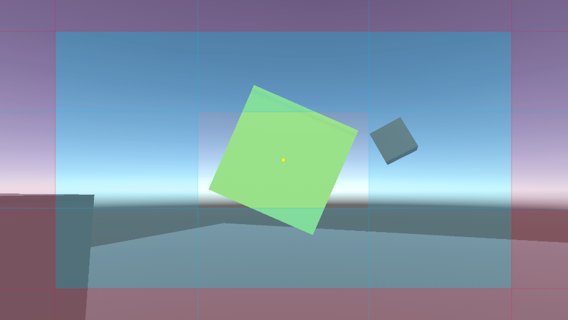
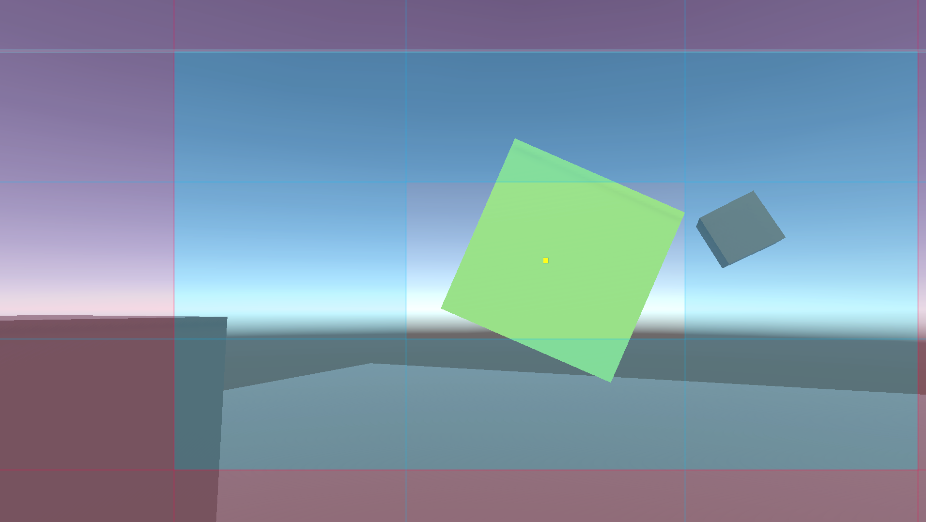
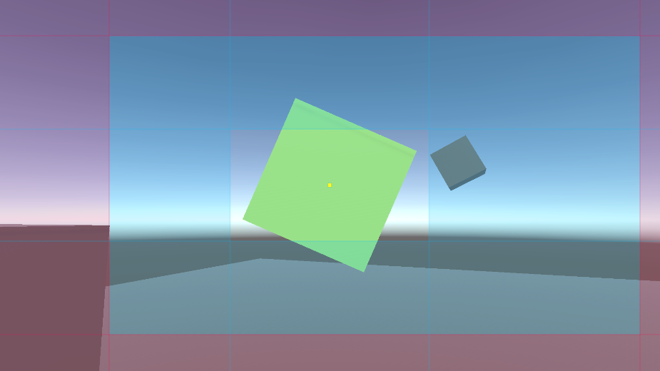

此 CinemachineCamera 位置控制行为会移动相机，以保持追踪目标在屏幕空间中的期望位置。你还可以指定偏移量、阻尼和构图规则 composition rules。

Composer（构图）是以 Screen Space 为基准控制 CC 的位置的 Control，不像其他基于 3D 空间的 rule 控制 CC 位置的 Control。

Position Composer 仅改变相机在空间中的位置，不会旋转相机。若要控制相机的视角，请在相机的变换中设置 CinemachineCamera 的旋转，或者为 CinemachineCamera 添加一个程序化的旋转控制组件。

所谓 Composer 就是使用 Screen Space 约束来控制 CinemachineCamera，而不是 3D 空间中的约束。Composer 是与 Follow、Orbital Follow 一样的过程化算法，一个 CinemachineCamera 只能有一个过程化算法，因此使用了 Follow，就不能再使用 Composer 了。

Position Composer 适用于2D和正交相机，同时也支持透视相机和3D环境。

**该算法首先沿相机Z轴移动相机，直至追踪目标与相机XY平面达到期望距离；随后在相机XY平面内移动相机，直至追踪目标到达相机屏幕上的期望位置点。**

Composer 构图将屏幕分为 3 个区域，有点类似 CSS box 模型：

- 最外围是 Hard Limit 区域，图中红色区域所示
- 中间是 Soft Limit 区域，图中蓝色区域所示
- 中间是 Dead Zone，图中空白区域所示

Hard Limit 区域和 Dead Zone 区域都是可选的，如果不启用，就相当于区域设置为 0.

Dead Zone 区域是 target 在屏幕上的自由活动区域，当 Target 位于这个区域时，CC 不会调整位置。

Soft Limit 区域是软边界，当 target 进入这个区域，Composer 会平滑地移动 CC，将 Target 重新调整到 Dead Zone 中。

Hard Limit 区域时硬边界，Composer 会硬性限制 CC 不会进入此区域。

只有 Soft Limit 区域是必须的。如果关闭 Dead Zone（Dead Zone 区域为 0），则 target 总是居于中心，只有 target 偏离中心，Composer 就会立即调整 CC 的位置，直到 Target 重新居于中心。

每个区域的 size 和 offset 设置使用相对视口的归一化数值。1 等于整个 Screen Space 的高度和宽度。

关注点（target + target_offset）在屏幕上的 Rest 位置也可以偏移，默认是屏幕中心，Screen Position 可以偏移这个值，这个值偏移时，Dead Zone 和 Soft Limit 区域也会跟随偏移。Head Limit 区域可以认为是从 Soft Limit 外边缘向外围无限延伸。


正常构图：



Screen Position 偏移：







属性：

- Target Offset

  Tracking Target 本地坐标系中的焦点（关注点）相对于原点的偏移。这为 Tracking Point 提供了基于 Target 一定的偏移，适用于虽然跟踪 Target，但是跟踪点不在 Target 的原点上的情况。

- Lookahead Time

  开启 Lookahead 之后，composer 根据目标物体的运动来调整其目标偏移量。Composer 会看向一个 它预估目标物体将在未来若干秒后所处的位置。
  
  即 CC 不会直接观察 target 的当前位置，而是根据 target 的当前速度，以一定时间提前量，计算一个未来的位置，然后观察这个未来的位置。

  ```public Vector3 PredictPositionDelta(float lookaheadTime) => m_Velocity * lookaheadTime;```

  这个参数就是指定 Lookahead 时间提前量，单位是秒。

  在 LookaheadSettings 的声明中，它定义为

  ```C#
  [Range(0f, 1f)]
  public float Time;
  ```

  它在 Inspector 中只能设置在 0-1 之间，也就是最大设置为 1s，这也是通常的情景，设置太多的 lookahead time 没有意义。但是这并不阻止在 code 将它设置为任何值。

  同理，ThirdPersonFollow 的 AvoidObstacle 的 Camera Radius 也是如此，在 Inspector 中只能设置到 0-1 之间，但是这并不阻止在 code 将它设置为任何值。

  请注意，此设置对嘈杂的动画较为敏感，可能会放大噪声，从而导致不希望出现的相机抖动。如果当目标物体运动时相机抖动得无法接受，请调低此设置，或者让目标物体的动画更加平滑。

- Lookahead Smoothing

  前瞻算法的平滑度。数值越大，预测结果越平滑（能减少抖动），但预测延迟也会相应增加。

- Lookahead Ignore Y

  若启用此选项， lockahead 计算时将忽略Y轴方向的移动。

- Camera Distance

  Position Composer 的执行过程是先移动 CC 与 target 保持常量的距离（相机空间 Z 轴距离），然后再在相机空间的 XY 屏幕上移动来满足构图规则。

  沿相机轴线方向与追踪目标之间要保持的距离。

- Dead Zone Depth

  类似 XY 屏幕的 Dead Zone，相机空间 Z 轴也提供了 Dead Zone，如果 Tracking target 位于这个指定的 camera distance 内，不会沿着 Z 轴移动 camera。

- Damping

  相机在三个相机空间轴向上试图维持期望位置的响应程度。数值越小，相机响应越灵敏；数值越大，相机响应越迟缓。为每个轴设置不同数值可实现丰富多样的相机行为表现。

- Screen Position

  目标在屏幕上的水平与垂直位置。相机会自动调整以将追踪对象放置在此位置。0 表示屏幕中心，-0.5 和 0.5 分别表示屏幕边缘。

- Dead Zone

  如果 target 在 Screen Position 的这个距离内，camera 不会调整。

- Hard Limits

  Camera 不会让 target 位于这个 hard limits 之外。

  - Size：相机可放置目标对象的区域大小，以屏幕尺寸的比例表示。该区域默认以"屏幕位置(Screen Position)"为中心，但可通过"偏移(Offset)"设置进行调整。数值为1时表示占据整个屏幕宽度或高度。
  - Offset：相对 Target Position 水平、垂直偏移 hard limits。

- Center On Active

  当相机激活时，将相机移动以使目标位于 Dead Zone 的中心。


