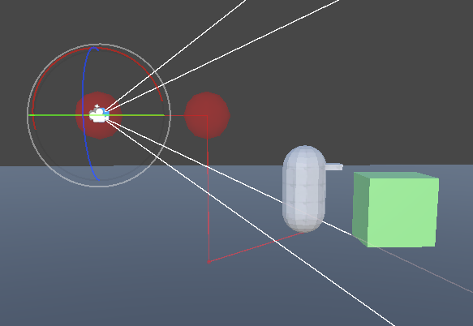

使用 CinemachineCamera 的第三人称跟随功能，使相机相对于追踪目标保持恒定的位置和距离（受阻尼控制约束），并跟踪目标的移动和旋转。

Third Person Follow 在 Tracking Target 的本地坐标系定义了一个 rig，用来挂载 CC。

Rig 由 4 个点组成，如图所示的 4 个绿色标签标记的点：

- origin：Target 的原点，固定的
- shoulder：定义肩膀相对于 origin 的水平偏移

  偏移由 shoulder offset 定义，即 shoulder = origin + shoulder_offset

  注意 shoulder offset 是一个 vector3，因此它可以定义 3d 空间中的任何偏移，但是通常它是用来从 origin 水平偏移出 shoulder 用的。

- hand：定义 CC 相对于 shoulder 的垂直高度

  hand 由 shoulder 沿 +y 升高 vertical arm length 得到，即 hand = shoulder + (0, vertical_arm_length, 0)

- CC：CC 的最终位置

  由 hand 向后（-z）延长 Camera Distance 得到，即 CC = hand + (0, 0, -camera_distance)

CC 跟随这个最终计算出来的位置，跟随的阻尼由 Damping 定义。

注意 ThirdPersonFollow 和其他 Position Control 一个不一样的地方在于，它的 Rotation 也是被锁住的，不能被编辑，总是朝向前方 forward(+z)。而且旋转 Target，CC 会 Hard Lock Target 的旋转（即实时跟随旋转，没有阻尼）。这通常不是想要的结果，因此可以为 CC 添加 Rotation Control 让它来控制 CC 的旋转（朝向）。例如：

- Hard Look At

  锁定 CC 瞄准到 LookAt Target，并且没有阻尼，类似没有 Rotation Control 时的行为，但是 Hard Look At 可以让 CC 瞄准到 LookAt Target，而不是总是沿着 Tracking Target 的 forward，并且 LookAt 可以指定一个不同的 GameObject，并且 Hard Look At 可以提供一个 Offset，从 LookAt Target 的偏移

- Rotate With Follow Target

  CC 跟随 Tracking Target 旋转而旋转（注意不是 LookAt Target），与没有 Rotation Control 的情况一样，但是提供了一个 Damping 值来平滑旋转
  

第三人称跟随的 mini-rig 设置定义了相机相对于目标的位置和距离。通过合适的肩部偏移，这个迷你装备可以生成第三人称视角的相机——角色在画面中偏移，相机从角色肩部上方观察。**通过不同的设置，它也可以生成第一人称视角的相机。**

会产生如下结果：

Rig 和 Camera Position 通过 3 个枢轴点 pivot points（origin，shoulder，hand）以及一个位于手部后方的相机共同定义。

- Origin(A)：tracking target 的 origin 位置。当 target 水平绕轴旋转 pivot，rig 绕着这个 origin 随之旋转。
- Shoulder(B)：默认情况下，它会偏移到一侧，以形成过肩跟随位置。追踪目标的垂直旋转会传递到此处，因此 rig 会围绕原点水平旋转，并围绕肩膀垂直旋转。
- Hand(C)：相对于肩膀的垂直偏移量。手臂长度会影响相机垂直旋转时追踪目标在屏幕上的位置。默认情况下，它会从肩膀处偏移，以便垂直旋转时能让角色在屏幕上保持良好的位置。对于第一人称相机，该值可以设置为0。
- Camera(D)：相机的旋转将始终与追踪目标的旋转保持平行，但位置会固定在手部后方指定的相机距离处。相机始终直接注视着手部。

注意 rig 上的 rotations：

- B 绕 A 水平旋转。使用 A 作为原点，B 的位置基于 Shoulder Offset 的 X Y Z 值计算。

  

- C 绕着 B 垂直旋转。C 点的位置是根据 B 点的 Vertical Arm Length 计算得出的。正值会使 C 点位于 B 点上方，负值则会使 C 点位于 B 点下方。

  

A 作为 Origin 原点，B 先从 A 偏移，C 再从 B 垂直偏移。

# Controlling the Camera

该相机没有直接的输入控制。你必须有一个控制器脚本来移动和旋转追踪目标；相机将根据该追踪目标来定位和定向自身。当追踪目标是角色本身时，相机的旋转始终与角色的旋转相匹配。当追踪目标是一个可以独立于角色旋转的不可见游戏对象时，相机将能够围绕角色进行旋转。

# Built-in Collision Resolution

第三人称跟随组件内置了碰撞解决方案系统，因此当目标靠近障碍物时，相机会自动调整位置以避免穿入障碍物内部；该内置碰撞解决方案确保相机始终能观察到目标，即使中间存在障碍物阻挡。当目标过于接近障碍物时，相机 rig 会通过弯曲和拉伸来保持相机位于障碍物外部，同时始终确保目标处于视野范围内。

只要保证 Camera 位于 Mesh 的外面，就不会穿帮，即使 Camera 紧贴着 Mesh 的表面，这只会让玩家感觉到贴在物体表面上观察环境，因为 Camera 的视锥体会自动剪裁 Mesh。只有 Camera 进入到 Mesh 内部，才会出现穿帮的视角。因此自动碰撞解决的方案只有确保 Camera 不进入 Mesh 内部就可以。

碰撞解析原理是，实时从 origin 向 hand 投射一个 Sphere Ray，如果中途没有碰撞，就认为是安全路径，正常运行。如果遇到障碍物，就将 hand 沿着射线方向移动到第一个碰撞点附近，使得以 hand 为中心的包围球恰好与碰撞体相交，保证 hand 在碰撞体的外面，随后 CC Damping 移动到 hand（此时忽略 Camera Distance），如此继续运动，直到 Sphere Ray 检测不到碰撞，Camera Rig 恢复正常。

如下图所示，相机 CC 和 Target 本身直接向前移动，都不会遇到碰撞体，但是因为碰撞检测是由 origin 向 hand 发射一个 Sphere Ray 完成的，因此只有这个 Ray 有碰撞，Hand 就会回收到碰撞点附近，进而 CC 也跟随到此。

Camera Radius 指定了 Sphere Ray 的球体半径，它在 [0, 1] 之间，但它不是归一化的因子，就是正常的距离单位（m），这可以通过源代码看到。也就是说 Cinemachine ThirdPersonFollow 内置的碰撞解析强制了 Sphere 的半径在 0-1 之间。

当 Sphere Ray 遇到碰撞点，Hand 包围球就会收缩到第一个碰撞点，然后 CC 会忽略 Camera Distance（即 CC 到 Hand 的 Z 轴距离），同步到 hand 的位置，这个 Sphere Ray 检测是实时进行的，直到 Sphere Ray 检测不到碰撞点，Hand 和 CC 就都会回到正常位置。

Hand 会直接回缩到碰撞点，但是 CC 到 Hand 的过程可以有 damping。

Damping Into Collision 控制当 CC 前进到 Hand 的碰撞位置时的 Damping。
Damping From Collision 控制当 CC 回到正常 rig 位置的 Damping。

Sphere Ray 检测的 Layer 可以通过 Camera Collision Filter 指定，只有这些 layers 中的物体被视为碰撞体。
Ignore Tag 指定具有此标签的障碍物将被碰撞解决方案忽略。建议将该字段设置为目标对象的标签。

# Shaky Movement, Steady Aim

当与 CinemachineThirdPersonAim 扩展组件结合使用时，可以构建出一个强大的相机装备系统，即使相机移动出现抖动或噪声干扰，也能为射击类游戏保持稳定的瞄准效果。CinemachineThirdPersonAim会重新调整相机朝向，确保屏幕中央始终锁定固定目标点，从而修正因相机抖动产生的偏差。

# 属性

- Damping：相机跟踪目标的响应灵敏度。每个轴向可单独设置参数。该数值表示相机追上目标新位置所需的大致时间。数值越小，相机响应越灵敏；数值越大，相机响应越迟缓。
- Shoulder Offset：肩膀枢轴点相对于追踪目标原点的位置。该偏移量是在目标本地空间中的。
- Vertical Arm Length：Hand 相对于 Should 的垂直偏移量。 Arm 长度会影响相机垂直旋转时追踪目标在屏幕上的位置。
- Camera Side：指示 camera 在哪个 shoulder 上（左肩、右肩、以及二者插值的任何地方）。
- Camera Distance：指示 hand 到 camera 的距离。
- Camera Collision Filter：指示哪些 layers 被包含在 collision resolution，哪些 layers 被排除。
- Ignore Tag：具有此标签的障碍物将被碰撞解决方案忽略。建议将该字段设置为目标对象的标签。
- Camera Radius：指定相机在不调整位置的情况下，可以接近可碰撞障碍物的最近距离。
- Damping Into Collision：指定相机躲避障碍物而移动的渐进程度。数值越高，相机调整位置的过程越平缓。Into：进入碰撞
- Damping From Collision：指定相机在完成躲避障碍物，恢复至正常位置的渐进程度。数值越高，相机回归正常位置的过程越平缓。From：从碰撞中出来

