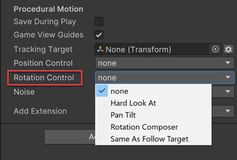

这个 Rotation Control behaviour 指示如何旋转 CinemachineCamera。

Rotation Control 只控制 CMC（CinemachineCamera）的旋转，要控制 CMC 的位置，使用 Position Control。

Cinemachine 包含以下 rotation behaviour：

- None：不过程化旋转 CinemachineCamera。rotation 可以被 object parent 控制，可以被 script 控制，或者被 animation 控制。
- Rotation Composer：保持 Look At Target 总是在 Camera 的画面内（Frame），以及 composition control（画面构图控制，即 target 在画面的哪个位置，如何旋转）和 damping。
- Hard Look At：保持 Look At target 在 camera frame（画面）中心。
- Pan Tilt：旋转 CinemachineCamera，可选地基于 user input。
- Same As Follow Target：设置 camera 的 rotation 以匹配 Tracking Target 的 rotation。Follow Target 可以作为 Camera 的 Look At target，也可以作为传递旋转给 camera 的 target，即 CMC 不一定要看着 Target，而可以随着 Target 旋转而旋转。

