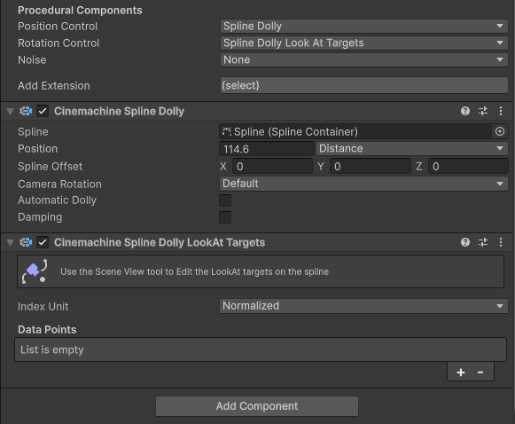
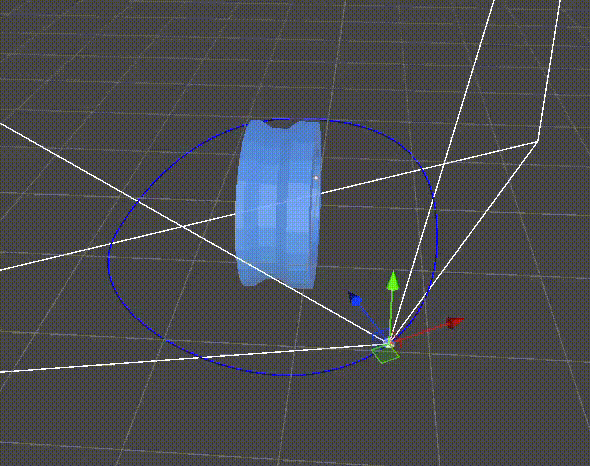
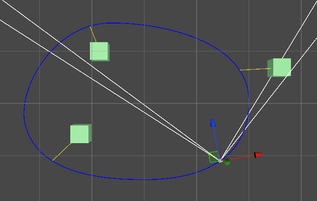

这不是一个单独使用的 Rotation Control，它要结合 Position Control 的 SplineDolly 一起使用。

SplineDolly 可以单独作为 Position Control，但是 SplineDollyLookAtTargets 是配合它使用的。

如图所示，前面是仅有 SplineDolly 时，CC 沿着 Spline 运动，但是方向总是保持不变，后面是使用了 SplineDollyLookAtTargets，CC 总是 Look at 某个位置。这个位置有其 Data Points 定义。如果没有 Data Points，就 Look at 世界空间的原点。

CinemachineSplineDollyLookAtTargets is a component that allows the camera to look at specific points in the world as it moves along a spline。

这个 Control 观察的位置不依赖 LookAt Target，而依赖 Data Points 中指定的位置。每个 DataPoint 提供 4 个属性：

- Transform LookAt：look at 的 target object，它可以是 None，此时取值 (0, 0, 0)

- Vector3 Offset：LookAt 本地坐标系中的偏移，如果 LookAt == None，它就是世界空间中的位置

- float Index

  这个 LookAt take effect 的点在 Spline 上位置，它的单位取决于 Index Unit 的设置：

  - Distance：以正常长度单位 m 来定义 take effect point 在 spline 上的位置
  - Normalized：0-1 之间的相对位置
  - Knot：take effect 位置定义为 Knot 的索引，可以说浮点数，会自动在两个 knot 之间插值

   注意切换不同的单位时，之前定义的 take effect 会保持在原理的位置，组件自动那些位置在新的单位下的 value，并设置到 Index。

- float Easing

  控制这个数据点的 ease in 和 ease out。0 会在 LookAt points 之间线性插值，1 会慢下来并简单暂停旋转，来 look at target。

DataPoints 的原理如下图所示：

3 个绿色的 Cube 为 3 个 Data Points 的 Look At。Look At 的位置还可以使用 Offset 偏移。

然后 Index 为每个 Target 在 Spline 上定义一个 take effect 的位置，即 target 指向蓝色的 spline 的黄线与 spline 的交点，黄线是指示这个位置的辅助线。

当 CC 在 spline 上运动到一个 take effect 位置时，CC 会完全 Look At 这个 Target。而在两个 take effect 位置之间时，CC 会 Look At 两个 Target 中间的位置，具体瞄向哪个位置由 Easing 决定。如果 Easing = 0，就是简单的线性插值。例如在 point1 和 point2 之间，0 完全 look at point1，1 完全 look at point2，0.5 就 look at (point1 + point2) / 2，即中间位置。Easing = 1 时，大部分时间也类似 Lerp，但是在 CC 靠近和开始远离 take effect point 时，会有一个 easing in 和 easing out 的效果，就是 CC 会慢下来并短暂停留观察 target，然后逐渐加速旋转，远离对 target 的观察。注意这个 easing（减慢、加速）只是针对 CC 的旋转来说的，不影响 CC 在 spline 上的移动。

