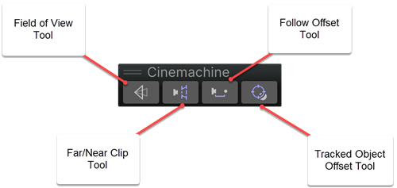
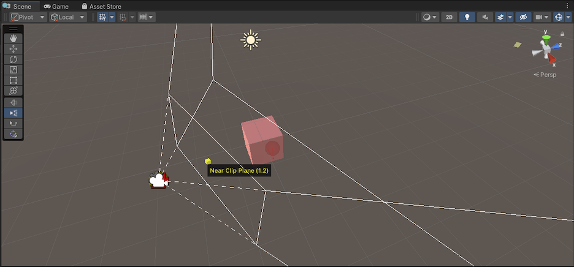
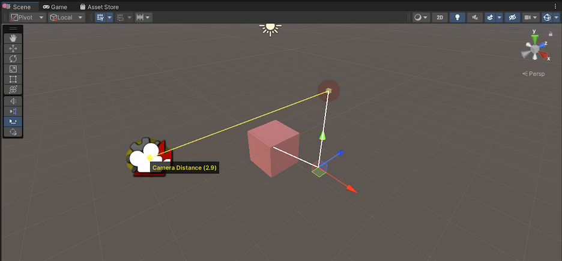
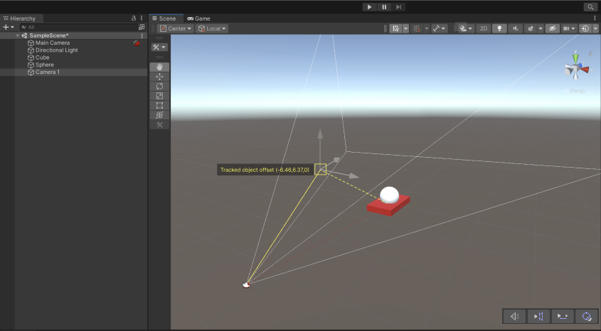

Cinemachine Handle 工具栏是一组3D控制工具，允许您在Scene视图中直观地操控CinemachineCamera的参数。您可以使用这些手柄工具快速高效地交互式调整选中对象的参数，而无需通过Inspector面板进行控制。

当您选择一个关联了手柄控制功能的CinemachineCamera类型时，该工具栏会自动出现在Scene视图工具栏的叠加层中。

# Handle Tools

有 4 个 Handle tools 可用：

- Field of View(FOV)

  FOV Tool 可以调整 Vertical FOV，Horizontal FOV，Orthographic Size，或 Focal Length

  

- Far/Near clip planes

  通过拖拽 points 来调整 far clip plane 和 near clip plane。

  

- Follow offset

  Follow offset 是一个距离 Follow Target 的 offset。可以拖拽 points 调整 Follow offset position。

  

- Tracked object offset

  该操作以相机当前放置位置为基准。如果要跟踪的区域并非 target 的中心时，可以拖动控制点来调整要跟踪的位置到 tracing target 的偏移量。

  
  
