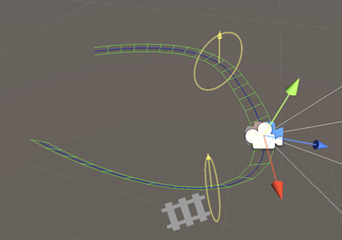
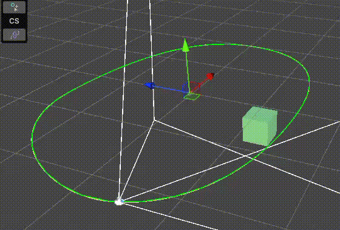

样条路径 Spline path 是由场景中的样条线构成的路径。使用样条线可以指定固定的轨迹来定位或动画化Cinemachine相机。

通过使用 Spline Dolly，可以让 Cinemachine 相机沿着样条路径移动。

要创建一个带 dolly path 的 Cinemachine Camera：

- 选择 GameObject > Cinemachine > Dolly Camera with Spline 菜单，会在 Hierarchy 中创建一个 Cinemachine Camera 和 spline。
- 在 Hierarchy 窗口中，选择新的 dolly spline GameObject。
- 在 Inspector 或 Scene View 中，添加或调整 waypoints。

任何 Unity spline 都可以被用作 Cinemachine。只需要将它拖拽到 Spline Dolly Spline 属性中，CinemachineCamera 会立即跟随这个 spline。

# Cinemachine Spline Roll

该行为为样条线添加旋转（Roll）。旋转是指围绕样条线切线方向的旋转。通过添加数据点，可以设置样条线上特定位置的旋转角度，系统将在这些点之间进行插值计算。此行为还会在场景视图中绘制铁轨样式的辅助线框（Gizmo），以便直观呈现旋转效果。

若将该行为添加到样条线本身，则所有沿该路径移动的 Cinemachine 相机或 Cinemachine Spline Dolly 都将遵循该旋转设定。反之，若将该行为直接添加到Cinemachine相机上，则旋转效果仅对该相机可见。

和 Spline Dolly LookAt Targets 组件一样，为 Spline Roll 指定 DataPoints 的时候，如果使用 Index 设置 data point 在 spline 上的位置，所有的 data points 会自动按照 index 排序，使得 index 总是按照从上到下，从小到大的顺序排列。因此每次修改 index 的时候，可能会看见正在输入的 data point 一下子跳到了列表中的另一个位置。

Spline 上的 Data Point 和 Knot Data 是一样的，都是在 Spline 的某几个位置上定义一些数据，然后在 Spline 上的任何一点，可以像 Spline 的 position 一样为这些 data 插值，具体应用则看程序如何使用这些 data。

例如 Spline Roll 可以在几个关键位置定义一个绕 Spline 切线（Z 轴）的 roll 角度，然后就可以插值得到 Spline 上任何一点的 Roll 角度，则 CC 就可以沿着 Spline 一边运动一边旋转了。

Data Points 和 Knot Data 可以基于 Distance、Normalized、Knot 在 Spline 上的任何一点定义数据，不仅仅只能在 Knot 上定义数据。这些位置称为 waypoints。

# Cinemachine Splien Cart

Cinemachine Spline Cart 是 Cinemachine Spline Dolly 的通用版。后者只用于将 CC 约束在 Spline 上，而 Spline Cart 不是用于 CC 的，而是用于任何 GameObject，它将 GameObject 固定在 Spline，位置和旋转都不能被编辑，只能被 Spline 控制。它和 Spline Dolly 一样通过操作 Position（Distance，Knot，Normalized）在 Spline 上移动 GameObject。Spline 上的切线方向和 Roll（通过 Spline Roll）定义了每一个位置 GameObject 的旋转。

Spline Roll 定义了 Spline 沿着切线的 Up 向量。

Spline Cart 类似 Spline Animate 组件。但是 Spline Animate 不能处理 Spline Roll，GameObject 不能沿着 Spline Roll。

Cinemachine Spline Cart 是一个组件，它将其 GameObject 的变换约束到一条样条线上。可以使用它来沿路径 animate 一个 GameObject，或者将其作为 CinemachineCamera 的跟踪目标。

- Spline：要跟随的 spline
- Update Method：如果 speed 不为 0，何时移动 cart。Update 或 LateUpdate 用于正常 updating，Fixed Update 用于物理系统同步更新
- Position Units：测量 Position 的 unit
  - Knot：spline 的控制点，0 为第一个控制点，1 为第二个控制点。非整数值表示控制点直接的插值位置
  - Distance：沿着 spline 的距离，使用正常的距离长度单位。0 表示 spline 起点，1 表示距离起点 1m 的位置
  - Normalized：归一化距离，0 表示 spline 起点，1 表示 spline 终点

- Speed：Cart 以这个速度移动。value 根据 Position Units 解释
- Position：沿样条线放置推车（Cart）的位置。可以直接对此进行动画制作，或者如果速度不为零，则会根据更新方法（Update Method）指定的时间自动更新该位置。该值的解释依据位置单位（Position Units）而定。
- Automatic Dolly：是否沿着 spline 自动移动
- Method：控制自动推车移动的方式。可以通过编写自定义的 SplineAutoDolly.ISplineAutoDolly 类来实现对此功能的扩展
  - None：不进行自动推车移动。您必须通过设置 PathPosition 来手动控制 Cinemachine 相机在样条线上的位置
  - Fixed Speed：Camera 沿着 path 以固定速度移动，可以设置速度值
  - Nearest Point To Target：将相机定位在样条线上距离追踪目标位置最近的点上。Cinemachine相机中必须设置追踪目标（Tracking Target）。还可以指定相对于最近点的偏移量，以微调相机的位置。

**注意，Cinemachine Camera 除了 Hard Lock，不会位于 Target 的位置上，通常是跟在 Target 后面，或者围绕着 Target 的球面或曲线上，即它的位置被约束在球面或曲线上，但是会 Look At Target。这个扩展就是为 Camera 指定一个 Spline**

