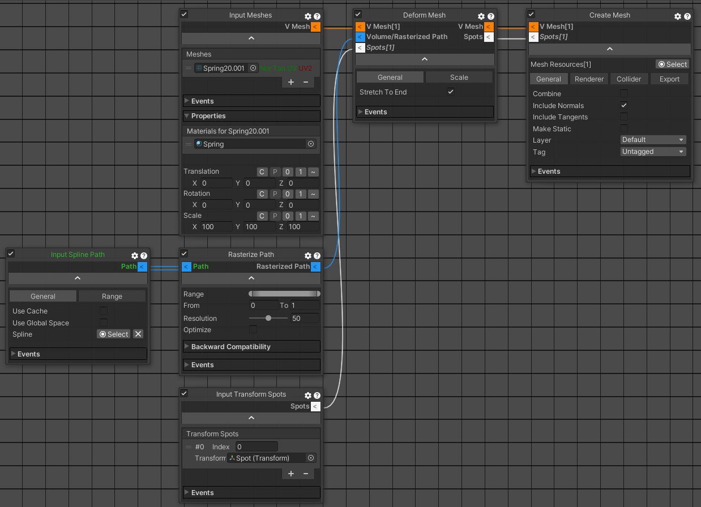

# Curvy Spline Misc

## Deform Mesh

Curvy Generator Deform Mesh Graph：



其中 Deform Mesh 的 Spots[] 属于一组位置。在 Curvy Spline 中，spot 就是一个位置，任何需要位置的地方，都用 slot 表示。例如沿着曲线散布一些 GameObjects。这里 Deform Mesh 使用的 spot 用来沿着曲线生成 mesh，每个 slot 作为起点会生成一个 mesh。所有的 mesh 沿着曲线排列。Curvy Generator 默认 Deform 模板创建的 Graph 使用 RasterizePath 和 InputMesh 自动计算可以沿着曲线创建多少个 mesh。这样的 mesh 都是有一定长度的，并且只会生成整数个 mesh。当曲线长度不足以生成整数个 mesh，就会向下 floor clamp，直到曲线长度增加到可以在创建一个新的 mesh。

Deform Mesh 的 Stretch To End 选项可以让生成的 mesh 序列收尾都位于曲线两端，而在 mesh 中间分配多余空间，类似 FlexBox 布局。

要只沿着曲线 deform 一个 mesh，需要明确指定只用一个 spot（因为一个 spot 创建一个 mesh）。删除模板创建的 Input Mesh Spots，添加 InputTransformSpots，在场景中创建一个 empty gameobject 作为 spot 添加到 Input Transform Spots 中。为了使 mesh 两端完全位于曲线的两端，将 spot gameobject 添加到第一个 CP 作为 child，并设置 localPosition = zero，这样 mesh 起始端就会在曲线的起始点（因为 mesh 在 spot 的位置创建。严格来说，mesh 只能在曲线上的位置创建，如果 spot 不再曲线上，会调用 spline 的方法获得距离 spot 最近的曲线上的位置，作为 mesh 的起始点）。然后设置 Deform Mesh 的 Stretch To End，将 mesh 的末尾和曲线的末尾对齐。这样，mesh 就可以完全随着曲线拉伸变形了。

要控制 mesh 在曲线上的伸缩范围，可以设置 BuildRasterizedPath 的 From/To 属性。但是当前版本的 Curvy Spline 有一些问题：

- From 和 To 不能相等，To 必须完全大于 From，否则生成的 CGPath 是 null，会导致 Deform Mesh 模块总是抛出 ArgumentNullException
- To 使用 Mathf.Max(From, value) 确保总是大于等于 From，但是 From 没有这样的检查。因此在设置范围的时候，必须先设置 From，再设置 To，才能确保 To 总是大于等于 From
- From/To 使用 Repeat 将 value clamp 在 0-1 之间，但是为了使 value=1 时仍然 clamp 为 1，CurvySpline 提供了一个特定的 DTMath.Repeat，它与 Mathf.Repeat 类似，但是 DTMath.Repeat(1，1) 返回1 而不是 0。然而，From 中使用了这个定制的 Repeat，To 中使用的还是 Mathf.Repeat，这应该是作者的疏漏。这导致当设置 To = 1 的时候，实际 value = 0，导致 From 不可能完全小于 To，因此 CGPath = null，Deform Mesh 抛出 ArgumentNullException。当前可以手动修改 BuildRasterizedPath.cs，将 To 的 Maths.Repeat 替换为 DTMath.Repeat。


```C#
public float From
{
    get => m_Range.From;
    set
    {
        float v = DTMath.Repeat(
            value,
            1
        );
        if (m_Range.From != v)
        {
            m_Range.From = v;
            Dirty = true;
        }
    }
}

public float To
{
    get => m_Range.To;
    set
    {
        float v = Mathf.Max(
            From,
            value
        );
        if (ClampPath)
            v = Mathf.Repeat(
                value,
                1
            );
        if (m_Range.To != v)
        {
            m_Range.To = v;
            Dirty = true;
        }
    }
}
```

```C#
/// <summary>
/// Much like Mathf.Repeat(), but DTMath.Repeat(v,v) returns v instead of 0
/// </summary>
public static float Repeat(float t, float length)
    => (t == length) ? t : t - Mathf.Floor(t / length) * length;
```

最后，要保证 From 和 To 之间至少保持一定的距离，避免抛出 ArgumentNullException。

