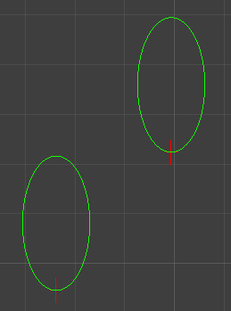

# Gizmos

Gizmos 用于在 Scene view 绘制可视化辅助调试信息。

所有 Gizmos 绘制在 OnDrawGizmos 和 OnDrawGizmosSelected 函数中。

OnDrawGizmos 每一帧调用，OnDrawGizmos 中绘制的所有 gizmos 都是可以拾取的。OnDrawGizmosSelected 只在脚本所在的 gameobject 被选择时才会调用。

Gizmos.matrix 用来获取或设置绘制使用的矩阵。可以设置任意 TRS 矩阵来调整 Gizmos 的绘制。

```C#
Matrix4x4 om = Gizmos.matrix;
Gizmos.matrix = Matrix4x4.Scale(new Vector3(0.5f, 1, 1)) * Gizmos.matrix;
DebugExtension.DrawCircle(center, Vector3.forward, Color.green, size);
});
Gizmos.matrix = om;
```

这里将 Gizmos.matrix 左边乘以一个缩放矩阵，缩放矩阵使 X 轴缩小为原来的一半，这样之后绘制的圆形就变成了椭圆。



GUI.matrix 也是一样。
