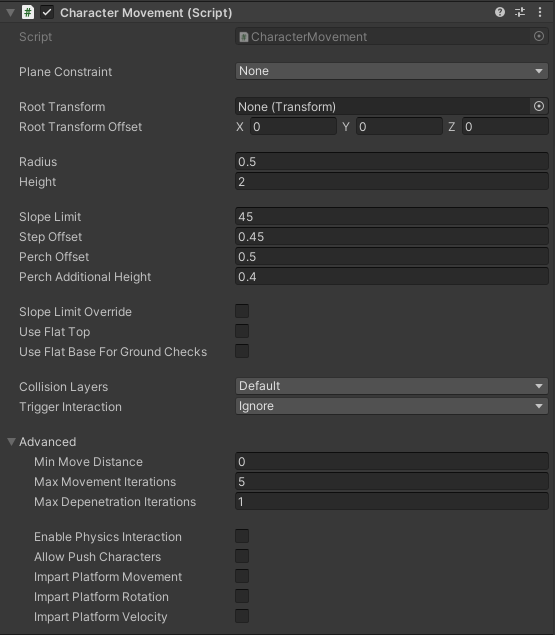

# Description

CharacterMovement 组件是一个强健和功能丰富，完全 kinematic character controller，也称为一个 motor。

它已经被开发为 Unity CharacterController 的完全替换体，同时保持相似的工作流，通过诸如 Move/SimpleMove 方法，同时以大量高级功能和优点超越它。

Character Controller 利用直接的 collisions 约束的运动，消除使用 Rigidbody 带来的复杂性。

与动态 Rigidbody 不同，CharacterController 不会被 forces 影响，只会在调用 Move 函数时才开始运动。接下来，它执行期望的移动，同时还遵循 collision constraints。

在游戏的早期日子，游戏不依赖真正的 physics engine（例如 PhysX SDK，Unity 底层的物理引擎）。但是，它们仍然使用一个角色控制器在关卡中移动 players。诸如 Quake 或 Doom 的游戏使用定制的 code 用于碰撞检测和响应，通常构成整个游戏的仅有的物理系统。尽管这些实现缺失大量物理功能，它们严重依靠精细调整的值来达成沉浸式玩家体验。管理它们行为的专门算法通常称为 collide and slide 算法，经过数十年的精细调整实现优化的性能。

CharacterMovement 组件是此类算法的一种实现，为角色控制提供了可靠且被广泛认可的行为。

# CharacterMovement 组件



## 属性

- new Transform transform：缓存的 character transform
- new Rigidbody rigidbody：Character 的 rigidbody
- RigidbodyInterpolation interpolation：Rigidbody 的 interpolation 设置
- new Collider collider：Character 的 capsule collider
- Transform rootTransform：avatar 的 root bone
- Vector3 rootTransformOffset：root transform 会被放在这个 offset 上
- Vector3 position：Character 的当前位置
- Quaterion rotation：Character 的当前 rotation
- Vector3 worldCenter：Character 在世界空间中的位置
- Vector3 updatedPosition：Character 的更新位置
- Quaternion updatedRotaion：Character 的更新旋转
- ref Vector3 velocity：
  Character 的当前相对速度。速度是相对的，因为它不会追踪在此之外发生的 transform 的移动，例如当角色被 parent 到另一个移动的 transform 下时，比如一辆正在移动的车辆。
- float speed：Character 的速度
- float forwardSpeed：character 沿着 forward 向量的速度
- float sidewaysSpeed：Character 沿着它的 right vector 的速度
- float radius：Character 的 capsule collider 半径
- float height：Character 的 capsule collider 高度
- float slopeLimit：能作为 walkable slope 的最大角度（角度，不是弧度）
- float stepOffset：视为有效 step（台阶）的最大高度（米）
- float perchOffset

  允许 Character 停留在一个 surface 的边缘，如果 Character 的 position 到 edge 的水平距离小于这个值
  需要注意的是，我们仍然强制使用 stepOffset 来启动上台阶动作，这仅仅允许角色能够悬挂在边缘或稍微更高地离开地面

- float perchAdditionalHeight：当角色悬停在平台 ledge 边缘时，在判断可悬停在可行走地面之上的高度时，将此额外距离加到 stepOffset 上
- bool slopeLimitOverride：是否允许外部 slope limit override
- bool useFlatTop：开启时，将 head collision 当作好像 character 使用一个 flat top 的 shape
- bool useFlatBaseForGroundChecks

  执行 ground checks 时，就好像 character 使用一个 flat base，即消除 foot collision。这会避免 characters 在一个 ledge 侧边时缓慢下滑。
  Capsule 底部的圆滑部分沿着平台边缘缓慢下滑。

- LayerMask collisionLayers：collision detection 期间考虑的 Layers
- QueryTriggerInteraction triggerInteraction：决定 Character 应该如何与 triggers 交互
- bool detectCollisions：是否应该执行碰撞检测
- CollisionFlags collisionFlags：上一次 Move 调用中，capsule 的哪个部分与环境碰撞了
- bool isConstraintedToPlane：Character movement 是否约束到 plane 上
- bool constrainToGround：当在 walkable ground 时，运动是否应该约束在地面上。触发 ground constraint
- bool isConstrainedToGround：Character 是否应该约束在 walkable ground
- bool isGroundConstraintPaused：是否临时暂停 ground constraint
- float unconstrainedTimer：当 isGroundConstraintPaused 开启时，这个值指示临时暂停的时间
- bool wasOnGround：Character 在上一个 Move 调用时是否在 ground 上
- bool isOnGround：Character 当前（本次 Move 调用）是否在 ground 上
- bool wasOnWalkableGround：上一次 Move 调用时，character 是否在 walkable ground
- bool isOnWalkableGround：当前 Character 是否在 walkable ground
- bool wasGrounded：上一次 Move 调用时，character 是否在 walkable ground 并且约束在地面上
- bool isGrounded：当前 character 是否在 walkable ground 并且约束在地面上
- float groundDistance：到 ground 的距离（可正可负）
- Vector3 groundPoint：当前 ground impact point
- Vector3 groundNormal：当前 ground normal（Ground GameObject Transform 的 up vector）
- Vector3 groundSurfaceNormal：当前 ground surface normal（Ground mesh 的表面 up 向量）
- Collider groundCollider：当前 ground collider
- Transform groundTransform：当前 ground transform
- Rigidbody groundRigidbody：碰撞到的 collider 的 Rigidbody。如果 collider 没有挂载到 Rigidbody，则为 null
- FindGroundResult currentGround：包含当前 ground 信息的结构体
- MovingPlatform movingPlatform：包含当前 moving platform（如果有的话）信息的结构体
- Vector3 landedVelocity：当 landed（例如 isGrounded）时的临时 velocity
- bool fastPlatformMove：如果确定所乘坐的移动平台不会与静止的世界障碍物发生碰撞，将此选项设置为 true
- bool impartPlatformMovement：Character 是否随着它所站在的 moving platform 一起移动。impart：继承

  ```
  角色是否随其所站立的移动平台一起移动  

  该句描述的是游戏开发中一个常见的机制问题：角色与移动平台的跟随关系。具体而言，它探讨的是当角色站在一个处于运动状态的平台（如移动的车辆、旋转的平台或滑动的地板）上时，角色是否会同步跟随该平台的运动而改变自身位置。  

  在游戏开发中，这一机制的实现通常涉及物理引擎的配合（如Unity的Rigidbody组件、Unreal Engine的CharacterMovementComponent）以及父子关系的设置。例如，若将角色设为平台的子物体，平台移动时会自动带动角色；若通过脚本控制，则需实时更新角色的位置以匹配平台的运动轨迹（如通过线性速度或位移计算）。这一功能的实现直接影响玩家的操作体验，尤其是在横版过关、平台跳跃或载具驾驶等场景中，确保角色与环境的互动符合预期是设计的关键环节。
  ```

- bool impartPlatformRotation：Character 是否接收它所在的 moving platform 的旋转变化。如果为 true，Character 与 Platform 一起旋转
- bool impoartPlatformVelocity：如果为 true，则在从平台上跳跃或掉落时，会继承该平台的当前速度
- bool enablePhysicsInteraction：开启时，当 player 走进 dynamic rigidbodies 时，会与其交互
- bool physicsInteractionAffectsCharacters：开启时，当 player 走进其他 characters 时，会与其交互
- float pushForceScale：当走进 rigidbodies 时，应用到 Character 的 force（根据 mass 和相对速度计算的 force）乘以这个系数

## 方法

- void SetDimensions(float characterRadius, float characterHeight)

  设置 character 的 bounding volume（capsule）的 dimensions

- void SetHeight(float characterHeight)

- Vector3 GetPosition()

  返回 Character 的当前位置

- void SetPosition(Vector3 newPosition, bool updateGround=false)

  更新 character 的当前位置。如果 updateGround 为 true，会查找 ground，并更新 character 的当前 ground result

- Quaternion GetRotation()

  返回 Character 的当前旋转

- void SetRotation(Quaternion newRotation)

- void SetPositionAndRotation(Vector3 newPosition, Quaternion newRotation, bool updateGround=false)

- RotateTowards(Vector3 worldDirection, float maxDegreesDelta, bool updateYawOnly = true)

  旋转 character 朝向给定方向（在世界空间），使用 maxDegreesDelta 作为 rotation 变化的速率。

  - worldDirection：世界空间中的 target 方向
  - maxDegreesDelta：每秒改变的 rotation（度/秒）
  - updateYawOnly：如果为 true，旋转只在 character 的 plane 上执行（被它的 up-axis 定义）

- Vector3 GetPlaneConstraintNormal()

  当前 plane constraint normal 向量

- SetPlaneConstraint(PlaneConstraint constrainAxis, Vector3 planeNormal)

  定义限制运动的 axis，使得 movement 不能沿着给定的 axis 运动

- Vector3 ConstrainDirectionToPlane(Vector3 direction)

  ​​返回给定方向向量（已归一化）在当前约束平面上的投影​。

- Vector3 ConstrainVectorToPlane(Vector3 vector)

  将给定向量约束到当前 PlaneConstraint（如果有的话）

- void AddForce(Vector3 force, ForceMode forceMode = ForceMode.Force)

  添加一个 force 到 Character 上。这些 forces 会累积并在 Move 调用期间应用。

- void AddExplosionForce(float strength, Vector3 origin, float radius, ForceMode forceMode = ForceMode.Force)

  Applies a force to this Character that simulates explosion effects.
  The explosion is modeled as a sphere with a certain centre position and radius in world space; 
  normally, anything outside the sphere is not affected by the explosion and the force decreases in proportion to distance from the centre.
  However, if a value of zero is passed for the radius then the full force will be applied regardless of how far the centre is from the rigidbody.
  The force direction is from the given origin to the Character center.

- void LaunchCharacter(Vector3 launchVelocity, bool overrideVerticalVelocity = false, bool overrideLateralVelocity = false)

  - launchVelocity: The desired launch velocity
  - overrideVerticalVelocity: If true replace the vertical component of the Character's velocity instead of adding to it
  - overrideLateralVelocity: If true replace the XY part of the Character's velocity instead of adding to it

  ​​为角色设置待处理的发射速度。该速度将在下一次移动调用时被处理​​

  关键术语解析

  1. ​​待处理的发射速度（Pending Launch Velocity）​​

     指角色当前未被应用的、等待执行的初始速度。它通常用于实现“爆发性移动”（如跳跃、冲刺或被击飞），是角色运动状态的临时存储变量。与实时速度（当前帧的运动速度）不同，待处理速度需要经过游戏引擎的移动逻辑处理后，才会生效为角色的实际运动。
  
  2. ​​Character（角色）​​
  
     游戏中的可控制或AI驱动的实体，具备位置、速度、碰撞体等属性。角色的运动通常由物理引擎（如Unity的Rigidbody、Godot的CharacterBody2D）或自定义移动脚本控制，确保符合物理规则（如重力、碰撞）。

  3. ​​Move Call（移动调用）​​
  
     游戏引擎中触发角色位置更新的函数（如Unity的CharacterController.Move()、Godot的move_and_slide()）。该函数会根据角色的当前速度、加速度等参数，计算下一帧的位置，并处理碰撞、滑动等物理效果。待处理速度会在Move Call中被读取并应用到角色的运动中。

  当调用“Set a pending launch velocity”方法时，系统会将指定的速度向量（包含大小和方向）存储到角色的“待处理速度”属性中。该速度不会立即改变角色的位置，而是等待下一次Move Call的到来。在Move Call执行时，引擎会将待处理速度与角色的当前速度合并（或替换，取决于具体实现），然后根据合并后的速度计算角色的新位置，并处理碰撞、重力等物理效果。这种方式确保了速度变化的有序性，避免了速度的突变，使角色运动更加平滑和可控。

  应用场景举例

  - ​​跳跃机制​​：当玩家按下跳跃键时，游戏会为角色设置一个向上的待处理速度（如Vector3.up * jumpForce）。在下一次Move Call中，该速度会被应用，使角色向上移动，随后受到重力影响逐渐下落。
  - ​​冲刺效果​​：玩家按下冲刺键时，角色会获得一个临时的高速待处理速度（如currentSpeed * sprintMultiplier）。Move Call会根据该速度增加角色的移动距离，实现冲刺效果。
  - ​​击飞效果​​：当角色被敌人攻击时，敌人会给角色施加一个向后的待处理速度（如-transform.forward * knockbackForce）。Move Call会处理该速度，使角色向后滑动，模拟被击飞的效果。
  
- void AttachTo(Rigidbody parent)

  允许你显式挂载 Character 到要给 moving platform，使得它不依赖 ground state。

- void PauseGroundConstraint(float unconstrainedTime = 0.1f)

  临时关闭 ground constraint，允许 Character 临时可以自由离开地面。例如 LaunchCharacter，Jump 等等。

- CollisionFlags Move(float deltaTime)

  沿着 Character 当前 velocity 移动 character。

  ​​执行碰撞约束移动，解决此移动过程中发现的任何碰撞/重叠​。

  游戏开发或物理仿真中​​碰撞约束移动​​（Collision-Constrained Movement）的核心逻辑，即在执行角色或物体的移动操作时，系统会主动检测并处理移动路径中的碰撞与重叠问题，确保移动的合理性与物理真实性。

  关键术语解析

  1. ​​碰撞约束移动（Collision-Constrained Movement）​​

     指移动过程中需遵循​​碰撞约束​​（Collision Constraint）的规则——通过物理引擎或算法，强制物体在移动时不穿透其他物体（如墙壁、地面、其他角色），并正确响应碰撞（如反弹、停止或滑动）。这种约束是物理仿真的基础，避免出现“穿模”等不真实现象。

  2. ​​解决碰撞/重叠（Resolving Collisions/Overlaps）​​

     是碰撞约束的具体实现步骤：当检测到移动中的物体与其他物体发生​​碰撞​​（物体表面接触且有穿透趋势）或​​重叠​​（物体内部交叉）时，系统会通过调整物体的位置、速度或施加冲量，使其恢复到合法状态（无穿透、符合碰撞规则）。例如，角色撞墙时会停止前进，或从墙上反弹。

  3. ​​移动调用（Movement Call）​​

     指触发物体移动的函数或逻辑（如游戏引擎中的CharacterController.Move()、Rigidbody.AddForce()）。在调用移动函数时，系统会自动整合碰撞约束逻辑，确保移动的每一步都符合物理规则。例如，Unity的CharacterController组件在移动时会自动检测碰撞，并调用约束解决算法调整位置。

- CollisionFlags Move(Vector3 newVelocity, float deltaTime)

  沿着给定的 velocity 向量移动 character。

  这执行碰撞约束的运动，解决运动过程中发现的任何碰撞、重叠。

  - newVelocity：当前帧的更新速度。它通常是重力引起的垂直运动和 character 移动时的水平运动的合成。
  - deltaTime：模拟的 deltaTime。如果不指定，默认为 Time.deltaTime。

  返回 CollisionFlags。它指示 collision 的方向：None，Sides，Above，Below。

- CollisionFlags SimpleMove(Vector3 desiredVelocity, float maxSpeed, float acceleration,
            float deceleration, float friction, float brakingFriction, Vector3 gravity = default,
            bool onlyHorizontal = true, float deltaTime = 0.0f)

  使用基于摩擦的物理模型更新 character 的 velocity，并且沿着更新的 velocity 移动 character。

  这会执行碰撞约束的运动，并在移动过程中解决任何发现的碰撞、重叠。

  - desiredVelocity：目标速度
  - maxSpeed：grounded 时的最大速度。当 falling 时（not-grounded）还决定了最大的水平速度
  - acceleration：加速时（例如 desiredVelocity != Vector3.zero），速度的改变率（米/秒/秒）
  - friction：影响运动控制的设置。更高的值允许更快地改变速度
  - brakingFriction：停止 braking 时应用的摩擦 Friction（drag 阻尼）系数（当 desiredVelocity == Vector3.zero，或者如果 character 超过了最大速度）
  - gravity：当前 gravity 力，默认为 0
  - onlyHorizontal：确定当 falling（not-grounded）时垂直速度是否应该忽略，来阻止重力效果
  - deltaTime：模拟的时长，deltaTime

  返回 CollisionFlags。它指示 collision 的方向：None，Sides，Above，Below。

- int GetCollisionCount()

  返回上一次 Move 调用期间发现的 collisions 数量。

- CollisionResult GetCollisionResult(int index)

  获取上一次 Move 调用的第 index 个 CollisionResult。

- void IgnoreCollision(Collider otherCollider, bool ignore = true)

  使 character 忽略与 otherCollider 的所有 collisions。

- void IgnoreCollision(Rigidbody otherRigidbody, bool ignore = true)

  使 character 忽略与 otherRigidbody 挂载的所有 colliders 的碰撞。

- void CapsuleIgnoreCollision(Collider otherCollider, bool ignore = true)

  使 character collider（例如 CapsuleCollider）忽略与 otherCollider 的所有 collisions。

  注意如果 otherCollider 在 CollisionLayers mask 中，在 Move 调用中，character 仍然可以与 otherCollider 碰撞。

/// <summary>
/// Sweeps the character's volume along its displacement vector, stopping at near hit point if collision is detected.
/// Returns True when the rigidbody sweep intersects any collider, otherwise false.
/// </summary>

- bool MovementSweepTest(Vector3 characterPosition, Vector3 sweepDirection, float sweepDistance,
    out CollisionResult collisionResult)

  ```return MovementSweepTest(characterPosition, velocity, sweepDirection * sweepDistance, out collisionResult)```

  沿着它的 displacement vector 扫描 character 的 volume，如果检测到碰撞，在最近的 hit point 停止。

  Displacement Vector（位移向量）：物理学中用于描述物体位置变化的核心矢量。它将物体的运动简化为从初始位置执行最终位置的向量，包含移动距离和移动方向两个关键信息。

  路径是物体移动的完整路线，位移向量只从初始位置执行最终位置。

  位移向量是分析物体运动的基础工具，用于计算速度、加速度等物理量，也是牛顿运动定律、动能定理的核心理论基石。

  当 Rigidbody 扫描到任何 collider，返回 True，否则返回 False。

- void ComputeGroundDistance(Vector3 characterPosition, float sweepRadius, float sweepDistance, float castDistance, out FindGroundResult outGroundResult)

  计算从 capsure 底部 sphere 到 ground 的距离，并存储在 collisionResult 的结果中。

  该距离是指胶囊体（Capsule）下半球首个撞击点所扫过的距离；若为射线检测（Raycast），则指从胶囊体底部起始的距离。

- void FindGround(Vector3 characterPosition, out FindGroundResult outGroundResult)

  为给定位置的 capsule 执行一个垂直射线扫描，查找 ground。

  如果对向下扫描的结果 ShouldComputePerchResult() 返回 true，Character 会尝试停留 perch。

  如果 collision 关闭（detectCollisions == false），不会发现 ground。

/// <summary>
/// Checks if any colliders overlaps the character's capsule-shaped volume in world space using testHeight as capsule's height.
/// Returns true if there is a blocking overlap, false otherwise.
/// </summary>

- bool CheckCapsule()

  检测是否有任何 colliders 与 character 的 capsule-shaped volume 在世界空间中重叠。

- bool CheckHeight(float testHeight)

  检测是否有任何 colliders 与 character 的 capsule-shaped volume 在世界空间中重叠，使用 testHeight 作为 capsule height。

  如果有一个 blocking 重叠，返回 True。

- bool Raycast(Vector3 origin, Vector3 direction, float distance, int layerMask, out RaycastHit hitResult, float thickness = 0.0f)

  投射要给射线，从 origin，沿着 direction 方向，以 length 为长度，检测场景中的特定 colliders（layerMask）。

- int OverlapTest(Vector3 characterPosition, Quaternion characterRotation, float testRadius,
    float testHeight, int layerMask, Collider[] results, QueryTriggerInteraction queryTriggerInteraction)

  在 physics 世界中检测 capsule，返回所有重叠的 colliders。返回 overlapped colliders 的数量。

- Collider[] OverlapTest(int layerMask, QueryTriggerInteraction queryTriggerInteraction, out int overlapCount)

  在 physics 世界中检测 capsule，返回所有重叠的 colliders。返回 overlapped colliders 的数量。

  返回 overlapped colliders 的数组。

- Collider[] OverlapTest(Vector3 characterPosition, Quaternion characterRotation, float testRadius,
    float testHeight, int layerMask, QueryTriggerInteraction queryTriggerInteraction, out int overlapCount)

  在 physics 世界中检测 capsule，返回所有重叠的 colliders。返回 overlapped colliders 的数量。

  返回 overlapped colliders 的数组。

## 回调函数

- delegate bool ColliderFilterCallback(Collider collider);

  让你定义 character 是否应该与给定的 collider 碰撞。

  如果过滤（忽略）给定的 collider，返回 True，如果碰撞，返回 False。

- delegate CollisionBehaviour CollisionBehaviourCallback(Collider collider);

  让你定义与 collider 碰撞时，character 的 behaviour。

  返回 collision behaviour 的 flags（character 的 behaviour）。

- delegate void CollisionResponseCallback(ref CollisionResult inCollisionResult, ref Vector3 characterImpulse, ref Vector3 otherImpulse);

  让你修改与 dynamic objects 的碰撞响应。例如，计算结果冲量或应用点（CollisionResult.point）。

- ColliderFilterCallback colliderFilterCallback

  让你定义 character 是否应该与给定的 collider 碰撞。

  如果过滤（忽略）则返回 true，如果碰撞返回 false。

- CollisionBehaviourCallback collisionBehaviourCallback

  定义与 collider 碰撞时 character 的行为。

- CollisionResponseCallback collisionResponseCallback

  让你修改与 dynamic objects 的碰撞响应。例如，计算结果 impulse 和应用点（CollisionResult.point）。

## 事件

- event CollidedEventHandler Collided

  当在 Move 期间，character 与其他 collider 碰撞时触发的事件。可以多次调用。

- event FoundGroundEventHandler FoundGround

  当作为向下扫描的结果（FindGround 方法），character 查找到 ground（walkable 或 non-walkable）时触发的事件。


