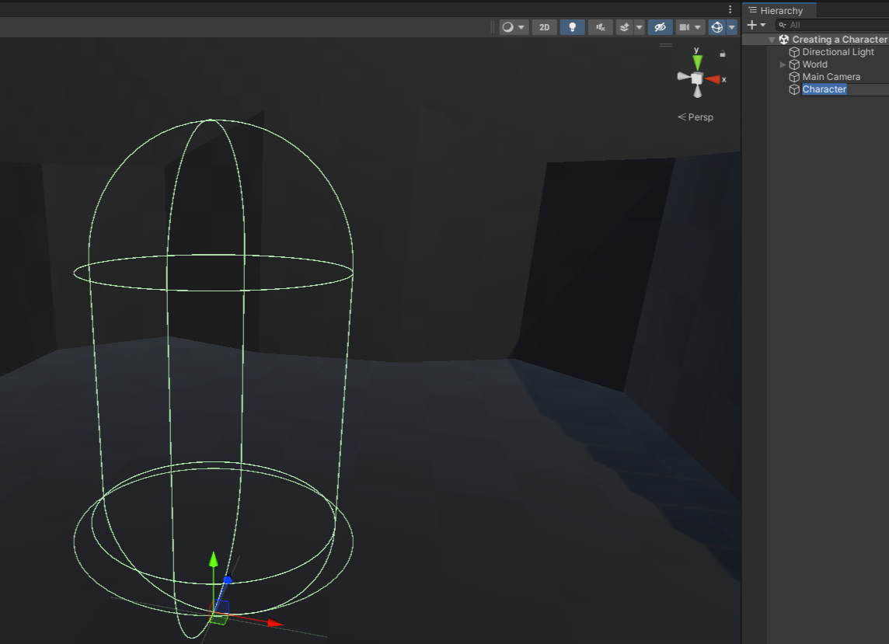

# Creating a Character

- 右键点击 hierarchy 窗口，选择 ECM2 > Character，这会创建一个名为 Character 的空 character（没有视觉表现）
  
  确保它的 origin 设置为 (0, 0, 0)，这会在 parenting model 时免去很多麻烦。

  

- 将你的 Model parent 到新创建的 Character GameObject 下面。

- 在 CharacterMovement 组件中，调整 radius 和 height，这会自动配置 character 的 capsule collider 来更好地匹配 character 模型

这样，就有了一个完全配置和可用的 character。但是现在还不能控制它，为此需要创建一个脚本，解析输入，并调用 Character 的方法来移动它。
