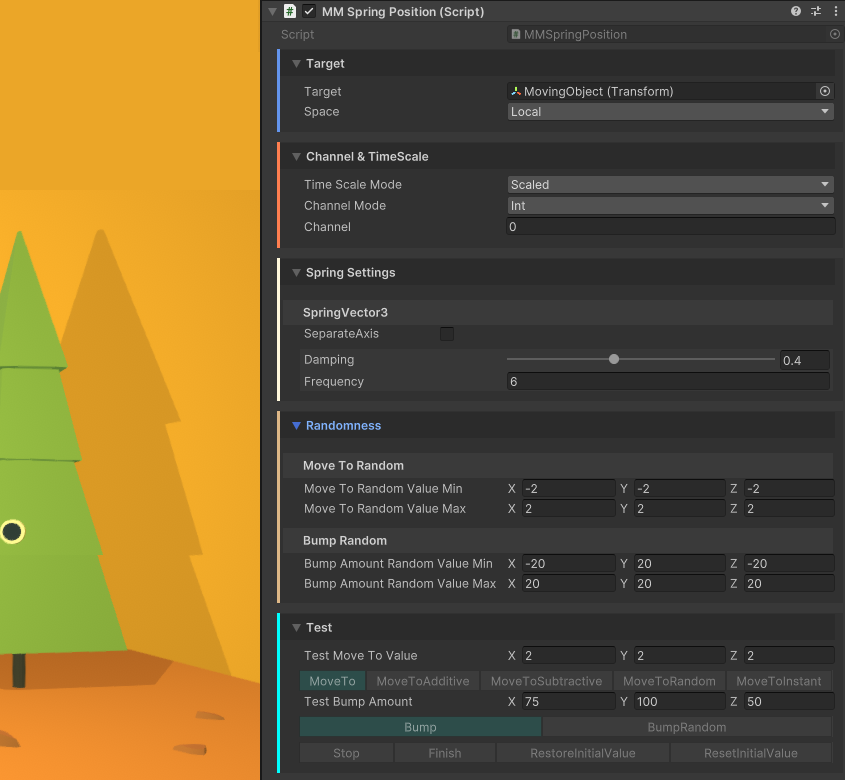
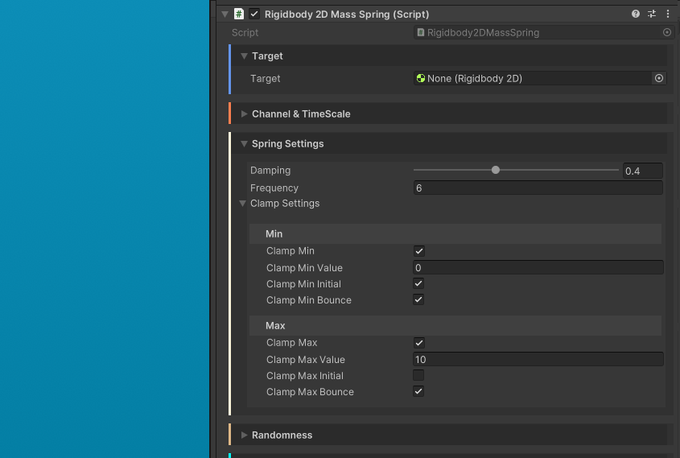

## Introduction

你对插值的概念应该不陌生——就是让一个数值（无论是浮点数、向量还是颜色等）从初始值A平滑过渡到目标值B的过程。FEEL系统提供了丰富的插值实现方式，从基础的线性插值（Lerp）到高级曲线控制一应俱全。更令人惊喜的是，它还支持将数值绑定到 Spring "弹簧"系统，让这个虚拟弹簧自然地驱动数值随时间变化。这种设计能产生极其自然的动态效果（就像玩现实中弹簧玩具那样充满乐趣），而且允许多个弹簧效果同时作用而不会产生冲突，多个弹簧效果还能叠加累积。值得一提的是，FEEL的弹簧系统经过深度优化，完全独立于帧率运行，使用起来更是简单直观。接下来就让我们看看它能如何为你的游戏增色添彩！

在深入研究之前，你可能想先体验一些演示。虽然Feel中的大多数演示都以某种形式展示了弹簧效果，但FeelSprings演示场景是对这一概念的最佳入门，它就像一个关于弹簧效果的小型系列教程。你还可以查看MMFollowTargetDemo场景和FeelSquashAndStretch场景，以获取更多示例。

## Core concepts

在“经典”插值中，你可以要求代码将一个对象从A点移动到B点，同时指定A点和B点、移动的动画曲线以及持续时间；而使用弹簧来实现动画则有所不同。在这里，我们无需为物体的移动指定持续时间，只需告诉弹簧移动到一个新值，或者对弹簧施加一个“冲击”，弹簧的设置将决定它的运动行为。

- Settings

  有两个主要 settings 定义 spring 的行为：

  - Damping：该参数决定了弹簧在受到扰动后恢复至静止状态的速度快慢。你可以将其理解为现实世界中弹簧的刚度或张力——阻尼系数取值范围为0到1：数值越接近0，表示弹簧越松弛；数值越接近1，则表示弹簧越紧绷。
  - Frequency：确定每秒弹簧震荡多少次来回到它的静止位置

  这个两个值的组合可以帮助创建非常不同的结果，不要害怕尝试不同组合来得到你想要的行为。

- Interactions

  有两个主要的方式来和 spring 交互：

  - MoveTo 指示 spring 移动到一个新的值。你可以简单指定一个新的值，
  - Bump 会按照你指定的幅度 “push” 弹簧的值，基本上是让弹簧的值朝某个方向变化。并且随着时间推移，根据其设置，弹簧的值会恢复到“bump”之前的状态。在对弹簧施加“bump”时，你要记住，弹簧的设置会影响“bump”的幅度。一个非常松弛的弹簧不需要很大的“bump”就能移动较远的距离，而一个非常紧绷的弹簧则需要较大的力。

   In both MoveTo and Bump cases, it’s one call, one feedback, one event, or one line of code

- Springs in Feel

  如何使用 springs，有一些主要的方式：

  - Spring Components：有 70 个 spring 和 counting，这些是你可以一键添加的组件，并可以控制大量的属性，从 light 的强度到 image 的颜色。你可以使用 spring feedbacks，events，或者直接调用
  - Feedbacks：一些 feedbacks 带有内置 spring 行为，就像 Position Spring 或 Scale Spring feedback
  - Spring API：Feel 带有一个高级易于使用的 Spring API，然后你可以在自己的 code 中用来添加 juice 到任何东西上
  - Other Components：在Feel的各个组件和辅助工具中，你都能发现 Spring 机制的应用实例。比如MMFollowTarget辅助工具，只需简单点击几下，就能通过弹簧系统或其他方式快速设置物体跟随行为

## Spring Components

最便捷的入门方式是直接使用Feel内置的70多种弹簧组件（完整列表见下文）。只需确定你想要影响的物体属性，选择合适的弹簧组件，然后通过"AddComponent"菜单将其添加到游戏对象上即可。



Inspector 划分为 4 个主要区域：

- Target

  这里你可以为 spring 指定 Target。如果为空，spring 会自动尝试和查找 spring 所在组件上的相应组件。还可以找到特定于那个 spring 的 fields

- Channel and TimeScale

  这里你可以定义 channel 选项，也可以选择 spring 是否应该运行在 scaled 或 unscaled time（unscaled 不会被 timescale 影响）

- Spring Settings

  这里你可以定义 spring 的 damping 和 frequency。对于操纵 vector values 的 springs，还可以指定是否锁定单独的 axis。你还可以为每个 axis 单独设置 damping 和 frequency，以及 clamping 选项等等

- Randomness

  这里你可以定义 bounds，在这个范围内选择随机值，然后在 spring 组件上调用 MoveToranndom() 或 BumpRandom() 方法。

- Test

  这里你可以操作你可以在 spring 上使用的各种命令。主要操作 MoveTo 和 Bump 被蓝色高亮，并绑定它们上面的 test value。

## Spring methods

无论你是通过组件、反馈、事件来与弹簧交互，还是直接调用其方法，都需要了解弹簧的核心指令集：

- MoveTo(newValue) : moves the spring to the specified value, using its damping and frequency settings to handle value movement
- MoveToAdditive(newValue) : moves the spring to a value equal to its current value + the newValue passed in parameters
- MoveToSubtractive(newValue) : moves the spring to a value equal to its current value minus the newValue passed in parameters
- MoveToRandom : moves the spring to a new value picked between a min and a max
- MoveToInstant(newValue) : instantly moves the spring to the specified value
- Bump(bumpAmount) : bumps, or “pushes” the spring by the specified amount
- BumpRandom : bumps the spring with an amount picked between a min and a max
- Stop : stops the spring’s movement instantly
- Finish : moves the spring to its final destination position, instantly
- RestoreInitialValue : restores the spring’s target value to the one it had initially (either when the spring got enabled, or when ResetInitialValue() was last called)
- ResetInitialValue : sets the spring’s target’s current value as its initial position, to be potentially restored later, via a call to RestoreInitialValue()

## Using spring components with feedbacks

你可以轻松地通过反馈组件来控制任意弹簧组件。首先需要根据被控制的数值类型判断弹簧类型（包括浮点型Float、二维向量Vector2、三维向量Vector3、四维向量Vector4或颜色Color）。例如：灯光强度弹簧属于浮点型弹簧，而位置弹簧则是三维向量弹簧。若不确定具体类型，可在弹簧组件的检查器面板中查看——该信息会明确标注在"弹簧设置"区域的顶部。
完成类型确认后，只需在MMF播放器中添加对应类型的弹簧反馈组件，然后通过以下任意方式指定目标弹簧：

- 直接引用：将目标弹簧拖拽至反馈组件中
- 事件驱动：通过事件通道进行关联

如何使用一个 feedback 控制一个 spring 组件：

- 创建一个新 scene，添加一个 cube 在 0, 0, 0
- 选择 MainCamera，添加一个 MMSpringCameraFieldOfView 组件
- 创建一个新的 empty object，添加一个 MMF Player 在上面，在 Player 中添加一个 Springs > SpringFloat feedback（因为 field of view 是一个 float value），拖放 MainCamera 到 TargetSpring slot，将 BumpAmount 设置为 1000
- 点击 editor 的 play 按钮，然后在运行时在 MMF Player 上点击 Play 按钮

## Using spring components via code

和一个 spring component 交互非常容易，你只需直接调用方法：

```C#
MMSpringLightIntensity mySpring;
mySpring.MoveTo(3f);
mySpring.Bump(25f);
mySpring.BumpRandom();
mySpring.BumpRandom(0f, 5f);
```

所有的 spring 组件还可以监听 events，这样你可以从自己的代码中触发它们，例如：

```C#
// 触发一个 event，它会导致所有监听 channel 3 的 float springs Move to value 2
MMChannelData channelData = new MMChannelData(MMChannelModes.Int, 3, null);
MMSpringFloatEvent.Trigger(SpringCommands.MoveTo, null, channelData, 2f);
```

你也可以通过 events 使用所有经典 spring 命令。

## List of included spring components

Feel 包含大量 springs 来控制你游戏中的几乎所有东西：

- AudioSource : pitch, volume
- Camera : field of view, orthographic size
- HDRP : bloom intensity, chromatic aberration intensity, color adjustment contrast, color adjustment hue shift, color adjustment saturation, depth of field focus distance, lens distortion intensity, motion blur intensity, panini projection distance, vignette center, vignette color, vignette intensity, white balance temperature, white balance tint
- Light : color, intensity, range
- Rendering : ShaderController, Sprite color, texture offset, texture scale
- Others : MMTimeScale, Animator speed
- Post Processing : bloom intensity, chromatic aberration intensity, color grading contrast, color grading hue shift, color grading saturation, color grading temperature, color grading tint, depth of field focus distance, lens distortion intensity, motion blur shutter angle, vignette center, vignette color, vignette intensity
- Transform : position, rotation, rotation around, scale, squash & stretch
- UI : Image alpha, Image color, Image fill amount, RectTransform position, RectTransform size delta TextMeshPro : alpha, character spacing, dilate, font size, line spacing, softness, text color, word spacing
- URP : bloom intensity, chromatic aberration intensity, color adjustment contrast, color adjustment hue shift, color adjustment saturation, depth of field focus distance, lens distortion intensity, motion blur intensity, panini projection distance, vignette center, vignette color, vignette intensity, white balance temperature, white balance tint

如果这些还不够，创建一个新的 script 只需要几秒钟！

## Creating a new spring component

创建一个新的弹簧组件极其简单，整个过程耗时不到一分钟。具体操作只需新建一个脚本，并让其继承你所需要的弹簧组件基类。

为了更直观地理解这个过程，我们来看一个自定义弹簧的示例——这个示例将针对Rigidbody2D的Mass属性进行控制：

```C#
using MoreMountains.Feedbacks;
using UnityEngine;
public class Rigidbody2DMassSpring : MMSpringFloatComponent<Rigidbody2D>
{
	public override float TargetFloat
	{
		get => Target.mass;
		set => Target.mass = value;
	}
}
```

可以看出我们继承了MMSpringFloatComponent类，因为这个弹簧需要控制质量值（mass），而质量值属于浮点型数据。如果我们需要创建Vector2类型的弹簧，就应该继承MMSpringVector2Component类，Vector3、Vector4或Color类型的弹簧同理。接着我们明确指定这是一个针对Rigidbody2D的质量弹簧组件，这样弹簧就能自动设置其目标对象。最后我们重写了TargetFloat属性，并定义了它的getter和setter方法。如果是处理MMSpringVector2Component组件，你则需要重写其TargetVector2属性。
当然，你也可以直接参考内置的70多个弹簧组件示例，看看它们是如何实现的。

## Clamping



在浮点型弹簧或独立轴向量弹簧上，你可以设置限制（clamp）参数。这些设置非常简单，能防止弹簧控制的值超出你所定义的边界。你可以选择将该值限制为最小值、最大值，或者同时限制两者。例如，当你有一个控制角色y值的弹簧，并且希望角色能在空中被向上推动，而不会在下落时穿过地面，这时这些设置就会很有用。

对于最小值和最大值的限制，你可以定义一个不能超过的最小值或最大值，或者将ClampInitial设为true，在这种情况下，弹簧的初始值将作为限制值。最后，Bounce（反弹）选项将决定限制是否会使弹簧向相反方向反弹。

## The Springs API

我们已经了解了如何使用现成的组件或反馈来处理弹簧效果，但你也可以直接在代码中调用弹簧API进行更灵活的控制。具体实现时，你需要声明基础弹簧类型（包括MMSpringFloat、MMSpringVector2、MMSpringVector3、MMSpringVector4或MMSpringColor）的实例，示例如下：

```C#
[Header("Spring")]
public MMSpringFloat MySpring；
```

这将在检视面板中添加一个自定义属性绘制器，你可以通过它实时调节弹簧的阻尼系数、频率以及限制参数。此后无论在代码的哪个位置，都能直接调用该弹簧实例的方法——这些方法与本页前面介绍的完全一致，例如：

```C#
MySpring.MoveTo(2f);
```

最后要做的就是在 Update 时处理 spring：

```C#
MySpring.UpdateSpringValue(Time.deltaTime);
```

然后，你可以以你想要的任何方式使用 spring 的 value：

```C#
float something = MySpring.CurrentValue;
```

下面是一个完整的示例，设置一个 image 以 bouncy spring 跟随 mouse：

```C#
using UnityEngine;
using MoreMountains.Feedbacks;

public class Test : MonoBehaviour
{
	public MMSpringVector2 _vector2Spring;
	private RectTransform _rectTransform;
	private Vector2 _mouseLocalPoint;

	void Start()
	{
		_rectTransform = GetComponent<RectTransform>();
	}

	void Update()
	{
		// we compute the place where we want our image to move to, based on the position of the mouse
		RectTransformUtility.ScreenPointToLocalPointInRectangle(_rectTransform.parent as RectTransform,
		Input.mousePosition, null, out _mouseLocalPoint);

		// we tell our spring to move to that value
		_vector2Spring.MoveTo(_mouseLocalPoint);

		// we update our spring
		_vector2Spring.UpdateSpringValue(Time.deltaTime);

		// we apply the spring's current value to our image's position
		_rectTransform.anchoredPosition = _vector2Spring.CurrentValue;
	}
}
```
