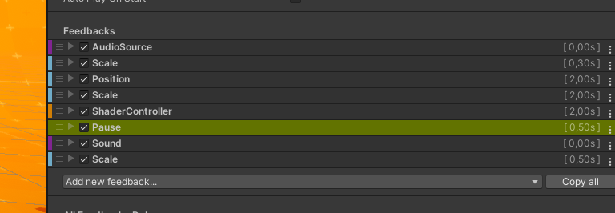
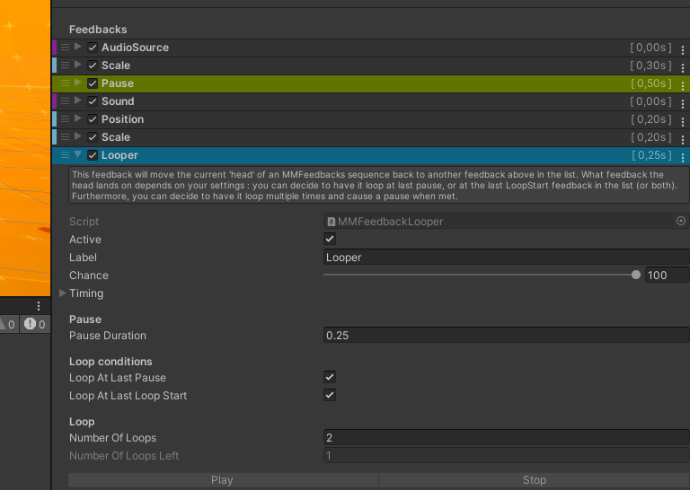
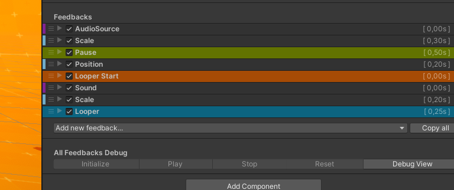
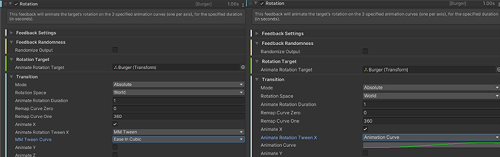
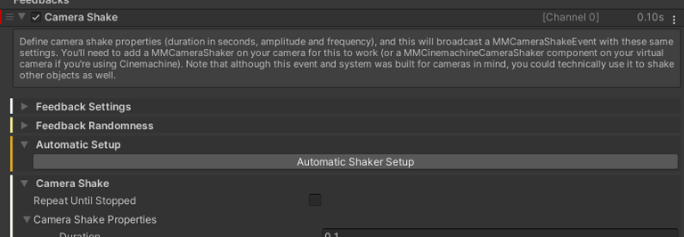

## Core notions

feedbacks system 是一个强大、直观和全面的框架，可以很容易地继承到 Unity 项目中，让你可以添加 juicy feedbacks 到每个 action 上，只需要几次点击。

两个主要部件：

- MMF_Player（More Mountains Feedbacks Player），作为你想要添加的任意数量 Feedbacks 的 container，并且可以播放和 sequence 它们。通常你会通过 code 调用它的方法，来 play/pause/stop/reverse/etc 它的 feedbacks sequence。
- Feedbacks 是你添加到 MMF_Player 上的元素，以播放它们。每个 Feedback 负责一个单独的 action（播放一个 sound，flashing the screen，震动相机，等等）。有很多 feedback 可用（150），而且对每个 feedback，你可以定义很多特定设置，来创建你自己独特和惊叹的效果。

## Basic controls

下面是一些控制 MMF_Player 的方法：

```C#
public MMF_Player MyPlayer;

// 初始化 player 和它的所有 feedbacks，确保播放前，所有东西都正确设置
// 默认，它会自己在 Start 中执行。但是如果你在运行时做了任何改变，改变后再次调用这个方法
MyPlayer.Initialization(); 

//让 MMF Player 播放 feedbacks sequence
MyPlayer.PlayFeedbacks();

//传递一个 position 和 intensity 到可能用到它们的 feedbacks
Vector3 myPosition = new Vector3(1f, 2f, 0f);
float myIntensity = 1f;
MyPlayer.PlayerFeedbacks(myPosition, myIntensity);

//停止 player，阻止 sequence 任何后面的 feedbacks 播放
MyPlayer.StopFeedbacks();

//跳到 sequence 的结尾，将所有 feedback targets 设置到它们的最终状态
//注意这可能花费 3 个 frames 来完成
MyPlayer.SkipToTheEnd();

//SkipToTheEnd 的逆操作，ForceInitialValues 将支持这个方法的 feedbacks 设置到它们 transitions 的初始状态
//这是一个遗留方法，它播放并立即停止 feedbacks，并且绝大多数情况下，你可能会想使用 RestoreInitialValues 作为代替
MyPlayer.ForceInitialValues();

//将所有 targets 翻转到它们的初始状态，并对每个 feedback 具有专用的实现
MyPlayer.RestoreInitialValues();
```

## Shakers

一些 feedback 会直接作用于 target 对象，而另一些则会向 listener（监听器）广播事件。例如Bloom（辉光）反馈、AudioSource音量调节反馈，以及Cinemachine转场反馈等，均采用这种工作模式。这里的监听器被称为Shaker（震动器）​，因为它会在接收端"扰动"目标参数值。

在每个反馈组件的检查器面板中，通常会有相关提示说明需要配置Shaker。

需要注意的是，大多数基于震动器（Shaker）的反馈机制都遵循这一工作原理，不同之处仅在于震动器端和反馈端各自可用的参数设置数量存在差异。

实例：

1. 创建 scene
   - 添加一个 camera，在它前面放一个 sphere
   - 添加一个 empty object，在其上添加一个 PostProcess Volume（或者它的 URP 的变体），设置为 Global，在其上添加一个新的 profile，创建一个 Vignette override
   - 在 camera 上，添加一个 PostProcess Layer，在 Layer 中选择 Everything
   - 添加一个 empty object，在其上添加一个 MMF_Player

2. 添加一个 PostProcessing feedback
   - 在 PostProcess Volume 上，添加一个 MMVignetteShaker
   - 在 MMF_Player 上，添加 Add > Post Process > Vignette
   - 添加 Play，播放 MMF_Player

3. 添加一个 Camera Shake feedback
   - 选择 camera，添加一个 MMCameraShaker
   - 在 MMWiggle inspector 中，选中 Position（可选地可以调整 rotation 和 scale），展开 Position，uncheck WigglePermitted，在 WiggleType 下拉菜单中，选择 Noise
   - 在 scene root 创建一个 empty object，添加一个 MMF_Player 组件，添加一个 Camera > Camera Shake feedback 到它上面
   - 点击 Play，开始 PlayMode，然后点击 feedback 上的 play
   - camera 开始震动，然后你可以调整 camera shake values 来得到不同的效果

## Channel

在几乎所有涉及某种 Shaker 的 feedback 中，你都会发现一个"Channel"（通道）属性。该属性允许你指定一个独特的通道来广播此反馈信号。震动器本身也具备通道属性——其工作原理类似于对讲机：只有与特定反馈信号通道匹配的震动器才会被该反馈所控制。这一机制非常实用，例如：在分屏设置中仅让特定屏幕的"绽放效果"（Bloom）产生震动，或是同时降低多个音频源的音量而保持其他音频不受影响。

在所有 feedback（通常位于"feedback 设置"折叠面板下）和 shaker 中，你都可以找到频道（Channel）配置选项。该功能主要提供两种工作模式：

- Int: 该模式允许你指定一个整数作为频道标识符。其工作原理非常简单：当你在反馈效果中将频道值设为5时，所有同类震动器只要同样设置为频道5，就会在该反馈触发时产生震动效果。
- MMChannel: 该模式允许你使用 ScriptableObject 作为 channel 标识符。虽然相比直接使用 int 需要更多前期配置工作，但它具有显著优势：更直观的辨识度、更便捷的调试体验（可快速定位特定资源的所有引用位置），以及更高效的长期维护性（重命名频道资源会自动更新所有关联引用）。Feel插件已内置多套可直接使用的MMChannel资源，但你当然可以（而且建议）自行创建专属资源。

## Pauses

默认情况下，MMF_Player 中的所有反馈效果会同步触发。虽然每个反馈可以设置不同的内部时序参数（如初始延迟等），但它们的启动时刻完全一致。这些反馈最终可能会在不同时间点显现效果或进入活跃状态，但它们的起始时间必定相同。

若插入一个或多个暂停节点，反馈效果便会改为从上到下依次执行。

系统提供两种 Pause 类型（Pause 也是一种 feedback 类型），你可以在演示场景中对比它们的实际效果。

- Pause

  

  这个 MMF_Player 包含 5 个 feedbacks，然后是一个 Pause，然后是两个 feedbacks。当播放这个 MMF_Player，从 top 到 Pause（包括它）都会在同一时间播放。剩下的两个会在 Pause 结束之后播放。这等效于最后两个 feedbacks，Sound 和 Scale，会在播放这个 MMF_Player 后的 0.5s 开始播放。

- Holding Pause

  

  这个 MMF_Player 和上面的一样，只是 Pause 替换为 Holding Pause。Holding Pause 也会等等它的整个 duration，但是会等到 sequence 中它上面的所有 feedbacks 都完成才开始等等。

  此时它上面所有的 feedbacks 一起播放，这意味 Holding Pause 会等等它上面时间最长的 feedback 播放完，才开始 pause，它自己会 pause 0.25s，因此最后连个 feedbacks 会在 MMF_Player Play 之后的 2.25s 之后开始播放。

- Script Driven Pause

  除了上面两种系统提供的 Pause，还可以从 script 派生 pauses。在任何包含 Pause 和/或 Loop 逻辑的MMF_Player组件中，你都可以调用MMF_Player.PauseFeedbacks()方法来暂停执行，直至调用MMF_Player.ResumeFeedbacks()方法才会继续运行。你也可以通过MMF_Player检查器面板上的暂停按钮进行手动测试。若暂停是由脚本触发的，你还可以设置自动恢复功能——指定经过若干秒（以秒为单位）后自动继续执行。这种机制支持创建灵活的交互逻辑：既可以让某个事件在X秒后自动触发，也能通过手动调用MMF_Player.Resume()方法提前恢复执行。

## Loops

除了每个反馈组件在"时间"设置栏中的重复选项外，系统还支持在MMF_Player层级定义"循环"结构。具体实现方式是在反馈序列中添加"循环器"（Loopers）类型的反馈。当执行流遇到循环器时，播放指针会根据规则回溯——优先返回至上一个遇到的暂停点；若无暂停点，则返回至上一个循环起始位置；若两者均未找到，则回到反馈列表顶端重新开始。



在此情况下，系统会按以下顺序执行反馈效果：首先播放AudioSource（音频源）、Scale（缩放）和Pause（暂停）反馈；接着执行Sound（声音）、Position（位置）和Scale（缩放）反馈。随后遇到循环结构，执行流将返回至Pause反馈，再次依次播放Sound、Position和Scale反馈。该循环设定重复次数为2次，因此上述过程会完整执行两轮，最终结束整个流程。



这个案例的配置结构与之前类似，但关键区别在于：​在暂停节点之前新增了一个循环起始点（Loop Start）​。此时反馈系统的执行逻辑将变为——在"循环器"（Looper）与"循环起始点"之间形成闭环，按照设定的循环次数重复执行Sound（声音）和Scale（缩放）反馈。

## Chance

每个反馈效果都设有概率滑块（Chance）​，允许你自定义该效果的触发概率——取值范围从0（永不触发）到100（必然触发）。默认情况下该值恒定为100。当概率值设为25%时，该反馈平均每4次执行中会触发1次（统计学概率）。

## Timing

每个 feedback 上有一个 Timing foldout，展开它可以访问以下选项：

- TimeScale Mode

  设置 feedback 运行使用 scaled time 还是 unscaled time。它只应用到这个 feedback，不应用到所有 feedbacks。

- Initial Delay : a delay, in seconds, to apply before executing this feedback

  一个延迟，in seconds，应用在 feedback 执行之前。

- Cooldown Duration

  播放之后，再次期间 feedback 不能再次播放（可以防止用户控制的 feedback 任意执行）。

- ExcludeFromHoldingPauses

  这个设置可以让 holding pauses 忽略这个 feedback。这可以用于处理特别长的 feedback，你可能只希望播放它，但不影响后面的 sequence。

- ContributeToTotalDuration

  是否将这个 feedback 算入 parent MMF_Player 的 total duration。

- Number of Repeats

  这个 feedback 应该重复的次数（默认为 0）。

- Repeat Forever

  选中这个选项，让 feedback 一直重复下去。

- Delay Between Repeats

  repeat mode 下再次 play feedback 应该经过的延迟。

- Play Direction

  当 MMF_Player 以特定方向（默认从上到下，或者反过来）播放时，定义特定 feedback 应该如何反应。

- MMFeedbacks Direction Condition

  定义 feedback 是否应该一致 play，还是只在 MMF_Player 以 forwards/reverse 顺序播放时才播放。

- Play Direction

  该选项允许你定义反馈效果的播放方向：支持正常模式、倒放模式、沿宿主对象方向播放，或沿宿主对象反方向播放。大多数反馈效果都支持倒放功能——例如，一个将物体从A点移动到B点的位置反馈（Position Feedback），在倒放时会逆向执行，使物体从B点返回A点。

- Constant Intensity

  在执行过程中，MMF_Player组件会调用其子级MMF_Feedback组件，并传递一个可选的强度参数（Intensity）​——该参数作为乘数因子，用于调节反馈效果的"作用强度"。若勾选"恒定强度"选项，该反馈将忽略全局强度调节器的数值影响。

- Use Intensity Interval

  勾选此项后，你可以为该反馈效果设定最小和最大强度阈值——只有当强度值处于此范围内时，反馈才会被触发执行；超出该范围的强度值则不会激活此反馈。这一功能特别适用于需要根据强度值产生差异化效果的场景。

  举例来说，在角色受伤系统中：当角色受到重度伤害时（强度值50-100），可以通过ShaderController反馈使其闪烁红色警示；而轻度伤害时（强度值0-50），则触发另一个ShaderController反馈使其呈现黄色警示。通过这种方式，单个MMF_Player组件就能根据伤害强度值实现差异化的视觉反馈效果。

- Sequence

  用于播放这个 feedback 的 Sequence。

- Track ID

  在 Sequence 上使用的 ID。

- Quantized

  Sequence 是否应该在量化模式下播放。

你还可以在运行时改变 Timing values，使用 SetInitialDelay，SetDelayBetweenRepeats，SetSequence 方法。

如何反向播放一个 feedback：

- 选择 MMF_Player，在 Setting foldout 中，设置 Direction 为 BottomToTop
- 通过 code

  ```C#
  MyPlayer.Direction = MMFeedbacks.Directions.BottomToTop;
  MyPlayer.PlayFeedbacks();
  ```

## Enable/Disable feedbacks

如果你想阻止 feedbacks 播放，有很多方式可以实现：

- 在 global 层面，可以使用 MMFeedbacks.GlobalMMFeedbacksActive 静态开关。将它设置为false，会阻止所有或任意 feedback 播放
- 在 MMF_Player 层面，如果它们以任何方式被 disabled（mono, gameobject），feedbacks 将不会播放
- 在 MMF_Feedback 层面，可以 check 或  uncheck feedback 名字傍边的 checkbox，来开启或关闭它。你还可以 check 它的 Active checkbox

## Tweens



在多个反馈效果中，你可能会遇到“补间类型”（tween type）字段。这类字段通常用于描述一个数值随时间变化的过程。以图中所示的“旋转反馈”（Rotation feedback）为例，当“AnimateX”布尔值设为 true 时，就会出现这样一个字段。

当该反馈被触发播放时，它会在设定的持续时间（本例中为 1 秒）内，按照指定的补间类型，将目标对象的 X 轴旋转角度从 0° 动画过渡到 360°。在图示左侧，已选择了一个预设补间类型（Ease In Cubic，即“缓入三次方”）；而在右侧，则是通过一条动画曲线来进行插值计算。

## Remap

在许多反馈效果中，你可能会遇到“重映射”（remapped）数值。这类数值通常在使用动画曲线时发挥作用。我们以“泛光反馈”（Bloom feedback）为例来说明：它允许你控制泛光强度随时间的变化过程。你可以通过“震动持续时间”（Shake Duration）字段来定义整个变化过程持续多久，同时还可以通过一条动画曲线来设定强度在该时间段内的变化规律。

这条动画曲线的 X 轴范围固定为 0 到 1。虽然在技术上你可以在 Y 轴上设置任意数值，但通常建议保持数值归一化（即保持在 0 到 1 之间），这是一种良好的实践方式。而“重映射”字段正是为了应对这种情况而设计的。

在“泛光反馈”中，你可以设置两个参数：RemapIntensityZero 和 RemapIntensityOne，它们分别对应动画曲线上 Y 值为 0 和 Y 值为 1 时所映射到的实际强度值。如果你选择的是一条钟形曲线，并将这两个参数设为默认值 0 和 1，那么泛光强度就会从 0 上升到 1，再回落回 0。而如果你将它们重映射为 1 和 5，那么泛光强度就会从 1 上升到 5，然后再回到 1。

## Relative Values

该资源包中包含的众多反馈效果，大多会让某个数值随时间发生变化。无论是泛光强度（bloom intensity）、音频源音高（audiosource pitch），还是物体的旋转角度（object’s rotation），这都是你经常会遇到的常见情况。

大多数这类反馈效果还支持（可选地）使用“相对数值”（relative values）进行控制。如果你选择启用这一功能，那么反馈效果在执行时，会将你设定的数值与目标对象的初始值相加，从而实现基于初始值的增量变化。

## Randomization

所有MMF反馈效果都有一个“反馈随机性”（Feedback Randomness）部分，在这里你可以选择是否对你的反馈输出进行随机化处理。这将使你能够对反馈输出的任何内容应用一个随机强度乘数（在两个浮点数值之间）。该修饰符具体做什么取决于你的反馈类型，你可以查看其代码来了解具体细节，但一般来说，这会影响反馈的“强度”。例如，这可能是音效剪辑的音量、色差抖动的强度，或者纹理偏移的距离。

从每个反馈的随机性部分，你还可以选择应用一个随机持续时间乘数。该乘数将在其x和y值之间随机选取，这将直接影响反馈的持续时间，使其增加或减少。你也可以在MMF播放器级别应用类似的持续时间修饰符，在这种情况下，它们将平等地应用于所有反馈效果。

最终，应用了所有 modifiers 之后， feedback 的 duration 为：

```
Feedback Duration * Feedback's RandomDurationMultiplier * MMF Player's Duration Multiplier * MMF Player's RandomDurationMultiplier
```

## Automatic Shaker Setup

许多反馈效果都依赖于“震动器”（shakers）。虽然在很多情况下你可能更倾向于手动设置它们，但反馈系统为许多反馈效果提供了自动配置的功能。



对于支持自动配置的反馈效果，你会在其检视面板（Inspector）中看到一个名为“自动设置”（Automatic Setup）的可折叠区域。只需点击该按钮，系统就会尝试自动完成相应的设置工作。这个过程可能简单如在一个已有的Volume上添加一个MMVignetteShaker，也可能复杂到创建一整套摄像机装备并将你的主摄像机移动到其中——具体取决于你使用的反馈类型和当前项目环境。

需要特别注意的是：这个按钮会直接修改你的场景文件。虽然系统会尽力完成配置，但它并非万能，某些情况下可能会配置失败。如果遇到这种情况，请不要犹豫，通过支持表单向我们反馈你的具体使用场景——这些信息将帮助我们改进系统并覆盖更多使用案例。无论如何，请务必事先保存好场景的安全备份，以防出现意外情况时可以回滚。

你还会在MMF Player设置面板的底部找到一个类似的“自动震动器设置”（Automatic Shaker Setup）按钮。点击这个按钮的效果等同于逐个点击MMF Player中所有反馈效果各自的自动设置按钮，可以一次性完成全部配置。

## Automated Target Acquisition

有些反馈效果只是简单地广播一条消息（例如 Vignette 反馈会通知所有匹配的 Vignette 震动器开始“抖动”），而另一些则需要指定某种目标对象。比如 Position 反馈需要一个可移动的 Transform 对象作为目标，Light 反馈则需要场景中某个物体上的 Light 组件作为目标。

通常情况下，你可以在反馈效果的 Inspector 面板中通过拖拽方式将目标对象指定到对应的插槽中来设置目标。当然，你也可以通过代码来设置目标。有时你可能希望自动化这个目标设置过程，这时就可以用到“自动目标获取”（Automated Target Acquisition）功能。

对于那些支持自动设置目标的反馈效果，在其 FeedbackSettings 折叠区域（位于 Timing 设置旁边）的底部，你会看到一个名为“自动目标获取”（Automated Target Acquisition）的选项区。在那里，你可以选择一种目标获取模式：

- None
- Self：在 MMF Player gameobject 上拾取 target
- AnyChild：在任何 MMF Player child objects 上拾取 target
- ChildAtIndex：在 MMF Player 的某个指定索引的 child 拾取 target
- Parent：在第一个找到 target 的 parent 上拾取 target
- Various reference holders：target 将从 MMF Player 的反馈列表中所指定的参考持有者（reference holder）上进行拾取，具体选取方式包括：选取列表中的第一个反馈对应的目标、前一个（即当前反馈之前找到的第一个目标）、任意方向上距离当前反馈最近的目标、下一个（即当前反馈之后找到的第一个目标），或者列表中的最后一个反馈对应的目标。

最后几种模式依赖的是“参考持有者”（Reference Holder）反馈——你可以像添加其他任何反馈一样，将其加入到你的 MMF Player 中。这个反馈在被播放时本身不会产生任何实际效果，但你可以在它的设置中指定一个目标游戏对象（target game object）。

当其他处于“参考持有者获取模式”（reference holder acquisition mode）的反馈需要寻找一个参考目标时，如果发现当前的“参考持有者”反馈与它们的设置相匹配，它们就会在这个“参考持有者”所指定的目标游戏对象上去查找并获取所需的参考目标。

## Additive Plays

在许多反馈效果中，你会看到一个名为 "AllowAdditivePlays" 的选项。  

- 如果该选项设为 true，即使当前反馈正在播放，再次调用它时也会立即触发新的播放（允许多个实例同时运行）。  
- 如果设为 false，则只有在当前播放结束后，才能触发新的播放（防止叠加执行）。  

这个选项适用于需要控制反馈是否可以叠加播放的场景，比如避免同一个特效重复触发导致视觉混乱，或者确保某些动作（如震动、音效）不会被意外打断或重复播放。

## Alternative ways to play a feedback

尽管绝大多数时间，你可能想要通过 code 播放 feedbacks，还有其他方式可以播放。

- 通过 animation 的 Animation Events 播放 MMF Player

  在 Animation Events 的 Function 下拉菜单中，选择 PlayFeedbacks()

- 通过 Timeline 触发 MMF Player

  通过 signal receiver 的 event reaction slot，选择 MMF Player > PlayFeedbacks()

## Preventing a type of feedback from playing

有时你可能需要确保某类反馈效果不会被触发——比如临时禁用所有屏幕震动效果，或者确保镜头畸变反馈不会播放，这可能与游戏选项菜单中的某个设置相关联。实现这类控制非常简单，操作方式如下：

```
// this will prevent all scale feedbacks, anywhere, from playing
MMF_Scale.FeedbackTypeAuthorized = false;
// Of course you can do that for all types of feedbacks, not just Scale.
```

你也可以使用 ​​MMFeedbacksAuthorizations​​ 组件来实现这一功能。它的使用方法非常简单：

- 在场景中创建一个空物体（Empty Object）；
- 在该物体的 Inspector 面板中，取消勾选你不想播放的反馈类型；
- 如果需要批量禁用某一类反馈，可以直接点击顶部的切换按钮（Toggle Buttons），一次性关闭整组反馈类型的播放权限

## Script Driven Timescale

反馈系统原生支持两种时间模式：​​不受缩放影响的时间（Unscaled Time）​​和​​受缩放影响的时间（Scaled Time）​​。但如果你需要完全自定义时间流速——比如自行控制Delta Time（时间增量）和游戏时间——系统同样提供支持！

具体实现方式如下：

- 通过脚本将目标反馈组件的 Timing.UseScriptDrivenTimescale 设为 true
- 手动更新该反馈的 Timing.ScriptDrivenDeltaTime（脚本驱动时间增量）
- 手动更新该反馈的 Timing.ScriptDrivenTime（脚本驱动时间）

## Disabling Help Texts

大多数反馈组件在检视面板（Inspector）中都配有帮助文本框，用于说明该反馈的使用方法。若需关闭这些提示，只需找到位于 MMFeedbacks/Editor/Resources 路径下的 MMFeedbacksConfiguration 资源文件，取消勾选其中的 ​​"Show Inspector Tips"​​ 选项即可。
