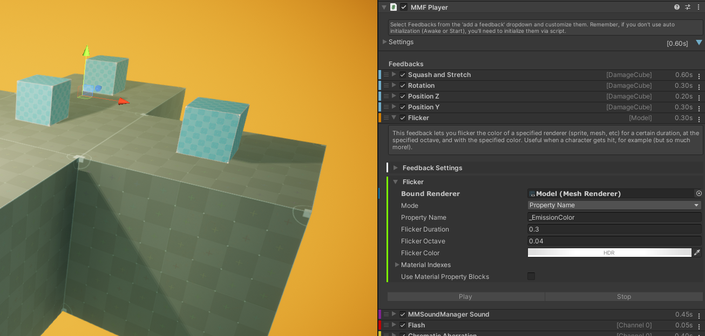
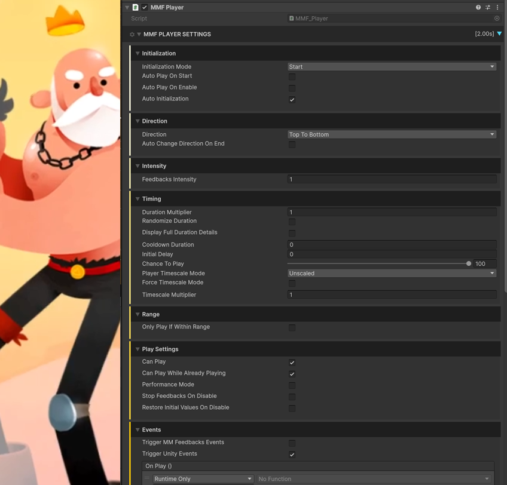
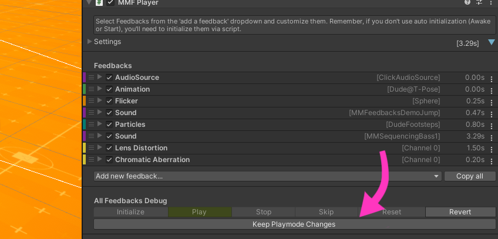
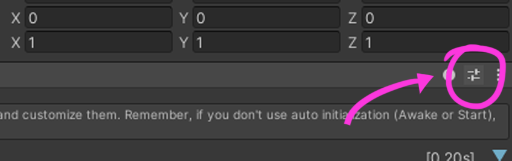
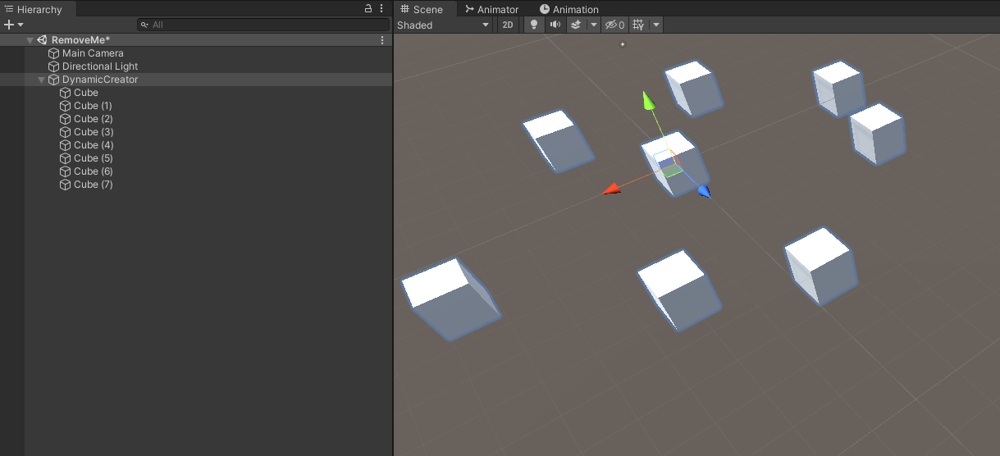

​​MMF_Player​​ 是你为游戏添加动态效果（Juice）的核心组件。使用时，只需在场景中创建一个空物体（Empty GameObject），然后为其添加 ​​MMF_Player​​ 组件。在该组件的检视面板（Inspector）中，你可以设置一系列通用参数，随后通过 ​​"Add new feedback"​​ 下拉菜单添加并调整各种反馈效果。

你可以通过以下方式灵活管理反馈效果：

- ​​拖拽最左侧图标​​ 重新排序反馈
- ​​点击折叠/展开箭头​​ 控制反馈的显示状态
- ​​勾选复选框​​ 单独启用或禁用某个反馈
- ​​编辑标签字段​​ 重命名反馈以便识别
- ​​使用最右侧下拉菜单​​ 快速复制或删除反馈



一旦添加了一些 feedbacks，你可能想要播放它们。有两种简单方式可以实现：

- 通过 Unity Event，选择 MMF_Player:PlayFeedbacks
- 通过 code，引用 MMF_Player 变量，调用各种播放方法

​​调试与测试功能​​：你可以在运行时通过调试模式直接从检视面板（Inspector）底部的按钮栏进行实时测试，这里提供了初始化（Initialize）、播放（Play）、停止（Stop）和重置（Reset）等方法的快捷测试选项。此外，每个反馈标题栏右侧的下拉菜单也支持单独测试特定反馈效果。

​​时间参数控制​​：每个反馈的检视面板中都包含一个​​Timing​​下拉菜单，允许你精细调整以下参数：

- 初始延迟（Initial Delay）
- 冷却时间（Cooldown Duration，即两次播放之间的最小间隔）
- 循环选项（Repeat Options）

​​随机触发概率​​：所有反馈都配备了一个​​Chance​​滑动条（范围0-100%），用于控制该反馈的实际触发概率：

- 100% = 每次必定触发
- 0% = 永不触发
- 25% = 平均每4次触发1次（以此类推）

## 命名约定

你需要指定两个主要的类

- MMF_Player，它让你播放 feedbacks
- MMF_Feedback 作为单个 feedback 的基类

MMF_Player 播放一个 MMF_Feedback 的列表。

Feedbacks 通常命名为 MMF_Something。

## Controls

每个 MMF_Player 组件的底部，你会发现通用的控制：


- Add new feedback：打开下拉菜单，选择要添加的 MMF_Feedback
- Search：允许你输入字符，并显示名称匹配的反馈的添加按钮。例如，在搜索栏中输入“URP”，将显示用于添加名称中包含“URP”的所有反馈的按钮。请注意，你还可以使用键盘的上下箭头键在该结果列表中选择反馈，按“Esc”键或点击其他位置以关闭结果面板。
- Copy all：复制所有反馈。然后你可以通过在同一区域出现的按钮，将其粘贴到其他任何 MMF_Player 上。这是从一个 MMF_Player 复制反馈到另一个的推荐方法。不要使用 Unity 的“复制组件值”功能。
- Initialization, Play, Stop, Reset, SkipToTheEnd, RestoreInitialValues, ChangeDirection：在 MMF_Player 上调用相应的方法，仅用于测试。绝大多数只在运行时可用，因此需要进入 playmode 才能测试
- Keep Playmode Changes：在运行时点击，对 MMF Player 的改变在退出 play mode 后会保存

## Settings

在每个 MMF_Player 顶部，有一个可折叠的 Setting 区域，可以调整 MMF_Player Level 的 setting。



Initialization:

- Initialization Mode：肯能的初始化模式。如果你使用脚本，你必须调用初始化方法，并传递给它一个 owner。否则，你可以让这个组件在 Awake 或 Start 初始化自己，此时 owner 将会是 MMF_Player 自身。绝大多数情况下，使用 Start 就可以。
- Auto Play on Start：scene start 时 MMF_Player 是否播放
- Auto Play on Enable：MMF_Player 是否子啊 Enable 时播放
- Auto Initialization：如果设置为 true，系统会在播放 MMF_Player 之前尝试自动初始化它，在最佳可能的时间

Direction:

- Direction：这定义 feedbacks 播放的顺序。默认是从上到下，但是可以设置从下向上播
- Auto Change Direction on End：当所有 feedbacks 播放完毕，是否翻转它的方向

Intensity:

- Feedbacks Intensity：feedback 播放的 intensity。这个 value 将被绝大多数 feedbacks 使用，用来调整它们的强度 amplitude，1 为正常，0.5 为一半强度，0 为无效果。注意这个 value 控制什么依赖 feedback，不要害怕查看 code 以确定它们具体是什么。

Timing：

- Force TimeScale Mode：选中这个选项，可以强制 Player 上所有 feedbacks 以 scaled 还是 unscaled time 播放
- Duration Multiplier：一个 time multiplier，应用到所有 feedback durations（initial delay，duration，delay between repeats 等等）
- Randomize Duration：对每个 feedback duration 应用一个随机 multiplier，在一个最小值和最大值之间选择一个随机数
- Display Full Duration Details：如果为 true，editor-only，每个 feedback 的详细将会在 duration slot 中显示
- CoolDown Duration：冷却时间，播放一个 feedback 之后，在 cooldown 期间不能再次播放
- Initial Delay: MMF_Player 播放的开始延迟
- Chance to Play：Player 实际播放的概率（百分比）
- Player TimeScale Mode：Player 运行的 timescale
- TimescaleMultiplier：应用到所有使用的 timescale 的 multiplier，基本上让你加速或减慢 feedbacks。可以在运行时调整这个值

Range:

- Only Play If Within Range：如果为 true，下面的 range settings 将被考虑在内，以决定这个 Player 是否可以播放
- RangeCenter：计算 range values 时考虑的 transform。这通常是你的 Player character，或者 main camera
- RangeDistance：距离 RangeCenter 的距离（Units），在这个 range 内，feedback 被认为是在 Range 内
- UseRangeFalloff： 是否基于 RangeFallOff curve 修正 feedback 的 intensity，让 feedbacks 的强度随着远离 range center 而降低  
- Ignore Range Events：是否忽略 MMSetFeedbackRangeCenterEvent，用于在任何地方设置 RangeCenter

Play Settings:

- CanPlay：如果为 false，player 不能播放 feedbacks sequence
- CanPlayWhileAlreadyPlaying：uncheck 这个选项，当它任何一个 feedbacks 还在播放，会阻止 player 播放，
- Performance Mode：减少 player 的 inspector rendering 的消耗，释放资源。在编辑器之外没有影响，build 中性能已经进行了优化
- Force Stop Feedbacks On Disable：如果为 true，当 disable player 时自动调用 StopFeedbacks 

Events：

- Trigger MMFeedbacks Events：MMF_Player 是否应该发出一个 MMFeedbacksEvents，这是一个事件类型，你可以在任何 class 中监听
- Trigger Unity Events：MMF_Player 是否应该发出常规 Unity Events
- OnPlay：MMF_Player 每次播放时发出事件
- OnPause：MMF_Player 每次暂停时发出事件
- OnResume：MMF_Player 每次恢复时发出事件
- OnRevert：MMF_Player 被翻转时发出事件（如果 AutoChangeDirectionOnEnd = true，通常在播放的末尾自动 revert，或者当调用 Revert 方法时 revert）
- OnComplete：MMF_Player 每次播放它最后一个 Feedback 时发出事件

## Keeping runtime changes

MMF_Player 可以很容易保存运行时的修改，提升工作流效率。有两种方式可以保留运行时修改：

- 点击 MMF_Player inspector 底部的 Keep PlayMode Changes 按钮。一旦退出 play mode，运行时修改将会保存
- 在运行使用 Copy All，然后退出 Play Mode 之后，使用 Replace All 按钮将复制的 value 粘贴到 feedbacks 上



这两种方法都保留 MMF_Player 上的修改，包括 added/removed feedbacks，或者 feedbacks 内任何 value 的修改。如果需要，还可以复制单个 feedback 的数据，点击每个 feedback 右边的三个点按钮。

注意为了避免可能的失误，Keep Playmode Changes 模式在每次退出 play mode 之后，会自动关闭。如果想改变这个行为，可以编辑 MMF_PlayConfiguration setting，uncheck AutoDisableKeepPlaymodeChanges 选项。

## Stopping MMF_Players

如上一节所示，MMF_Player允许你调用其StopFeedbacks()方法。默认情况下，该方法会停止整个序列的播放，同时也会停止当时正在播放的各个反馈效果。举个例子，假设你有一个MMF_Player，其中包含一个Position类型的MMFeedback，该反馈正在将UI图标从位置A移动到位置B；如果你调用StopFeedbacks()，这个图标就会立即停止在当前位置。而如果你只想停止序列本身而不影响其内容，可以调用StopFeedbacks(false)，这样序列会被终止，但以UI图标为例，它会继续移动到目标位置B。最后，你还可以在反馈效果的层级进行微调——在每个反馈的"Timing"设置下拉菜单中，有一个"InterruptsOnStop"复选框。将其设置为false后，该反馈就会忽略停止指令并完成执行过程。通过这三种不同方式对StopFeedbacks()行为的组合控制，你就能实现各种自定义的场景设置。

## Events

MMF_Player组件可在其运行周期的特定阶段（包括播放、暂停、恢复、回退和完成）选择性地触发事件。在检视面板的底部，你会看到一个"Events"折叠菜单，用于设置当前MMF_Player是否触发MMFeedbacksEvents事件，以及是否触发常规的Unity事件。
随后，你可以像使用其他Unity事件那样，在检视面板的事件插槽中绑定任意自定义功能。
此外，你也可以通过代码监听MMFeedbacksEvents事件，具体实现方式如下：

```C#
using UnityEngine;
using MoreMountains.Feedbacks;
using MoreMountains.Tools;

public class OnCompleteTest : MonoBehaviour
{
    public void OnMMFeedbacksEvent(MMFeedbacks source, MMFeedbacksEvent.EventTypes type)
    {
        switch (type)
        {
            case MMFeedbacksEvent.EventTypes.Complete:
                Debug.Log("The feedback "+source.name+" just completed.");
                break;
        }
    }

    private void OnEnable()
    {
        MMFeedbacksEvent.Register(OnMMFeedbacksEvent);  
    }
    private void OnDisable()
    {
        MMFeedbacksEvent.Unregister(OnMMFeedbacksEvent);  
    }
}
```

如你所见，这个简单的类在启用(Enable)时会注册这些事件监听，在禁用(Disable)时取消注册。此后无论何时（无论哪个对象）触发这类事件，它的OnMMFeedbacksEvent方法都会捕获该事件，然后你就可以根据事件的来源和类型执行任意自定义操作。在这个示例中，我们专门筛选了"完成(Complete)"类型的事件，并显示触发该事件的MMFeedback组件名称。

## Templates

因为现在可以非常容易在任何时候复制 feedbacks，从一个 Player 到另一个，你可以很容易创建模板，然后在项目中的其他地方使用。

有多种方式实现。建议的方式是使用 Unity 的 preset system。创建要给 preset 非常简单：

- 选择一个已经包含一组 feedbacks 的 MMF_Player，将它作为模板
- 点击 preset 按钮，会打开一个 popup，点击 save current to 按钮

  

- 在 project 中选择一个目录保存 preset，给它一个名字
- 现在在任何 MMF_Player，点击 preset 按钮，就可以 recall 任何之前保存过的 preset 了，它会立即替换 MMF_Player 的整个 feedbacks 列表。如果误选了 preset，可以 ctrl+z 撤回

你还可以利用预制体(Prefabs)来"存储"MMF_Player上的反馈效果堆栈，并从中进行复制。在演示项目中随处可见这类预制体的使用范例。这里我们只是将常规预制体用作模板的存储容器——当然，你完全可以直接把这些预制体当作普通预制体使用。但如果你想创建全新的反馈播放器而又不想从零开始，只需在项目资源中选择一个模板，点击"Copy All"按钮复制其所有反馈效果，然后在任意位置创建新的MMF_Player并粘贴这些效果即可。系统会通过小提示图标明确指示所有需要绑定参数的位置，以确保反馈效果正常工作。这种工作方式能为某些开发流程节省大量时间。

## Quality of Life

MMF_Player具备多项提升用户体验的功能改进，能让设置更安全、便捷：

1. **反馈效果操作优化**：在播放器周期的特定阶段（播放、暂停、恢复、回退、完成），可选择性触发事件。检视面板底部有“Events”折叠菜单，可设置是否触发MMFeedbacksEvents事件及常规Unity事件。还能通过代码监听MMFeedbacksEvents事件。
2. **预设功能方便复用**：可通过Unity预设系统创建预设来复用反馈效果设置。选择包含所需反馈效果的MMF_Player，点击预设按钮，在弹出窗口点击“save current to”按钮，选择保存位置并命名。之后在任何MMF_Player上点击预设按钮，就能调用已保存的预设，替换其反馈效果列表，操作失误时可按Ctrl+Z撤销。
3. **反馈效果列表改进**：反馈效果列表中，若缺少某些绑定，会显示警告图标。展开反馈效果时，文本区域会提示修复方法。在需要修复的反馈效果区域，也有相同的警告图标。
4. **检视面板分组优化**：反馈效果的检视面板有分组，包含通用的“Feedback Settings”分组，可折叠/展开。在配置脚本对象中可设置默认折叠或展开这些分组。
5. **反馈效果信息补充**：折叠时，反馈效果会显示额外信息（目标、通道等），便于区分同类型反馈效果。
6. **反馈效果样式自定义**：可在反馈效果设置中为每个反馈效果单独定义背景颜色。
7. **反馈效果右键菜单便捷操作**：每个反馈效果有右键菜单（右侧三个小竖点），可进行播放、复制、粘贴、复制、删除操作。

## Modifying feedback values at runtime

要在 MMF Player 内访问 feedback，然后修改它上面的 field。可以使用 GetFeedbackOfType 或 GetFeedbacksOfType 方法。

```C#
// will return the first MMF_Scale found on that MMF_Player
MMF_Scale scaleFeedback = MyTargetMMFPlayer.GetFeedbackOfType<MMF_Scale>();

// will return a list of all MMF_Scale found on that MMF_Player
List<MMF_Scale> scaleFeedbacks = MyTargetMMFPlayer.GetFeedbacksOfType<MMF_Scale>();

// will return the first MMF_Scale found on that MMF_Player whose label matches "MyCustomLabel"
MMF_Scale scaleFeedback = MyTargetMMFPlayer.GetFeedbackOfType<MMF_Scale>("MyCustomLabel");

// will return a list of all the MMF_Scale found on that MMF_Player whose label matches "MyCustomLabel"
List<MMF_Scale> scaleFeedbacks = MyTargetMMFPlayer.GetFeedbacksOfType<MMF_Scale>("MyCustomLabel");
```

一旦有了 feedback 的引用，就可以改变它上面的值。修改这些值就像修改其他组件的值一样。

```C#
// grabs a LookAt feedback and changes its duration to 5s
MMF_LookAt lookAtFeedback = MyTargetMMFPlayer.GetFeedbackOfType<MMF_LookAt>();
lookAtFeedback.Duration = 5f;

// grabs all LookAt feedbacks on a target MMF Player and sets their duration to 5s
foreach (var lookAtFeedback in myPlayer.GetFeedbacksOfType<MMF_LookAt>())
{
  lookAtFeedback.Duration = 5f;
}
```

注意如果在运行时修改任何 timing/duration（时间）相关的值，在播放 MMF Player 前可以调用 ComputeCachedTotalDuration：

```C#
MyTargetMMFPlayer.ComputeCachedTotalDuration();
```

需要特别注意的是，许多反馈效果为了提升性能会在初始化阶段缓存数据。因此，如果你修改了某些设置但在播放MMF_Player时没有看到预期变化，请务必在修改后、播放前手动调用Initialization()方法进行刷新，具体操作如下：

```C#
// we get our Animation Crossfade feedback on our MMF Player and change its state name
MMF_AnimationCrossfade crossfadeFeedback = MyTargetMMFPlayer.GetFeedbackOfType<MMF_AnimationCrossfade>();
crossfadeFeedback.StateName = "SomeNewState";
// we initialize our MMF Player 
MyTargetMMFPlayer.Initialization();
// and we play it
MyTargetMMFPlayer.PlayFeedbacks();
```

## Playing individual feedbacks in a MMF Player

虽然最佳实践通常是只与MMF_Player主体交互（需要时可通过复制多个MMF_Player实例来实现扩展），但你也可以单独触发其中的每个反馈效果。前文已说明如何获取单个反馈效果的引用——只需在获得引用后调用其Play方法，即可单独播放该反馈效果。

```C#
// grabs a position feedback and plays it
MMF_Position uiPositionFeedback = resourcePanelFeelController.GetFeedbackOfType<MMF_Position>(uiResourcePanel.name);
uiPositionFeedback.Play(this.transform.position, 1f);
```

你会发现Play方法需要传入两个参数：第一个是位置参数，某些反馈效果会利用该参数（例如粒子生成类反馈效果会根据此位置参数在指定坐标生成粒子——前提是你已在设置中启用了该功能）；第二个是强度参数，部分反馈效果会据此调整最终表现效果。若这两个参数对你的使用场景没有影响，直接传入Vector3.zero和1f即可。

## Adding and removing feedbacks at runtime

运行时可以在脚本中很容易添加和删除 feedbacks。有两种主要的方法可以添加 feedbacks：

```C#
public MMF_Player MyTargetMMFPlayer;

MyTargetMMFPlayer.AddFeedback(typeof(MMF_Scale));

MMF_Scale scale = new MMF_Scale();
scale.Label = "MyCustomLabel";
scale.AnimateScaleDuration = 15f;
MyTargetMMFPlayer.AddFeedback(scale);
```

同样，也可以移除 feedbacks，只需要指示其在 list 中的位置：

```C#
MyTargetMMFPlayer.RemoveFeedback(1);
```

## Creating a player and its feedbacks at runtime

在运行时动态添加和移除反馈效果确实很酷，但Feel框架还支持动态创建完整的播放器实例。下面我们通过一个实例来演示：创建一个能够按顺序缩放多个立方体（每个立方体缩放之间稍作停顿）的MMF_Player。
具体实现步骤如下：

- 首先创建一个新的空场景
- 在场景中添加一个空游戏对象，并将其重命名为"DynamicCreator"
- 创建一个立方体对象并将其作为"DynamicCreator"的子对象
- 复制该立方体（可根据需要复制任意数量，所有立方体都保持为"DynamicCreator"的子对象）
- 将这些立方体在场景中适当分布排列

完成上述操作后，你的场景应该如下图所示：



现在创建一个新类，命名为 DynamicPlayerCreator：

```C#
using MoreMountains.Feedbacks;
using MoreMountains.Tools;
using UnityEngine;

/// <summary>
/// A test class that will automatically generate a MMF Player, containing as many scale feedbacks as this object has children.
/// To test it :
/// - create a new scene, and a new object in it. Add this component to it.
/// - create a bunch of cubes, position them where you want, then parent them to this object.
/// - press play in the editor, then press the "Create" button on this component's inspector
/// </summary>
public class DynamicPlayerCreator : MonoBehaviour
{
	// an inspector test button to trigger the Create method
	[MMInspectorButton("Create")] public bool CreateBtn;

	private void Create()
	{
		// we create a MMF Player
		MMF_Player newPlayer = this.gameObject.AddComponent<MMF_Player>();
		// we're going to play this MMF Player right after having created it, we'll initialize it manually.
		// we do this to avoid its Initialization method to run on its Start, which would be after we've played it
		newPlayer.InitializationMode = MMFeedbacks.InitializationModes.Script;

		if (transform.childCount == 0)
		{
			Debug.LogWarning("[DynamicCreation test class] to test this class, create a number of cubes, position them randomly, then parent them to this object.");
			return;
		}

		// for each child transform
		for (int i = 0; i < transform.childCount; i++)
		{
			Transform childTransform = transform.GetChild(i);

			// we create a new scale feedback, tweak its target, and add it to the player
			MMF_Scale newScaleFeedback = new MMF_Scale();
			newScaleFeedback.Label = "Scale child " + i;
			newScaleFeedback.AnimateScaleTarget = childTransform;
			newPlayer.AddFeedback(newScaleFeedback);

			// we create a pause feedback, define its pause duration, and add it to the player
			MMF_Pause newPauseFeedback = new MMF_Pause();
			newPauseFeedback.Label = "Pause " + i;
			newPauseFeedback.PauseDuration = 0.2f;
			newPlayer.AddFeedback(newPauseFeedback);
		}

		// we initialize and play our player
		newPlayer.Initialization();
		newPlayer.PlayFeedbacks();
	}
}
```

## Executing code once all feedbacks are done playing

MMF_Player 提供了事件监听功能，可监测播放、暂停、恢复、回退和完成等关键节点。其中"完成"事件特别适合用于在播放器运行结束时触发特定代码逻辑。
除了直接监听事件外，你还可以通过Unity事件系统来实现回调。这些事件钩子位于播放器组件的"Settings"折叠面板中。你既可以在检视面板中直接绑定方法（可视化操作），也可以通过代码进行动态绑定。

```C#
using MoreMountains.Feedbacks;
using MoreMountains.Tools;
using UnityEngine;

public class Test : MonoBehaviour
{
	public MMF_Player MyPlayer;

	void OnPlayerComplete()
	{
		MMDebug.DebugLogTime("The MMF_Player is done playing its feedbacks.");
	}

	/// Make sure you add and remove your listener (usually on enable / on disable like this)
	private void OnEnable() { MyPlayer.Events.OnComplete.AddListener(OnPlayerComplete); }
	private void OnDisable() { MyPlayer.Events.OnComplete.RemoveListener(OnPlayerComplete); }
}
```

现在，还可以使用 await 等待它完成：

```C#
using System.Collections;
using System.Collections.Generic;
using MoreMountains.Feedbacks;
using MoreMountains.Tools;
using UnityEngine;

public class AwaitTest : MonoBehaviour
{
	public MMF_Player FirstPlayer;
	public MMF_Player SecondPlayer;

	[MMInspectorButton("Test")]
	public bool TestButton;

	public async void Test()
	{
		await FirstPlayer?.PlayFeedbacksTask(this.transform.position);
		SecondPlayer?.PlayFeedbacks();
	}
}
Conv
```