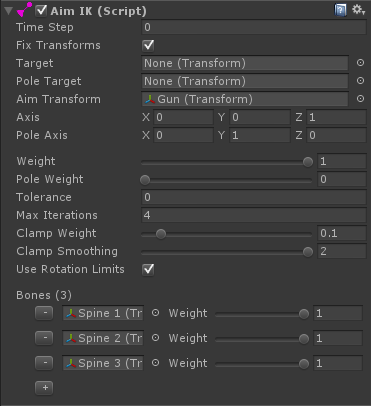

# Aim IK

AimIK solver 是一个 CCD 算法的修改版，它旋转一个 bones hierarchy 使得其中一个 child Transform 瞄准一个 target。这和内置的基础 Animator.SetLookAtPosition 或者 LookAtIK 功能不同，因为它有能力精确瞄准没有对齐 hierarchy main axis 的 transforms。

AimIK 可以对角色动画 retargeting 产生非常稳定和自然的外观。因此它非常适合 weapon aiming system。使用 AimIK，我们能够偏移一个单一的 forward aiming pose/animation 以瞄准 targets，即使几乎是角色后面的 target。只有在 Quaternion singularity point，即 180 角度偏移，这个 solver 无法知道用哪种方式旋转 spline。就像 LookAtIK，AimIK 也提供了一个 clampWeight 属性，以避免 singularity 问题。

AimIK 还使用 rotation limits，然而它比其他 solver 约束更容易出错被卡住，bone chain 被高度约束。

Aim 可以很快地提供高度精确效果，但仍然需要记住将 target position 维持到距离 aiming transform 的一个安全距离之外。如果（root transform）到 target position 的距离小于到 aiming Transform 的距离（即 aiming transform 位于 root transform 和 aiming transform 之间），solver 可能翻滚自身，从而无法产生一个有限的结果。

## Get started

- 设置你的角色的 Animator/Animation 播放一个 aiming forward animation/pose（动画或姿势）
- 添加 AimIK 组件到角色上
- 将 spine bones 赋予到 component 的 Bones 属性上，一个一个地，按照递降的顺序（parents first）
- 为 Aim Transform（你想要瞄准 target 的 Transform）赋值。它可以是 gun，hand bone，或者只是一个附加到 hand 的 empty game object
- 确保 Axis 表示 Aim Transform 的 local axis（坐标轴）。例如，如果一个 gun 的蓝轴（z）指向它的枪管，你需要设置 axis 为 (0, 0, 1)
- 设置 weight 为 1，点击 Play
- 在 Scene View 中移动 target handle，查看 AimIK 如何工作

## 组件变量

- fixTransforms：如果为 true，将会在每个 Update 中 fix 被 solver 使用的所有 Transforms 到它们的初始 state。这防止 unanimated bones 和 animator culling 潜在可能的问题，但是有一小部分性能代价（总之，选中可以得到更好的效果，但是有性能代价）

## Solver 变量

- target：瞄准到的 target transform。如果被赋值，solver IKPosition 将会自动设置到 target 的 position。
- poleTarget：如果被赋值，将会自动设置 polePosition 到这个 transform 的 position。IKSolverAim.polePosition 保存 Aim Transform 另一个轴 axis（pole Axis，类似 LookAt 中的 up 向量）朝向 IKSolverAim.polePosition。
- transform：（Aim Transform）我们想要瞄准到 IKPosition 的 transform，即 bones hierarchy 中的末端效应点 child transform（通常是手电筒，表示为粉色的锥形体）。必须是 bone hierarchy 中的线性下游 bone。例如，如果要瞄准一个 gun，或者它的一个 child，或者 hand bone
- axis：Aim Transform 的局部坐标轴。例如，如果一个 gun 的 z 轴指向它的枪管，则需要设置这个 axis 为（0，0，1）
- poleAxis：Aim Transform 的另一个朝向 IKSolverAim.polePosition 的局部坐标轴
- weight：平滑混合出 IK 效果的 solver 权重（IK or No IK）
- poleWeight：保持 AimTransform 的 poleAxis 朝向 polePosition 的权重
- tolerance：距离上一次达到的角度的最小偏移。如果到前一个角度的差小于这个 tolerance，则停止 solving。如果 tolerance 是 zero，将会不断迭代知道 maxIterations
- maxIterations：每帧最大迭代次数。如果 tolerance 是 0，将会一直迭代直到达到最大迭代次数
- clampWeight：截取 solver 的旋转。0 是自由旋转，1 是完全截取到 zero effect
- clampSmoothing：应用到 clamping 使它更平滑的 sine smoothing iterations 的数量
- bones：被 solver 使用的 bones 以使 Aim Transform 朝向 target 的 bones，即 IK 在 bone chain 上影响的骨骼链。所有的骨骼需要是 Aim Transform 的直接祖先节点，并按照递降顺序存储（从 root 到 life 的方向）。你可以跳过 hierarchy 中的 bones（即在递降顺序中不连续地指定 bone，跳过的 bones 在 IK 中就像和上一个指定的 bone 固定在一起一样）并且 Aim Transform 自身也可以被包含在内。这个 bone hierarchy 不可以有分支，意味着你不能 assing bones from both hands。Bone weight 决定它多大程度上被用在 hierarchy bending（即旋转 bones chain 时，每个 bone 贡献旋转的程度）。



## 改变 aiming target

```C#
public AimIK aimIK;
void LateUpdate () {
    aimIK.solver.IKPosition = something;
}
```

## 更新 Pole

polePosition 在设置武器瞄准中很有用。比如说有一个 gun，它的局部 Z 轴朝向它的枪管，局部 Y 轴向上。此时，我们必须设置 AimIK 轴为（0，0，1）以及 Pole 轴为 （0，1，0）。如果我们现在播放 scene，并设置 Weight 和 Pole Weight 为 1，我们将会有两个 handles，一个用于 aiming target，另一个用于调整 gun 绕着 AimIK 轴的向上向量。

```C#
public AimIK aimIK;
void LateUpdate () {
    aimIK.solver.polePosition = something;
    aimIK.solver.poleWeight = 1f;
}
```

## 改变 Aim transform

```C#
public AimIK aimIK;
void LateUpdate () {
    aimIK.solver.transform = something;
    aimIK.solver.axis = localAxisOfTheTransformToAimAtTheTarget;
}
```

## 运行时添加 AimIK

- 通过脚本添加 AimIK 组件
- 调用 AimIK.solver.SetChain()

## 运行时改变 AimIK bone hierarchy

```C#
public AimIK aimIK;
public Transform[] newBones;
void Change() {
    aimIK.solver.SetChain(newBones, aim.transform);
}
```

## 带有 Rotation Limits 使用 AimIK

有时必须限制骨骼链中一个骨骼的 AimIK 的效果。通常是当你希望在瞄准一个单手武器的过程中使用肘关节 elbow joint 时，或者当你希望只限制一个 spline bone 扭转时。肘关节和脊柱只能有限度扭转。如果你只添加 RotationLimit 组件到 bone，它还会影响动画（保持样条曲线僵硬，keep the spine stiff），而不仅是 IK。你可以使 RotationLimit 只在 AimIK 上有效果，通过每帧在 AimIK solves 之前预设 defaulting 它的 rotation。

```C#
public AimIK aimIK;
void LateUpdate() {
    // Set current animated localRotation as default local rotation for the rotation limits so they will not interfere with the animation, but only the IK
    for (int i = 0; i < aimIK.solver.bones.Length; i++) {
        if (aimIK.solver.bones[i].rotationLimit != null) {
            aimIK.solver.bones[i].rotationLimit.SetDefaultLocalRotation();
        }
    }
}
```

请注意每个 RotationLimit 减少 solver 平滑达到它的 target 的可能性。

FinalIK 0.4 引入了 polePosition 和 poleWeight，在绝大多数情况下可以避免在角色上使用 Rotation Limits，通过使用 pole 来保持 body upright（笔直向上）。

## Bone weights

Bones 字段中每个 bone 有一个 weight 参数。它确定一个 bone 在多大程度上被用于解析过程。例如如果你不希望一个特定脊柱 spine bone 弯曲得太厉害，你只需要减少它的权重。

## Aiming 2-handed weapons:

当瞄准一个双手武器，我们只能使用 AimIK bone hierarchy 中的 spine bones（通常是双手的共同 parents）进行作为 Aim transform。如果我们使用 arm bones 作为 Aim Transform，另一个手将会失去对武器物体的接触。有时只使用 spine bones 还不够，spine 将会过分弯曲，角色最终得到不自然的姿势。我们可以解决这个问题，通过添加一些 arm bones（抓住物体的 arm）到 AimIK 然后使用 FullBodyBipedIK 或 LimbIK 在 AimIK 完成之后将另一个手放回到它的位置上。

## Redirecting animation:

AimIK 非常适合保持 objects 稳定瞄准到 target。有时这些 objects 在动画中有大量挥舞动作，例如挥舞一把剑，在挥舞期间使用 AimIK 保持剑朝向一个特定位置不是非常好。这将会通过弯曲 hierarchy 剩余的骨骼以保持 sword 方向被固定，而这将会一个不期望的方式影响动画。仍然可能使用 AimIK 来重定向 redirect 挥舞动画，例如击剑和拳击，查看教程视频学习这如何完成。

## Recoil/reload animations while aiming:

当 AimIK 权重是 1，这个 solver 将会保持 weapon 总是朝向一个 target。这在播放一个反弹 recoil 动画或 reloading 动画可能不是期望的行为。我们可以动态改变 AimIK 的轴来克服这个问题。

```C#
void LateUpdate() {
    aimIK.solver.axis = aimIK.solver.transform.InverseTransformDirection(character.forward);
}
```

这行代码告诉 AimIK 无论动画中武器的方向怎样，它都是默认的 forward aiming 方向。“character.forward” 是这个武器在正常瞄准动画中的瞄准方向，没有任何 recoil（反弹），因此如果你播放一个 “aim right” 动画，你应该将它设置为 character.right。
