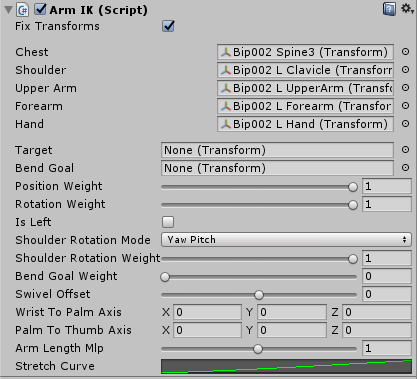

# Arm IK

ArmIK 是一个用于 VRIK 4-joint biped arm solver 的包装器组件。

## Component variables:

- ArmIK.fixTransforms - if true, will fix all the Transforms used by the solver to their initial state in each Update. This prevents potential problems with unanimated bones and animator culling with a small cost of performance.

## Wrapper variables:

- ArmIK.solver.chest - the last spine bone, that the arm bones must be parented to.
- ArmIK.solver.shoulder - the shoulder bone.
- ArmIK.solver.upperArm - the upper arm bone.
- ArmIK.solver.forearm - the forearm bone
- ArmIK.solver.hand - the hand bone.
- ArmIK.solver.IKPositionWeight - positional weight of the hand target. Note that if you have nulled the target, the hand will still be pulled to the last position of the target until you set this value to 0.
- ArmIK.solver.IKRotationWeight - rotational weight of the hand target. Note that if you have nulled the target, the hand will still be rotated to the last rotation of the target until you set this value to 0.

## Solver variables:

- ArmIK.solver.arm.target - the hand target. This should not be the hand controller itself, but a child GameObject parented to it so you could adjust it's position/rotation to match the orientation of the hand bone. The best practice for setup would be to move the hand controller to the avatar's hand as it it was held by the avatar, duplicate the avatar's hand bone and parent it to the hand controller. Then assign the duplicate to this slot.
- ArmIK.solver.arm.bendGoal - the elbow will be bent towards this Transform if 'Bend Goal Weight' > 0.
- ArmIK.solver.arm.shoulderRotationMode - different techniques for shoulder bone rotation.
- ArmIK.solver.arm.shoulderRotationWeight - the weight of shoulder rotation.
- ArmIK.solver.arm.shoulderTwistWeight - the weight of twisting the shoulders backwards when arms are lifted up.
- ArmIK.solver.arm.bendGoalWeight - if greater than 0, will bend the elbow towards the 'Bend Goal' Transform.
- ArmIK.solver.arm.swivelOffset - angular offset of the elbow bending direction.
- ArmIK.solver.arm.wristToPalmAxis - local axis of the hand bone that points from the wrist towards the palm. Used for defining hand bone orientation. If you have copied VRIK component from another avatar that has different bone orientations, right-click on VRIK header and select "Guess Hand Orientations" from the context menu.
- ArmIK.solver.arm.palmToThumbAxis - local axis of the hand bone that points from the palm towards the thumb. Used for defining hand bone orientation If you have copied VRIK component from another avatar that has different bone orientations, right-click on VRIK header and select 'Guess Hand Orientations' from the context menu..
- ArmIK.solver.arm.armLengthMlp - use this to make the arm shorter/longer. Works by displacement of hand and forearm localPosition.
- ArmIK.solver.arm.stretchCurve - evaluates stretching of the arm by target distance relative to arm length. Value at time 1 represents stretching amount at the point where distance to the target is equal to arm length. Value at time 2 represents stretching amount at the point where distance to the target is double the arm length. Value represents the amount of stretching. Linear stretching would be achieved with a linear curve going up by 45 degrees. Increase the range of stretching by moving the last key up and right at the same amount. Smoothing in the curve can help reduce elbow snapping (start stretching the arm slightly before target distance reaches arm length). To get a good optimal value for this curve, please go to the 'VRIK (Basic)' demo scene and copy the stretch curve over from the Pilot character.

