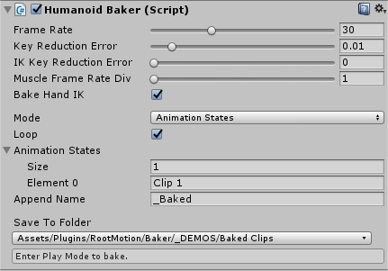
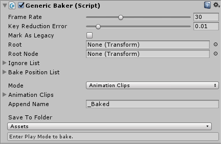

# Baker

Baker 是一个通用的工具，用于记录 humanoid，generic 和 legacy 动画剪辑。是一个抽象基类，被 HumanoidBaker.cs 和 GenericBaker.cs 扩展。

## Baker allows you to:

- 编辑动画片段
- 烘焙 IK 到动画中
- 合并 animation layers（成为单一动画片段）
- 烘焙 InteractionSystem Interaction
- 烘焙 ragdoll 物理
- blend ragdoll 物理和动画 (PuppetMaster)
- 烘焙 Timeline
- 修复 Humanoid retargeting 问题 (hand, foot positions)
- 烘焙外包（第三方）humanoid 动画到特定角色模型，以避免使用 Foot IK 以改善性能
- 烘焙动作捕捉 motion capture
- 使用 Baker 的高级 keyframe reduction 工具减少动画内存使用

## Getting started:

- 添加 HumanoidBaker 或 GenericBaker 组件到角色 Animator 同一个 GameObject
- 点击 Save To Folder 下面的按钮，选择一个目录来保存烘焙的动画片段
- 播放 scene
- 点击 bake button

## Animation Clips Mode

AnimationClips 模式可以被用来直接烘焙批量 AnimationClips，而不需要设置一个 AnimatorController。

设置 Baker 到 Animation Clips 模式并添加一些动画片段到 Animation Clips 数组。Append Name 是一个字符串，可以被添加到每个保存的片段的名字上。例如，如果你的动画片段名字是 Idle 和 Walk，则 _Baked 可以作为 Append Name，Baker 将会创建 Idle_Baked 和 Walk_Baked 动画片段。

## Animation States Mode

AnimationStates mode 可以用来批量烘焙 Mecanim Animaiton States（运行时动画片段）。这可以用于当你需要在 Mecanim 中使用 layers 和 AvatarMasks 设置一个复杂的 rig 的情形。

设置 Baker 到 Animation States mode 并添加你想要烘焙的 Animation State 名字（只是那些来自 base layer 的名字）到 Animation States 数组中。

Append Name

## Playable Director Mode

烘焙一个 PlayableDirector with a Timeline asset。设置 Baker 到 Playable Director 模式并确保这个 GameObject 有一个有效的 PlayableDirector。

## Realtime Mode

用于实时烘焙任意范围的动画，例如 ragdoll 模拟，或者一个 InteractionSystem interaction。因为是运行时烘焙，因此需要脚本调用。

```C#
using RootMotion;

public class MyBakingTool {
    public Baker baker;
    public float bakeDuration = 5f;

    void Start()
    {
        baker.mode = Baker.Mode.Realtime;
        StartCoroutine(BakeDuration(bakeDuration));
    }

    private IEnumerator BakeDuration(float duration) 
    {
        baker.StartBaking();
        yield return new WaitForSeconds(duration);
        baker.StopBaking();
    }
}
```

## Keyframe Reduction

当开发一款运行于低 RAM 的移动游戏时，如果你尝试着在动画 import 设置中增加 keyframe reduction error thresholds，动画质量将受到很大影响。最明显的问题将是脚开始在空闲动画中浮动，因为没有足够的关键帧记录它们正确的位置。空闲动画通常也是最长和消耗内存最多的。Unity实际上已经包含了这个问题的解决方案，它只是没有在 keyframe reduction 选项中实现。这个解决方案是 Humanoid “Foot IK” 系统 (“Foot IK”在 Animator 中切换，通过在动画预览窗口中启用“IK”切换来预览)，它通常用于修复 Humanoid 的 retargeting 问题。

Foot IK 工作通过从原始动画片段中存储 position 和 rotation channel，然后在 retargeting 角色(有不同 leg 长度)的 leg 上运行一个 IK pass 来正确地将 feet 放到地面上。Unity keyframe reduction 选项不允许你为这些 IK 曲线定义和 muscle 曲线 不同的参数，所以它们将会和 muscle channels 一样被减少，导致即使你启用了“脚IK”，feet 也会漂浮起来。

Baker 允许你定义分别定义 Key Reduction Error 和 IK Key Reduction Error ，因此对那些占用大量内存的 muscle channels 应用极端 key reduction 可以同时保持 IK channels 正常的 reduction。它还允许你以一个比 IK channels 低很多的 frame rate 烘焙 muscle channels，通过增加 Muscle Frame Rate Div 的值。这个选项可以帮助你使用少几倍的内存占用得到更好的动画质量。相同的技术可以被用于 hand IK，确保你的双手物品动画不会在 keyframe reduction 中遇到问题。

Foot IK 主要用来解决动画 rig retargeting 中 leg 长度不同 feet 落到地面的问题。记录每个关键帧原始的 position 和 rotation，然后在 retargeting 动画每个对应的关键帧对 foot 执行一个 IK，将 foot 放在原始的关键帧的 foot 的位置，这样就保证 retarget 之后的动画完美地落在地面上。

这里是使用 Foot IK 相同的技术来解决自动采样跳过原始关键帧的问题，即 keyframe reduction 问题。但是在 Unity 中 IK 曲线（为 IK 提供 weight 的曲线）和正常 bone 的曲线一样被 reduction，因此即使使用 Foot IK 也不能解决问题，因为 IK 的关键帧也丢失了。而 Baker 允许对 IK 曲线定义和成长 bone 曲线定义不同的 reduction，使得 IK 的数据保留地更多。Hand IK 也是同样的道理。

这里的核心是为 normal bone curves 和 ik curves 定义不同的 reduction error，使得 IK 数据保持得更多。

## Changing AnimationClipSettings

当你第一次烘焙一个动画片段，Baker 将会应用默认设置。如果你手动修改这个 animation clip 的设置然后重新烘焙，Baker 将会保持这些被修改的设置，使得你不需要重新应用它们。

## HumanoidBaker variables

frameRate 指定烘焙的动画时的采样率。每次到达采样的时间时，获得当前 pose 数据，作为关键帧插入烘焙结果的动画片段中。因为烘焙时，无法知道关键帧，或者说没有关键帧。动画片段文件中的数据记录的确实是关键帧，但是这里要烘焙的不是动画片段本身（否则直接使用这个动画片段就得了，为什么还要再烘焙一次），而是动画片段、IK 系统、Layer 叠加，甚至运行时脚本对骨骼的修改等所有数据源混合的结果，而且这是一个自动过程，不可能像手动创建动画时可以在任何时间指定一个关键帧，因此就指定一个采样率，每次到达采样时间时，直接将 pose 当前数据作为关键帧插入新生成的动画中，这个 pose 则是多种数据源混合而来的。

通过指定 frameRate 自动采样进行烘焙的一个问题是，采样的关键帧可能和原始动画中的重要时刻（关键帧）不同步，导致后者没有被记录到新的动画中。例如采样率为每秒 30 帧，但是原始动画中一个重要的姿势（例如运动动画中 foot 落在地面上）的时刻是 n/30 * 1/60，即在两个新的关键帧中间，那这个重要的姿势就会丢失，导致结果动画中，产生漂浮的效果。

Unity Import Setting 中优化动画也会导致同样的问题。

- frameRate：在 AnimationClips，AnimationStates 或 PlayableDirector 模式中，animation clip 被采样的帧率。在 Realtime mode，pose 被采样的帧率。在后面的情形中，不保证 player 能达到指定的帧率
- keyReductionError：最大允许的 keyframe reduction drror
- IKKeyReductionError：用于 Root.Q/T，LeftFoot IK 和 RightRoot IK channels 的 max keyframe reduction error。更大的 Key Reduciton Error 的值和更小的这个选项值允许你优化 clip 数据大小而没有 feet 漂浮效果（通过开启 Foot IK）
- muscleFrameRateDiv：用于 muscle curves 的 frame rate divider（除数因子）。如果你设置 Frame Rate 为 30，而这个 value 设置为 3，muscle 曲线将会以 10 fps 被烘焙。只有 Root Q/T 和 Hand 和 Foot IK 曲线将会以 30 fps 被烘焙。这允许你优化 clip 数据大小而没有 feet 漂浮效果（通过在 Animator 开启 Foot IK）
- bakeHandIK：hand IK 曲线是否应该被添加到 animaiton。如果使用 Humandoid retargeting 将这个 clip 用在另一个 character 而原始 hand positions 不重要时关闭这个选项
- mode
  - AnimationClips mode 可以用来批量烘焙 AnimationClips 而不需要设置一个 AnimatorController
  - AnimationStates mode 对于在 Mecanim 中使用 layers 和 AvatarMasks 设置一个复杂的 rig 非常有用
  - Realtime mode 用于连续烘焙 gameplay，raddoll 物理，或者 PuppetMaster dynamics
- loop：设置 baked animation clip 为 loop time，并匹配最后一帧和第一帧。注意当复写一个之前的 baked clip 时，AnimationClipSettings 将会从现有 clip 拷贝
- animationClips：要烘焙的 AnimationClips
- animationStates：Animator 中要烘焙的 AnimationStates 的名字（右键点击这个组件的 header 并选择 “Find Animation States” 使 Baker 自动填充，需要 state 的名字匹配它们使用的 clips 的名字
- appendName
- saveToFolder 保存烘焙的 AnimationClips 的目录



## Generic Baker variables

- frameRate：AnimationClips，AnimationStates 或 PlayableDirector 模式中为 clip 被采样的帧率。Realtime 模式中为 pose 被采样的速率。对于后者，不保证玩家能够达到指定的帧率
- keyReductionError：see above
- markAsLegacy：如果为 true，生成的 AnimationClips 将会被标记为 Legacy 并在 Legacy animation system 中使用
- root：要烘焙的 hierarchy 的 root transform
- rootNode：用于 root motion 的 root node
- ignoreList：要忽略的 transforms 列表，将不会为这些 transforms 烘焙 rotation 曲线
- bakePositionList：只对这些 transform 烘焙 localPosition 曲线。如果你在烘焙一个角色，骨盆（root）bone 应该被添加到这个 array 中
- mode：AnimationClips；AnimationStates；PlayableDirector；Realtime
- loop
- animationClips
- animationStates
- appendName
- saveToFolder


