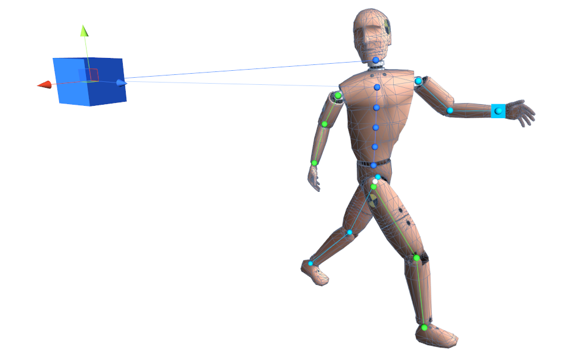
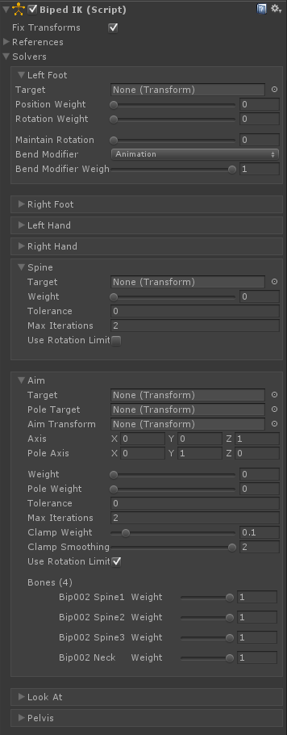

# Biped IK

用于标准 biped 角色的 IK 系统，被设计用来复制和改进 Unity 的内置 character IK setup 行为。

## BipedIK or FullBodyBipedIK?

最初 BipedIK 胜过 FullBodyBipedIK 的唯一优势是更好的性能。然而 FinalIK 4.0 之后，可以设置 FBBIK solver iteration count 为 0，此时 full body effect 将不会 solved，并且它几乎和 BipedIK 一样快。这允许在在远处的角色身上进行更容易的 IK 优化。因此，0.4 之后，建议使用 FullBodyBipedIK 组件作为 solving biped characters 的解决方案。

## BipedIK or Unity's Animator IK?

- Animator IK 不允许修改任何甚至是最基础的 solver parameters，例如 limb bend 方向，这使系统即使不是不可能也很难在稍微高级一点的情形中使用或扩展。即使在最简单的情形，Animator 也可能产生不自然的 poses 或者在不期望的方向完全一个 limb，而没有任何东西能够变通处理这个问题
- Animator IK 缺少 spine solver
- Animator 的 LookAt 功能经常解析出古怪的 pose，例如当回头看时向后弯曲 spine
- BipedIK 还可以和 Aim IK 协作

为了简化从 Unity 内置的 Animator IK 的迁移，BipedIK 支持相同的 API，因此你只需要将 animator.SetIKPosition(...) 改为 bipedIK.SetIKPosition(...) 就可以了。

BipedIK，就像 FinalIK package 中的其他组件，尽可能地减少 setup 所需要的工作。BipedIK 基于角色的骨骼结构和常见的命名约定自动检测 biped bones，因此除非你使用中文命名你的 bones，否则只需要将组件拖放到角色上应该就已经使 BipedIK 准备工作了。如果 BipedIK 未能识别 bone references，或者你就是想改变它们，你总是可以在 inspector 中管理这些 references。



## Getting started:

- 添加 BipedIK 组件到角色的 root 上（和 Animator/Animation 组件同一个 GameObject）
- 确保自动检测的 biped references 是正确的
- 点击 Play

## Accessing the solvers of Biped IK:

```C#
public BipedIK bipedIK;

void LateUpdate () {
    bipedIK.solvers.leftFoot.IKPosition = something;
    bipedIK.solvers.spine.IKPosition = something;
    ...
}
```

## Adding BipedIK in runtime:

- 通过脚本添加 BipedIK 组件
- 为 BipedIK.references 赋值
- 可选地调用 BipedIK.SetToDefaults() 来设置 solvers 的参数到 BipedIK 的默认值。否则将使用每个 solver 的默认值。

## Component variables:

- fixTransforms
- references：BipedIk 构建 sovler 需要的 character bones 的 references

## Solver variables (Limb IK)

自动检测或手动赋值的特定 limb 的骨骼，并构建专用于人形动物骨骼的各种 IK Solvers。BipedIK 就是一组 solver 的集合。

- Left Foot：LimbIK solver
- Right Foot：LimbIK solver
- Left Hand：LimbIK solver
- Right Hand：LimbIK solver
- Spine：CCD IK solver
- Aim：AimIK solver
- Look At：LookAtIK solver
- Pelvis(骨盆，root)：用来从 animated（播放的动画片段中） position/rotation 偏移角色 pelvis 的 Pos Offset 和 Rot Offset。Pos Weight 和 Rot Weight 可以被用来移动和旋转 pelvis 到 bipedIK.solvers.pelvis.position 和 bipedIK.solvers.pelvis.rotation

