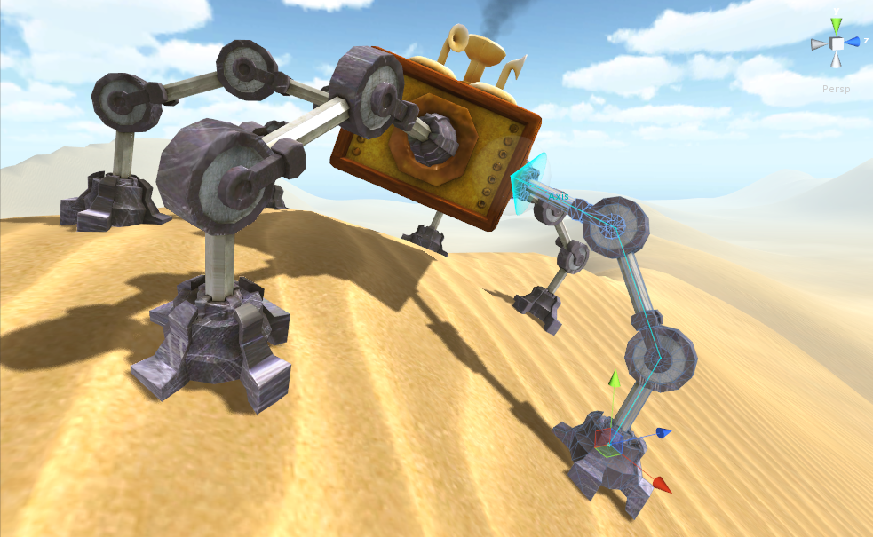
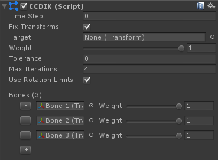

# CCD IK

CCD (Cyclic Coordinate Descent，循环坐标下降法) 是最简单最流行的 IK 方法，被广泛广泛应用到计算机游戏产业。这个 solver 背后的主要想法是每次将一个具有 end effector 的 joint align 到 target，使得链中的最后一个 bone 迭代地接近 target。CCD 是非常快而且可靠，即使应用 rotation 限制。CCD 倾向于过度强调骨骼的旋转接近 target position（一个非常长的 CCD chain 将会旋转翻转到它的 target 附近）。减少 bone weight，hierarchy 将会补偿这个效果（增加其他骨骼的 weight 来补偿）。它被设计用来处理连续的骨骼链，因此很难扩展到多个 end effectors（末端效应器）的问题（此时使用 FABRIK）。它也会花费大量的迭代来完全扩展到整个 chain。

每一帧中监控和校验 IK chain 在性能上将会非常昂贵，因此在运行时改变 bone hierarchy 必须通过在 solver 上调用 SetChain(Transform[] hierarchy) 来完成。如果 hierarchy 是有效的，SetChain 返回 true。CCD 允许直接编辑它的 bones 的 rotations（尽管不是通过 scene view 中的 handles），但是不是 positions，意味着你可以编写一个脚本，每一帧旋转 CCD 中 bones，但是你不应该尝试像 FABRIK solver 那样尝试改变 bone positions。然而，你可以随意 rescale bones，CCD 不关心 bone 的长度。

## Getting started:

- 在 chain 中第一个 gameobject 上添加 CCDIK 组件
- 将 chain 中所有 elements 赋值到组件中的 Bones，按递降顺序，首先是 Parent。Bones 可以被跳过，被跳过的 bones 将被作为一个整体
- 点击 Play，将权重设置为 1 

## Changing the target position:

```C#
public CCDIK ccdIK;
void LateUpdate () {
    ccdIK.solver.IKPosition = something;
}
```

## Adding CCDIK in runtime:

- 通过脚本添加 CCDIK 组件
- 调用 CCDIK.solver.SetChain()

## Using CCD with Rotation Limits:

简单添加一个 Rotation Limit 组件（RotationLimitAngle，RotationLimitHinge，RotationLimitPolygonal，或 RotationLimitSpline）到一个被赋值到 CCDIK 组件 Bones 的 bone 上。注意，每个 rotation limit 都会减少 solver 的稳定性和连续性。如果 CCDIK 不能够解析一个高度约束的 chain 到一个特定 target 位置，它应该不是 FinalIK 的 bug，而是 CCD 算法的基本弱点。记住，没有 IK 算法是完美的。



CCD with rotation limits applied

## Component variables:

- fixTransforms

## Solver variables:

- target：target Transform。如果被赋值，solver IKPosition 将会被自动设置到 target 的 position
- weight：平滑 blending out Ik 效果的 solver 权重
- tolerance：自最后到达的 position 的最小距离。如果距离前一次到达的 position 的距离小于这个 tolerance，停止解析。如果 tolerance 是 0，将会迭代直到 maxIterations
- maxIterations：每帧最大迭代次数。如果 tolerance 为 0，将总是迭代 maxIterations 次
- useRotationLimits：如果为 true，将使用 bones 上任何附加的 RotationLimit 组件
- bones：被 solver 使用的 bones，以达到 target。所有 bones 需要按照递降顺序保存（parents first）。Bones 可以在 hierarchy 中被跳过（不需要是连续的）。中间跳过的 bones 和上一个没被跳过的 bone 固定成一体。Bone hierarchy 不能有分支，意味着你不能 assing 双手 bones。Bone weight 决定它被 solver 使用的程度。


