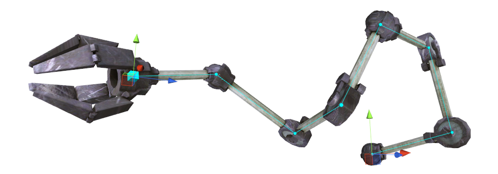
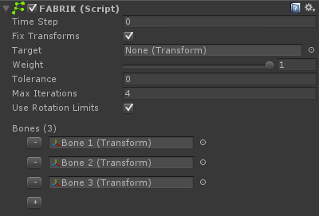

# FABR IK

Forward and Backward Reaching IK solver 基于论文：

"FABRIK: A fast, iterative solver for the inverse kinematics problem"

FABRIK 是一个启发式 heuristic solver，可以和任意数量的 bone segments 和 rotation limits 一起使用。它是一个基于 forward 和 backward 迭代移动的方法，其沿着到下一个 joint 的直线查找一个 joint 的新位置。FABRIK 建议在 position space 解决 IK 问题，而不是 rotation/orientation space，即通过移动而不是旋转，和 CCDIK 相反，尽管进行了特定修改以约束原始论文中描述的方法来提高 solver 稳定性。它通常使用被 CCD 更少的迭代达到 target，但是它在每个迭代中更慢，尤其是应用了 rotation limits 的时候。

FABRIK 尤其灵活，它甚至允许直接在 scene view 中操作 bone segments，而 solver 将会重新适应。Bone 长度也可以在运行时改变。每一帧监视和校验 IK chain 在性能上将会很昂贵，因此在运行时改变 bone hierarchy 必须通过在 solver 上调用 SetChain(Transform[] hierarchy) 完成。如果 hierarchy 有效，SetChain 返回 true。 

## Getting started:

- 添加 FABRIK 组件到 chain 中第一个 gameobject 上
- 添加 chain 中所有元素到 组件的 Bones 中
- 点击 Play，设置 weight 为 1

## Changing the target position:

```C#
public FABRIK fabrik;
void LateUpdate () {
    fabrik.solver.IKPosition = something;
}
```

## Adding FABRIK in runtime:

- 通过脚本添加 CCDIK 组件
- 调用 CCDIK.solver.SetChain()

## Using FABRIK with Rotation Limits:

简单添加一个 Rotation Limit 组件（RotationLimitAngle，RotationLimitHinge，RotationLimitPolygonal，或 RotationLimitSpline）到一个以及被赋值到 FABRIK 组件 Bones 中的 bone 上面。注意，每个 rotation limit 减少 solver 的稳定性和连续性。如果 CCDIK 不能够解析一个高度约束的 chain 到一个特定 target 位置，它应该不是 FinalIK 的 bug，而是 FABRIK 算法的基本弱点。记住，没有 IK 算法是完美的。



## Component variables:

- fixTransforms

## Solver variables:

- target
- weight
- tolerance
- maxIterations
- useRotationLimits
- bones


