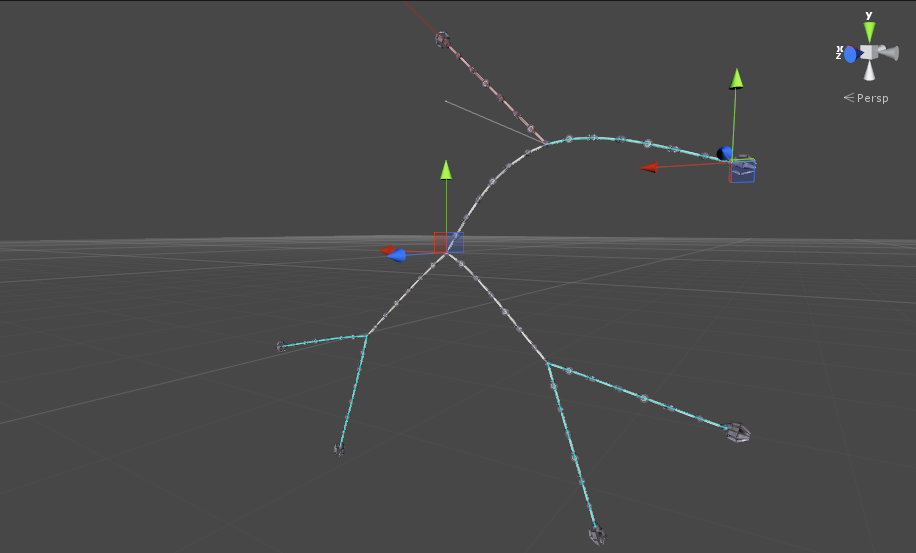
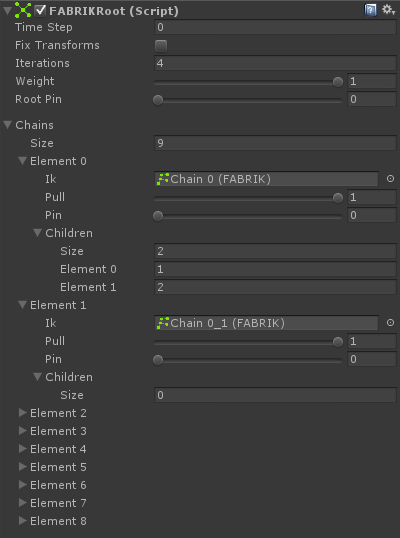

# FABRIK Root

Multi-effector FABRIK 系统。

FABRIKRoot 是一个组件，它连接 FABRIK chains 到一起，以形成极为复杂的包含多分支，end-effectors 和 rotation limits 的 IK 系统。

## Getting started:

- 创建 multiple FABRIK chains，按照你想要的它们连接的方式放置它们。Chains 不必彼此 parented
- 确保一个 child chain 第一个 bone 和它的 parent 的最后一个 bone 是相同的位置
- 创建一个 new GameObject，添加 FABRIKRoot 组件
- 添加所有 FABRIK chains 到 FABRIKRoot 组件的 Chains 字段中
- 点击 Play

## Accessing the chains of FABRIKRoot:

```C#
public FABRIKRoot fabrikRoot;
void LateUpdate () {
    Debug.Log(fabrikRoot.solver.chains[index].ik.name);
}
```

## Limitations:

- 各个 FABRIK chains 不能使用相同的 bones，它们必须完全独立
- 一个 FABRIK chain 的最后 bone 必须和它的 child chain 的第一个 bone 在相同的位置



FABRIK Root chain being pulled

## Component variables:

- fixTransforms

## Solver variables:

- weight：平滑 blending out IK effect 的 solver 权重
- iterations：每帧最大的迭代数
- rootPin：钉住 pinning 第一个 chains 到这个组件所在 Transform 的权重
- chains：被 FABRIKRoot 使用的 FABRIK 组件列表

## Chain variables:

- IK：FABRIK 组件
- pull：parent pull 权重。这个 chain 多大程度 pull 它的 parent
- pin：抗拒 resistance 被 child chains pull 的权重。如果为 1，这个 chain 不能被它的 child chains 拉离位置
- children：这个 chain 的直接 children 在Chains 数组的索引。Don't add children of the children。


