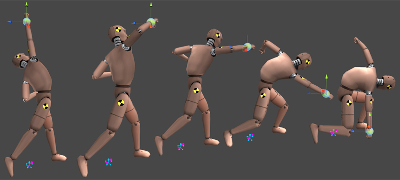
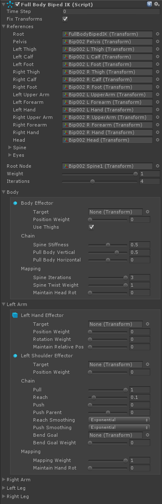

# Full Body Biped IK

Fianl IK 包含了用于 biped character 极为灵活和强大的高速轻量 FBIK solver。

FullBodyBipedIk 映射任意 biped character 到一个低解析度的 multi-effector（四肢，左右肩，左右大腿，head，body 都有相应的 effector）IK rig，解析它，然后将结果映射会 character。这在每帧 LateUpdate 中完成，在 Mecanim/Legacy 完成动画之后，因此它完全独立于 animating system。

- Chains

  在内部，每个 limb 和 body 都是 FBIKChain class 的实例。Root chain 是 body，包含一个单一 node，而 limbs 是它的 children。这种设置形成了一个 root node 周围的 multi-effector IK tree

注意：Nodes 是 Chains 的成员。例如，一个 Arm chain 包含 3 个 nodes，upper arm，forarm 和 hand。每个 node 维护一个对它的 bone 的引用(node.transform)（这有点类似于 Unity avatar，是一个虚拟 bone）。当 solver 正常处理或者完成后，这个 bone 的 solved position 被存储在 node.solverPosition。

- Effectors

  FullBodyBipedIK 有 3 个类型的 effectors：end-effectors（hands 和 feet），mid-body effectors（shoulder 和 thighs），和 multi-effectors（the body）。End-effectors 可以在被旋转，而改变 mid-body 和 multi-effectors 的 rotation 没有效果。改变 end-effector rotation 还改变了 limb 的弯曲方向（除非你正使用 bend goals 来覆盖它）。Body effector 是一个 multi-effector，意味着它还拖拽两个 thigh effectors（以简化 body 的位置）。Effectors 还有一个 positionOffset property，其可以用来非常容易地操作底层动画。Effectors 还在每个 solver update 之后重置它们的 positionOffset 到 Vector3.zero。

- Pulling, Reaching and Pushing

  每个 chain 具有 pull 属性。当所有 chain 都有 pull = 1，pull weight 在 limbs 之间均匀分配。这意味着如果 effectors 彼此相距非常远，不保证到达所有的 effectors。结果可以通过改变 chain 的 reach 参数，增加 solver interation count，或每帧更新多次 solver来调整和改善。

  然而，当 left arm chain 具有 pull weight = 1 而其他的都是 0，你可以从 character 的左手将它拉到无穷 Infinity 而不会失去左手对 target 的接触。Push 和 Push parent 的值决定一个 limb 在到达 reach 过程中如何传输能量到它的 parent nodes。在 Scene View 中试验这些 values 以得到对它们如何行为的更好理解。

- Mapping

  IKSolverFullBodyBiped 解析一个非常低解析度 resolution 但高速的 armature。角色在 spine 上可能有很多 bones，它可能在 arms 和 shoulder 或 hip bones 上有twist（扭转）bones 等等。因此，在解析之前，solver 需要将高解析度的骨架 skeleton 映射到低解析度骨架上，之后反过来。有 3 种类型的 mappers：IKMappingSpine 用于映射 pelvis 和 spine，IKMappingLimb 用于 limbs（包括 clavicle 锁骨），以及 IKMappingBone 用于 head。你可以通过 IKSolverFullBody.spineMapping，IKSolverFullBody.limbMappings 和 IKSolverFullBody.boneMappings 访问它们。



使用 FullBodyBipedIK retargeting 一个单一的 punching 动画。

## Limitations:

- FullBodyBipedIK 没有用于手指和脚趾的 effectors。使用 IK 解析 fingers 在绝大多数情况下过度了，因为在游戏中手的姿势非常少。使用 10 个 4-segment constrained CCD 或 FABRIK chains 来 position fingers 很可能不是你想要的，它会浪费你珍贵的毫秒数。查看 Driving Rig demo 来学习如何非常快速地（完全在 Unity 中）pose fingers 到物体上

- FullBodyBipedIK 采样你角色的初始姿势 (在Start()和每次你重新初始化 solver 时)，以找出四肢应该弯曲的方式。因此，这是一种限制，即角色的肢体 limbs 在那一刻应该按照自然的方向弯曲。然而，一些角色在几何上是完美的 T-Pose，这意味着他们的四肢是完全笔直的。有些角色的四肢甚至会稍微向相反的方向弯曲(例如一些 Mixamo rig)。如果出现这个问题，FullBodyBipedIK 会警告您。你所要做的，就是在场景视图中稍微旋转前臂或小腿骨，使其朝着应该弯曲的方向弯曲。因为这些旋转在播放模式下会被动画覆盖，所以你不用担心会弄乱你的角色，它们只是提示 FBBIK limbs 自然弯曲的方向

- FullBodyBipedIK 没有肘/膝盖效应器 effectors。如果将来有实际需求，这种情况可能会改变。肘部和膝盖的位置仍然可以修改，尽管 bend goals 是支持的。

- Optimze Game Objects 应该被关闭，或者至少是 solver 所需要的所有 bones 应该暴露出来

  Optimize Game Objects should be disabled or at least all the bones needed by the solver (FullBodyBipedIK.references) exposed

- 四肢 limbs 上额外附加的 bones 是支持的，只要它们的动画只是 twisting（扭转，绕着 Z 轴旋转）的。如果额外 bones 有挥舞动画，例如翅膀骨骼， FBBIK 将不能正确解析 limb

- 当角色通过 hand 被拉开时，FullBodyBipedIK 不会旋转肩骨 shoulder bone。它将保持肩骨相对于胸部的旋转，就像在动画中一样。在大多数情况下，这不是一个问题，但有时，特别是当接触头顶上方的东西时，沿着肩骨旋转会更真实。在这种情况下，你应该有一个底层的可以旋转肩骨的接触(程序化 procedural)动画，或者也可以在 IK solver 读取角色的姿态之前通过脚本旋转肩骨 should bone。在 demos 中中还包含了一个变通脚本，叫做 ShoulderRotator，只需要将它添加到 FBBIK 游戏对象中即可

  IK 和 Physics 系统一样，都是程序式动画的一种，它们随着时间约束骨骼的 position 和 rotation。Transform 最终效果取决于所有系统的对它的约束的综合，一个系统向左拉它，而另一个系统可能向右拉它。

- 当你移动一个 limb end-effector 而这个 effector rotation weight = 0，FBBIK 将会尝试维持 limb 的弯曲方向和它动画的方向一样。当 limb 从它的 animated 方向旋转接近 180 度时，你将会遇到 limb 翻滚的情况，意味着，solver 不知道在这个奇异点 point of singularity，以哪种方式旋转 limb（没有既有的弯曲方向可以参考，因为它在奇异点上）。因此如果你有一个 walking 动画，hands 向下，而你想使用 IK 来抓住一些头上的东西，你还必须 animate（动画之）effector rotation 或者使用一个 bend goal（应该是类似 pole，提示弯曲的方向，不在奇异点的时候，不需要 bend goal，因为有既有的角度偏移提示弯曲方向），以确保当接近 180 度角度偏移时 arm 不会从后面绕过来。这不是一个 bug，而是如果我们想要维持动画弯曲方向的逻辑必然性。

- FullBodyBipedIK 将所有肘、膝盖关节考虑为 3 DOF joints，使得 swing rotation 约束到一个半球的范围。这允许对全部 biped rigs 的弯曲精确映射，唯一已知的限制是 limbs 不能翻转 inverted（从 knee/elbow 断开）

## Getting started:

- 添加 FullBodyBipedIK 组件到角色的 root 上（Animator/Animation 组件同一个 GameObject）
- 确保自动检测的 biped 引用是正确的（bones）
- 确保 Root Node 被正确检测。它应当是 lower spine 中的一个 bone
- 在 scene view 观察一下角色，确保你在 character 上看见 FullBodyBipedIK armature
- 点击 Play，weigh in the effectors（增加效应器的权重）

## Accessing the Effectors:

```C#
public FullBodyBipedIK ik;

void LateUpdate () {
    // 设置左手 effector position 到世界空间中的一个位置。如果 effector 的 positionWeight = 0，这没有效果
    ik.solver.leftHandEffector.position = something; 

    // 设置左手 effector rotation 到世界空间中的一个 rotation。如果 effector 的 rotationWeight = 0，这没有效果
    ik.solver.leftHandEffector.rotation = something;

    // 增加 effector effector position 的权重，左手将会被钉到 pinned ik.solver.leftHandEffector.position（即左手跟随 effector）。
    ik.solver.leftHandEffector.positionWeight = 1f;

    // 增加 effector rotation 的权重，left hand 和 arm 将会被钉到 pinned ik.solver.leftHandEffector.rotation
    // 注意如果你只想要选择 hand，但是不改变 arm bending，只在 FBBIK 完成更新之后旋转 hand bone 就可以了（使用 OnPostUpdate delegate）
    ik.solver.leftHandEffector.rotationWeight = 1f;

    // 从动画的位置偏移 hand。如果 effector positionWeight = 1，这没有效果，以为 hand 的位置完全跟随 effector
    // 注意 effectors 在每个 update 之后会重置它们的 positionOffset 为 Vector3.zero，因此你可以（而且应该）增量地 additively 使用它们，不用害怕累积效应。
    // 这允许你你容易地通过多个脚本编辑这个 value
    ik.solver.leftHandEffector.positionOffset += something; 
    
    // effector mode 用于在没有权重时改变 limb 行为的方式。
    // Free 意味着 node 完全不被 solver 控制
    // (如果遇到 smoothness 的问题，试着改变 hands 的 effector mode 为 MaintainAnimatedPosition 或 MaintainRelativePosition
    // MaintainAnimatedPosition 在每个内部的 solver iteration 重置 node 到 bone 的 animated position
    // 这几乎总是用于 feet，因为通常你希望它们是动画中位置
    // MaintainRelativePositionWeight 维持 arm 相对于 chest 和 legs 相对于 hips 的 position。
    // 因此如果你从 left hand 拉 character，right arm 将会沿着着 chest 旋转。通常你不想要对 legs 使用这个行为。
    ik.solver.leftHandEffector.maintainRelativePositionWeight = 1f;

    // body effector 是一个 multi-effector，意味着它在 solver 中还操作其他 nodes，换句话说就是 left thigh 和 right thign
    // 因此你可以带着 thigh bones 移动 body effector。如果设置 effectChildNodes 为 false，thigh nodes 将不会被 body effector 改变。
    ik.solver.body.effectChildNodes = false;

    // 其他 effector：rightHandEffector, leftFootEffector, rightFootEffector, leftShoulderEffector, rightShoulderEffector, leftThighEffector, rightThighEffector, bodyEffector
    // 你还可以通过下面的方法查找一个 effector
    ik.solver.GetEffector(FullBodyBipedEffector effectorType);
    ik.solver.GetEffector(FullBodyBipedChain chainType);
    ik.solver.GetEndEffector(FullBodyBipedChain chainType); // Returns only hand or feet effectors
}
```

## Accessing the Chains:

```C#
public FullBodyBipedIK ik;
void LateUpdate () {

    // 改变 left arm 的 Pull value
    ik.solver.leftArmChain.pull = 1f; 

    // 改变 left arm 的 Reach value
    ik.solver.leftArmChain.reach = 0f;

    // 其他 chains：rightArmChain, leftLegChain, rightLegChain, chain (the root chain)
    // You can also find a chain by:
    ik.solver.GetChain(FullBodyBipedChain chainType);
    ik.solver.GetChain(FullBodyBipedEffector effectorType);
}
```

## Accessing the Mapping:

```C#
public FullBodyBipedIK ik;
void LateUpdate () {
    // 改变 spine mappig 的迭代次数（从低解析度 rig 映射到到解析度）的迭代次数
    ik.solver.spineMapping.iterations = 2;

    // 使 left hande 维持它在动画中的 rotation
    ik.solver.leftArmMapping.maintainRotationWeight = 1f;

    // Make the head maintain it's rotation as animated.
    ik.solver.headMapping.maintainRotationWeight = 1f;
}
```

## Adding FullBodyBipedIK in runtime (UMA):

```C#
using RootMotion; // Need to include the RootMotion namespace as well because of the BipedReferences

FullBodyBipedIK ik;

// 在运行时无论何时需要添加 FullBodyBipedIK，调用这个方法
// 请注意 FBBIK 将会在初始时采样 character 的 pose 使得在调用这个方法时，character 的 limbs 将会在它们自然方向弯曲
void AddFBBIK (GameObject go, BipedReferences references = null) {
    if (references == null) {
        // 自动检测 biped 定义，如果我们还没有它的话
        BipedReferences.AutoDetectReferences(ref references, go.transform, BipedReferences.AutoDetectParams.Default);
    }

    // 添加 FullBodyBipedIK 组件
    ik = go.AddComponent<FullBodyBipedIK>();

    //设置 FBBIK 到 references。如果你相信 FBBIK 自动设置它为 spines bones 中的一个 bone，你可以将第二个参数保留为 null
    ik.SetReferences(references, null);

    // Using pre-defined limb orientations to safeguard from possible pose sampling problems (since 0.22)
    ik.solver.SetLimbOrientations(BipedLimbOrientations.UMA); // The limb orientations definition for UMA skeletons
    // or...
    ik.solver.SetLimbOrientations(BipedLimbOrientations.MaxBiped); // The limb orientations definition for 3ds Max Biped skeletons
    // or..
    ik.solver.SetLimbOrientations(yourCustomBipedLimbOrientations); // Your custom limb orientations definition
    // To know how to fill in the custom limb orientations definition, you should imagine your character standing in I-pose (not T-pose) with legs together and hands on the sides...
    // The Upper Bone Forward Axis is the local axis of the thigh/upper arm bone that is facing towards character forward.
    // Lower Bone Forward Axis is the local axis of the calf/forearm bone that is facing towards character forward.
    // Last Bone Left Axis is the local axis of the foot/hand that is facing towards character left.
}
```

## Solving the head

Final IK 0.5 引入了 FBBIKHeadEffector 组件，它允许我们使用 FullBodyBipedIK 组件来映射一个 character 到 head 的 target position and rotation。

查看 Head Effector demo scene 学习如何设置。

这对 VR 开发者尤其有用。可以下载 Oculus VR demo scenes for Fianl IK。

## Optimizing FullBodyBipedIK:

- 你可以使用 renderer.isVisible 在 character 不可见的时候停止 solver
- 大部分时间，你不需要如此多的 solver iterations 和 spine mapping iterations。FinalIK 0.4 之后，我们可以设置 solver iteration count 为 0，此时 full body effector 不会被解析。这允许在角色距离很远时优化角色上的 IK（IK 的 LOD，当角色距离很远的时候，根本看不清动画细节，精确的 IK 解析也就没有什么意义）
- 如果你不需要的话，保持 Reach value 为 0。默认情况下，它们是 0.05f 来提高精确度
- 此外，设置 Spine Stiffness，Pull Body Vertical 和 Pull Body Horizontal 为 0 将会轻微提升性能
- 你不需要 spine array 中的所有 spin bones。FBBIK 在 spine 只有两个 bones 时工作最快，第一个 bone 作为 RootNode，另一个作为 spine 的最后一个 bone（两个 arm 的最近的祖先）。在 Spine 中拥有更少的 bones 使得它更坚实 rigid，有时甚至更好，看起来更自然

## Component variables:

- fixTransforms
- references：FullBodyBipedIK 需要建立它的 solver 的 character bones 的引用。Eyes 不是必须的

## Solver variables:

- rootNode：body 的中心 bone。在 Scene View 中应该会看见两个三角，the chest 胸膛（两个 shoulder 到 spine）和 the hips（两个 thigh 到 spin）臀部，通过 root Node 连接
  
  

- weight：solver IK 效果的权重。
- iterations：solver iteration count。如果为 0，full body effect 不会被计算。这允许远距离角色的 IK 优化

## Body variables:

- Target：body effector 的 target transform。如果被赋值，solver.bodyEffector.position 将会自动被设置为 target 的 position
- Position Weight：body effector 的 position 权重。如果 weighed in（增加权重，zoom in），body 将会被钉在 pinned solver.bodyEffector.position。这 overrides 了 bodyEffector.positionOffset
- Use Thighs（大腿）：如果为 true，body effector 上的任何效果还会应用到 thigh effectors 上。这使得移动下半身 lower body 更容易
- Spine Stiffness：spine constraints 的 stiffness（僵硬度）。减少这个值将使 spine 更容易弯曲 crack
- Pull Body Vertical：hand effectors 垂直拉身体（相对于 root rotation）的 weight
- Pull Body Horizontal：hand effectors 水平拉身体（相对于 root rotation）的 weight
- Spine Iterations：FABRIK 算法的迭代次数。如果在 References 中有两个 bones 被赋予 Spine，则不会被使用
- Spine Twist Weight：平滑扭转 twisting spine bones 到 chest triangle 的权重。相对昂贵，因此如果没有很多 spine twisting 要执行，将其设为 0
- Maintain Head Rot：如果为 1，head 将会被旋转回到解析 FBBIK 之前的那里（在世界空间）（即不 IK 解析 head）

## Limb variables:

- Target：effector 的 target transform。如果被赋值，effector.position 将会被自动设置到 target 的 position
- Position Weight：effector 的 position weight。如果增加权重（weighed in），effector bone 将会被钉在 pinned effector.position。这覆盖了 effector.positionOffset
- Rotation Weight：effector 的 rotation weight。如果增加权重（weighed in），limb 将会被旋转到 effector.rotation。这还改变了 limb 的 bending 方向。如果 solver 假设的 bending 方向是不能接受的，设置 rotation weight 为 0 并且或者只是在 FBBIK 完成之后旋转 hand/foot 或者使用一个 Bend Goal（Pole Target，用于指示方向）用于完全的精确度
- Maintain Relative Pos：如果为 1，unweighed limb 将会沿着 chest/hip 三角旋转
- Pull：pulling parent chain 的权重。如果这个 limb 是唯一具有全量 pull weight 而其他的 limbs 没有，你将可以从那个 effector pull character 而不是去接触（应该是例如手握住一个水杯，水杯是 target，移动水杯，手会随之移动，同时身体随之调整，但是手和水杯保持接触）
- Reach：拉 pull limb 的 first bone 靠近 last bone
- Push：当 end-effector 接近 shoulder/thigh 时，end-effector pushing should/thigh 的权重
- Push Parent：传递给 parent（transferred）的 push 力量大小（从 hand 或 foot 到 body）
- Reach Smoothing：损失一些精确度，平滑 Reach 效果
- Push Smoothing：损失一些精确度，平滑 Push，Push Parent 的效果
- Bend Goal：如果被赋值，将会按照从 shoulder/thigh 到 Bend Goal 的方向弯曲 limb
- Bend Goal Weight：limb 朝向 Bend Goal 弯曲的权重
- Mapping Weight：如果为 0，limb 将不会被映射，意味着 limb 的 bones 根本不会被旋转，即使 effectors 增加权重（weighed in）

  Mapping 指的是从低解析度 rig 映射到 character rig
  
  Mapping Weight 就是控制映射的权重，权重 = 1，IK 的结果才会在 character rig 上显示，权重 = 0，IK 在低解析度 rig 上运行，但是不会显示在 character rig 上

- Maintain Hand/Foot Rot：如果为 1，将会旋转 hand/foot 回到 FBBIK 之前的那里（世界空间）。这通常用于在改变 body 的 position 或 feet 的高度时，保持 feet 对齐到 surface，

