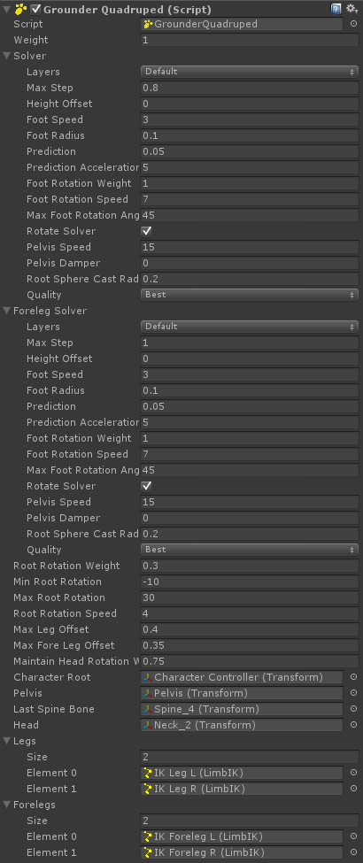

# Grounder

Grounder 是一个 automatic vertical foot placement and alignment correction system。

## How does it work?

Solver 以一个非常基本的原则工作：character 在 planar ground 上 animated。Feet 的 height 和 rotation 在它们 animated 时应该只被偏移它们的 ingame position 的 ground height 和 root height 的差。

让我们来采样动画中的一帧，其中 character 的左脚 y position 是 0.1. Ingame，Grounding solver 将会生成一些 raycasting 来查找 left foot position 的真实 ground height。比如说 raycasting 返回 0.2. 如果 character 的 ingame y position 是 0，foot position 相对于 character root 的 ground height 是 0.2. Foot 必须被垂直偏移准确的 value，结果为 0.3.

这种方式保证对动画的最小影响，因为 feet 只会在它们所在位置的 ground height 和 character root height（角色 foot 底部的高度）不同时才会被偏移。如果这个 offset 是负的，意味着 foot position 处的 ground height 更低，则 solver 需要向下拉 character 的骨盆 pelvis 使得 feet 能够到达它们的 offset targets。

## Getting started:

- 创建一个 empty GameObject，parent 它到 character 的 root，设置它的 localPosition 和 localRotation 为 0
- 根据那个 GameObject 的character 类型，添加 GrounderFBBIK，GroundBipedIK，GrounderIK 或 GroundQuadruped
- 为 Grounder component 中的所有 empty fields 和 ground layers 赋值
- 确保 character collider layer 不在 walkable layers 中

## Solver variables:

- layers：walk on 的 layers。确保排除了 character 自身的 layer
- maxStep：feet 的最大 offset。注意 foot 的 animated 高度从这个 range 中减去才是能够调整的最大高度，意味着 foot 相对于 root 的高度已经被 animated 到 0.4，而 max step 为 0.5，则它只能 offset 0.1
- heightOffset：从原始 animated height 偏移 character（无关 ground），这可以用于微小调整
- footSpeed：foot 的插值速度（interpolation speed）。增加它将会增加精确度，而以平滑度 smoothness 为代价（range：0 - inf）
- footRadius：feet 的 size。这对于 fastest quality settings 没有效果（range：0.0001 - inf）
- prediction：预测量级。预测是基于 feet 的速度向量的。增加这个值使 feet 查找它们路径上的更远障碍物，但是以平滑度 smoothness 为代价（range：0 - info）（创意行业，例如游戏开发，充满大量的利弊权衡，没有完美的解决方案。根据具体应用场景的特点选择合适的方案。应该对此习以为常） 
- footRotationWeight：offset feet rotation 的权重（range：0-1）
- footRotationSpeed：插值 foot offset 的速度（range：0 - inf）
- maxFootRotationAngle：foot offset 的最大角度（range：0 - 90）
- rotateSolver：如果为 true，将会使用 character 的 local up 向量作为 solver 的 vertical 向量，而 character 将能够在 walls 和 ceilings 上行走。如果没有需要关闭这个选项以节省性能
- pelvisSpeed：pelvis 的插值速度。增加这个值将会使 character 的 body 向上向下移动更快。如果你不想 pelvis 移动（通常是蜘蛛类型），设置它为 zero（range：0 - inf）
- pelvisDamper：阻尼 character root 的垂直运动。这只在 root 由于 physics 移动得过于剧烈时而你希望使垂直移动平滑一些时有用
- lowerPelvisWeight：向下移动 pelvis 到最低的 foot 的权重。这在当角色沿着楼梯向下走需要到达更低的台阶时移动 pelvis 
- liftPelvisWeight：向上移动 pelvis 到最高的 foot 的权重。这在当角色沿着楼梯向上走需要到达更高的台阶时移动 pelvis 
- rootSphereCastRadius：root sphere cast 的半径。这在 Fastest 和 Simple quality settings 中没有效果
- quality：主要决定 ray/sphere/acpsule casting 的权重。Fastest 只会每个 foot 生成一个 raycast，加上一个对 root 的 raycast。Simple 对每个 foot 生成 3 个 raycasts，加上一个对 root 的 raycast。Best 意味着每个 foot 1 个 raycast 和一个 capsule cast，以及一个 sphere cast 用于 root

## Grounder Components

### GrounderFBBIK

GrounderFBBIK 使用 FullBodyBipedIK 组件用于 offset feet 和可选地弯曲 spine。如果你的 character 已经有一些 FBBIK 功能而且你仍然需要这个组件时非常有用。Grounder FBBIk 使用 effectors 的 positionOffset，因此如果需要你仍然可以钉住 pin feet 而没有任何问题。

#### Component variables:

- weight：master 的权重。在不需要的时候，Grounder 的 effect 可以平滑的淡出（不在 IK 解析）以节约性能
- spineBend：spine bending 的程度。spine 只会在 character 面对一个斜坡或楼梯时弯曲。负值将会翻转效果
- spineSpeed：spine bending 的速度（range：0 - inf）
- spine：弯曲 spine 涉及的 FBBIK effectors 和它们的 水平/垂直 权重

### GrounderBipedIK

GrounderBipedIK 使用 BipedIK 组件来 offset feet 和可选地弯曲 spine。使用 BipedIK，你不必为 limbs 手动设置 IK 组件

#### Component variables:

- weight：master weight
- spineBend
- spineSpeed

### GrounderIK

GrounderIK 可以使用 CCD，FABRIK，LimbIK，或 TrigonometricIK 组件的任意数量和组合来偏移 limbs。这通常用于一个单个 hub 连接超过 2 个 legs 的 spider/bot 角色类型。

#### Component variables:

- weight 
- legs：IK 组件。可以是连接在相同的 pelvis 的 CCD，FABRIK，LimbIK，或 TrigonometricIK 的任意数量和组合
- pelvis：pelvis transform。这应该是 legs 和 spine 的最上面的共同 parent
- characterRoot：这只在你希望使用 root rotation 功能时需要。Root rotation 将会旋转 character root 到 ground normal
- rootRotationWeight：root rotation 的权重（range：0 - 1）
- rootRotationSpeed：root rotation 插值的速度（range：0 - inf）
- maxRootRotationAngle：从默认 Vector3.up 旋转 characterRoot.up 的最大角度（range：0 - 90）

### GrounderQuadruped（Quadruped 四足动物）

GrounderQuadruped 使用 2 个 Grounding solvers。这意味可以有 2 个拥有任意数量 legs 的 hubs 

#### Component variables:

- weight
- forelegSolver：用于 forelegs 的 Grounding solver
- characterRoot
- rootRotationWeight：root rotation 的权重。如果 quadruped 站在一个边缘并且俯下身来让前腿踏上地面，你需要增加这个 value，以及 root rotation limit（range：0 - 1）
- rootRotationSpeed：root rotation 插值的速度（range：0 - inf）
- minRootRotation：向下方旋转 quadruped 的最大角度（going downhill，range：-90 - 0）
- maxRootRotation：向上方旋转 quadruped 的最大角度（going uphill，range：0 - 90）
- pelvis
- lastSpineBone：spine 的最后一个 bone，forelegs 的 common parent
- maxLegOffset：legs 从它们 animated position 的最大偏移。这允许你设置 maxStep 更高而不使 feet 翻转 inverted（range：0 - inf）
- maxForelegOffset：forelegs 从它们 animated position 的最大偏移。这允许你设置 maxStep 更高而不使 forefeet 翻转 inverted（range：0 - inf）
- head：head transform，如果你想要在 animated 时维护 maintain 它的 rotation
- maintainHeadRotationWeight：在 animated 时维护 maintain head rotation 的权重（range：0 - 1）

