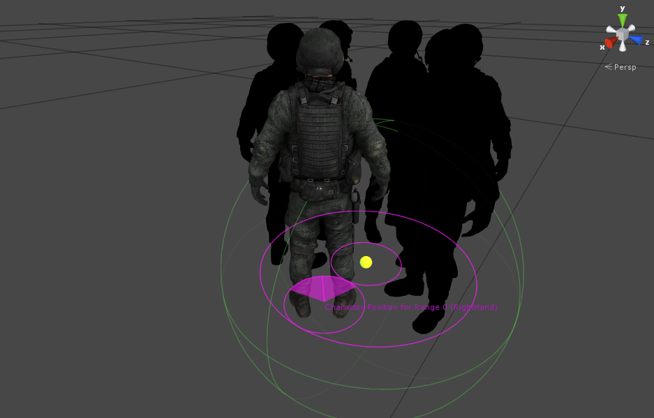

# Interaction System

## Overview

使用 FBBIK 一个重要的应用场景就是和游戏内的 GameObject 交互。提供了 FBBIK，我们可以自己编写脚本来实现交互逻辑。但是因为这个场景太常见了，因此 FinalIK 给出了解决方案，即 Interaction System，使得我们不必自己编写 code。

Interaction System 被设计用于方便设置 full body IK 与动态游戏环境的交互 Interactions。它需要一个带有 FullBodyBipedIK 的 character 并且由 3 个主要组件组成：InteractionSystem，InteractionObject，InteractionTarget

### Getting started:

- 添加 InteractionSystem 组件到一个 FBBIK character
- 添加 InteractionObject 组件到你想要交互的 object 上
- 创建一个 PositionWeight 权重曲线，包含 3 个 keyframes {(0, 0), (1, 1), (2, 0)}
- 添加 InteractionSystemTestGUI 组件到 character 并填充它的字段以快速 debugging interaction
- Play scene 并按下 GUI 按钮开始交互

### Getting started with coding:

```C#
using RootMotion.FinalIK;

public InteractionSystem interactionSystem; // Reference to the InteractionSystem component on the character

public InteractionObject button; // The object to interact with

public bool interrupt; // If true, interactions can be called before the current interaction has finished

void OnGUI() {
    // Starting an interaction
    if (GUILayout.Button("Press Button")) {
        interactionSystem.StartInteraction(FullBodyBipedEffector.RightHand, button, interrupt);
    }
}
```

查看 Interaction System 的 API 参考获取所有的 interaction 函数。

## Components of the Interaction System

### InteractionSystem

这个组件应该被添加到包含 FBBIK 组件的同一个的 gameobject。它是用来控制角色的 interactions 的 main driver 和 main interface。

#### Component variables:

- targetTag：如果不为空，只有具有指定 tag 的 targets 被 interaction system 使用。如果在游戏中有 character 具有不同的 bone orientations 时，这很有用。
- fadeInTime：被 interaction 使用的所有 channels fading in 需要的时间（effector 的 weight，reach，pull 等等）
- speed：这个 character 所有 interactions 的 master speed
- resetToDefaultsSpeed：如果 > 0，在没有交互时，lerp InteractionSystem 使用的所有 FBBIK channels 回到他们默认或初始 values 
- collider：使用 InteractionTriggers 注册 OnTriggerEnter 和 OnTriggerExit events 的 collider
- camera：被 需要 camera 位置的 Interfaction Triggers 使用。赋值第一人称视角相机
- camRaycastLayers：从 camera 进行 raycast 的 layers（沿着 camera.forward）。所有看着 target colliders 的 InteractionTrigger 应该被包含
- camRaycastDistance：从 camera raycast 的 max distance
- fullBody：对 FullBodyBipedIK 组件的引用
- lookAt：Look At 使用一个 LookAtIK 组件自动将 body/head/eyes 转向 Interaction Object
  - IK：对 LookAtIK 组件的引用
  - lerpSpeed：插值 LookAtIK target 到 Interaction Object 的速度
  - weightSpeed：weighing in/out LookAtIK weight 的速度


### InteractionObject

这个组件应该被添加在我们想要交互的组件上。它包含交互本质的绝大多数信息。它不指定哪些身体部分将被使用，而是指定了外观、感觉、和交互的动画。这种方式中，交互的特征 characteristics 被 object 定义，并且可以在多个 effectors 之间共享。因此一个 button 将被以相同的方式按下，无论是用哪个 effector。

#### Animating Interaction Objects:

Interaction System 引入了 animating objects 的概念，而不是 animating characters。因此相比于 animating 一个 character 打开一扇门或按下一个按钮，我们可以只 animate door opening 或者 button 被按下，并让 Interaction SYstem 移动 character 来 follow 这个动画（被交互的物体，例如门或者按钮，作为 master，它们主动播放动画，然后交互的角色的效应器跟随 master 运动，然后 IK 交互系统解析角色骨骼跟随效应器，即 master -> effector -> bones). 这种方式为我们提供了动态交互的极大灵活性，甚至允许多个同时 animated 的交互。你可以 animate 带有 dope sheet 的 InteracitonObject，然后通过使用 InteractionObject 组件中的 OnStartAnimation，OnTriggerAnimation，OnReleaseAnimation 和 OnEndAnimation animator events 调用那个动画。

#### Component variables:

- otherLookAtTarget：look at target。如果为 null，将会 look at 这个 GameObject。这只在 InteractionLookAt 组件被使用时有效
- otherTargetRoot：InteractionTargets 的 root Transform。这被用来自动查找所有 InteractionTarget 组件，因此所有 InteractionTargets 应该被 parented 到它上面，作为它的子节点
- positionOffsetSpace：如果被赋值，所有 PositionOffset channels 将会被应用在这个 Transform 的 rotation space。否则，它们将会被 character 的 rotation space
- weightCurves：weight curves 定义了 interaction 的过程。Interaction 将会和这个列表中最长 weight curve 一样长。Curve 的 horizontal value 表示自 interaction start 的时间。Vertical value 表示它的 channel 的 weight。因此如果我们有一个 weight curve 用于具有 3 个 keyframes {(0, 0), (1, 1), (2, 0)} 的 PositionWeight，keyframe 表示（time，value），则一个 effector的 positionWeight 将会在交互开始的第 1 秒到达 1，然后在第 2 秒回到 0。Curve types 表示的是：
  - PositionWeight - IKEffector.positionWeight,
  - RotationWeight - IKEffector.rotationWeight,
  - PositionOffsetX - X offset from the interpolation direction relative to the character rotation,
  - PositionOffsetY - Y offset from the interpolation direction relative to the character rotation,
  - PositionOffsetZ - Z offset from the interpolation direction relative to the character rotation,
  - Pull - pull value of the limb used in the interaction (FBIKChain.pull),
  - Reach - reach value of the limb used in the interaction (FBIKChain.reach),
  - RotateBoneWeight - rotating the bone after FBBIK is finished. In many cases using this instead of RotationWeight will give you a more stable and smooth looking result.
  - Push - push value of the limb used in the interaction (FBIKChain.push),
  - PushParent - pushParent value of the limb used in the interaction (FBIKChain.pushParent),
  - PoserWeight - weight of the hand/generic Poser.
- multipiler：weight curve multipilers（乘数，因子）被设计用于减少 AnimationCurves 的程度。如果你需要 rotationWeight curve 和 positionWeight curve 一样，你可以使用一个 multipiler 而不是重复这个 curve。在这种情况下，multiplier 将会是这样：Curve = PositionWeight，Multiplier = 1，Result = RotationWeight。如果为 null，将会使用 InteractionObject gameobject
- events：用来在 interaction 开始后的特定时间触发 animations，messages，interaction pause，或 pick-ups 的 events
  - time：触发 event 的时间（自 interaction start 之后）
  - pause：如果为 true，将会在这个事件中暂停 interaction。通过调用 InteractionSystem.ResumeInteraction(FullBodyBipedEffector effectorType) 或 InteractionSystem.ResumeAll() 来恢复 interaction
  - pickUp：如果为 true，Interaction Object 将会被 parented 到 interacting effector 的 bone 上。这只在单个 effector 和物体交互时正确工作。对于双手 pick-ups，请看 Interaction PickUp2Handed demo
  - animations：这个 event 上调用的 animations 列表。Animator 或 Animation 应用 Animation State cross-fade（使用 Cross Fade Time）将会被调用的 animator 组件。Layer 是 Animation State 的 layer，并且如果 Reset Normalized Time 被选中，animation 将会总是从 start 开始
  - messages：这个 event 上发送的 messages 列表（使用 GameObject.SendMessage()，所有消息都需要一个 receiver）。Function 是在 Recipient gameobject 上调用的函数的名字


### InteractionTarget

如果 Interaction Object 没有 Interaction Target，Interaction Ojbect 自己的 position 和 rotation 将会被用作所有 effectors 的 target。然而，如果你需要非常精确地放置一个 hand，你需要创建一个 Interaction Target。正常情况下，你会首先 pose 一个 character hand 的副本 duplicate，将它 parent 到 Interaction Object，并添加 Interaction Target 组件。InteractionObjects 将会自动发现它们 hierarchies 下面的所有 Interaction Targets，并将它们用于相应的 effectors。


#### Working with Interaction Targets

- 赋值 character，position 并 pose 一个 hand 到 Interaction Object
- 将 hand hierarchy parent 到 Interaction Object，删除剩下的 character 部分
- 添加 InteractionTarget Component 到 hand bone，填充它的字段
- 添加 HandPoser（或 GenericPoser）组件到 character 的 hand bone（不是你刚复制并放置的 hand）。这样将会使 fingers 匹配 posed target
- 播放 scene，并尝试 interaction

#### Component variables:

- effectorType：这个 target 对应的 FBBIK effector 的类型
- multipliers：weight curve multipliers 允许你为不同的 different effectors 的 override weight curve values
- interactionSpeedMlp：这允许你为不同的 effectors 改变 interaction 的速度
- pivot：twist/swing interaction target 的 pivot（上图中带有一个 axis 和一个 circle 的蓝色 dot）。经常地，你想要从任何角度访问一个 object，这个 pivot 允许 Interaction System 来旋转 target 以面向朝向 character 的方向
- twistAxis：twisting interaction target 的 axis（上图中的蓝色 axis。Circle 可视化 twist rotation）
- twistWeight：interaction 开始时向着 effector bone twisting interaction target 的权重
- swingWeight：interaction 开始时向着 effector bone swing interaction target 的权重。这将使得从 pivot 到 InteractionTarget 的方向匹配从 pivot 到 effector bone 的方向
- rotateOnce：如果为 true，在 interaction 开始时，将只会围绕 pivot twist/swing 一次


### InteractionTrigger

对于大多数 Interaction Objects，有特定的角度和位置范围，在其中它们可以自然地访问和到达 character。例如，如果 character 在一个合理范围并或多或少面对一个 button 的时候，这个 button 只能使用 left hand 按下。Interaction Trigger 被特别设计为每个 effector 和 object 定义这些范围。


上图显示一个为左手和右手定义 dor handle 的 interaction 范围的 InteractionTrigger。

绿色的 sphere 是 gameobject 上的 trigger Collider，gameobject 使用 character 的 InteractionSystem 注册这个 InteractionTrigger。

Circle 定义 position 的范围，在其中 character 能够和 door 交互。

紫色的 range 定义 character forward 的角度范围，在其中它可以使用 right hand 打开 door，粉色的 range 则用于左手。

#### Getting started

- 添加 InteractionSystem 组件到 character
- 确保具有 InteractionSystem 组件的 gameobject 还具有一个 collider 和 rigidbody
- 创建一个用于交互的 InteractionObject，添加一个 weight curve，例如 PositionWeight {(0, 0), (1, 1), (2, 0)} 
- 创建一个 empty gameobject，命名为 Trigger，parent 它到 Interaction Object，添加 InteractionTrigger 组件
- 添加一个 trigger collider 到 InteractionTrigger 组件，确保它能够在 InteractionSystem gameobject 上触发 OnTriggerEnter 调用
- 将 InteractionObject gameobject 赋予到 InteractionTrigger 的 Target 上。这将是从 trigger 到 object 的方向的引用
- 添加一个 Range，添加一个 Interaction 到这个 range，将 InteractionObject 赋予 Interaction Object
- 指定你想要用于 interaction 的 FBBIK effector 
- 设置 Max Distance 为一些值例如 1
- 设置 Max Angle 到 180，这样你可以从任何角度触发 interaction
- 遵循以下指令来创建一个控制 triggering 的脚本

InteractionSystem 将会自动维护一个 character collider 交互的 triggers 的列表。这个 list 可以通过 InteractionSystem.triggersInRange 访问。这个 list 只包含 对 character 当前 position 和 rotation 有一个合适的 effector range 的 triggers。

你可以对 character 查找最近的 trigger，通过：

int closestTriggerIndex = interactionSystem.GetClosestTriggerIndex();

如果 GetClosestTriggerIndex 返回 -1, 当前在 range 中没有有效的 triggers。否则，你可以触发 interaction，通过：

interactionSystem.TriggerInteraction(closestTriggerIndex, false);

查看 Interaction Trigger demo scene 和 UserControlInteractions.cs 脚本学习如何使 Interaction Triggers 工作。

#### Component variables

- ranges：character 和/或它的 camera 的 position 的范围，当 character 和这个 trigger 的 collider 接触时，用于触发 interaction
- characterPosition：character position 和 rotation 的范围
  - use：如果为 false，将不关心 character 站在哪里，只要它和 trigger collider 处于接触过程中
  - offset：在 XZ 平面上相对于 trigger 偏移 character position。Character 的 Y position 是没有限制的，只要它和这个 collider 接触
  - angleOffset：从默认 forward direction 的 angle offset
  - maxAngle：相对这个 trigger 的方向，这个 character forward 的最大的角度偏移
  - radius：相距 range center 的 character position 的最大偏移
  - orbit：如果为 true，将相对于 character 的 position，绕着 Y 轴旋转 trigger，这样 object 可以从所有方向交互
  - fixYAxis：fixes trigger 的 Y axis 为 Vector3.up。这使得 trigger 相对于 object 是对称的。例如一个 gun 将能够从相对于 barrel 的相同方向被 pick up，不管 gun 的哪一面 resting on
- cameraPosition
  - lookAtTarget：camera 应该 looking at 什么来触发这个 interaction
  - direction：从 lookAtTarget 朝向 camera 的方向（在 lookAtTarget 空间）
  - maxDistance：从 lookAtTarget 到 camera 的最大 distance
  - maxAngle
  - fixYAxis
- interactions：InteractionSystem.TriggerInteraciton 上将被调用的 interactions 的定义


Valid position of the character without 'Orbit'



Valid positions of the character with 'Orbit'
