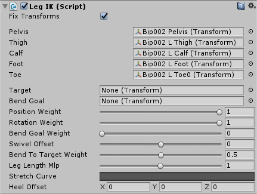

# Leg IK

LegIK is a wrapper component for VRIK's 4-joint biped leg solver.

## Component variables:

- LegIK.fixTransforms - if true, will fix all the Transforms used by the solver to their initial state in each Update. This prevents potential problems with unanimated bones and animator culling with a small cost of performance.

## Wrapper variables:

- LegIK.solver.pelvis - the pelvis bone.
- LegIK.solver.thigh - the upper leg bone.
- LegIK.solver.calf - the lower leg bone.
- LegIK.solver.foot - the foot bone
- LegIK.solver.toe - the toe bone.
- LegIK.solver.IKPositionWeight - positional weight of the toe/foot target. Note that if you have nulled the target, the foot will still be pulled to the last position of the target until you set this value to 0.
- LegIK.solver.IKRotationWeight - rotational weight of the toe/foot target. Note that if you have nulled the target, the foot will still be rotated to the last rotation of the target until you set this value to 0.

## Solver variables:

- LegIK.solver.leg.target - the foot/toe target. This should not be the foot tracker itself, but a child GameObject parented to it so you could adjust it's position/rotation to match the orientation of the foot/toe bone. If a toe bone is assigned in the References, the solver will match the toe bone to this target. If no toe bone assigned, foot bone will be used instead.
- LegIK.solver.leg.bendGoal - the knee will be bent towards this Transform if 'Bend Goal Weight' > 0.
- LegIK.solver.leg.bendGoalWeight - if greater than 0, will bend the knee towards the 'Bend Goal' Transform.
- LegIK.solver.leg.swivelOffset - angular offset of knee bending direction.
- LegIK.solver.leg.bendToTargetWeight - if 0, the bend plane will be locked to the rotation of the pelvis and rotating the foot will have no effect on the knee direction. If 1, to the target rotation of the leg so that the knee will bend towards the forward axis of the foot. Values in between will be slerped between the two.
- LegIK.solver.leg.legLengthMlp - use this to make the leg shorter/longer. Works by displacement of foot and calf localPosition.
- LegIK.solver.leg.stretchCurve - evaluates stretching of the leg by target distance relative to leg length. Value at time 1 represents stretching amount at the point where distance to the target is equal to leg length. Value at time 1 represents stretching amount at the point where distance to the target is double the leg length. Value represents the amount of stretching. Linear stretching would be achieved with a linear curve going up by 45 degrees. Increase the range of stretching by moving the last key up and right at the same amount. Smoothing in the curve can help reduce knee snapping (start stretching the arm slightly before target distance reaches leg length). To get a good optimal value for this curve, please go to the 'VRIK (Basic)' demo scene and copy the stretch curve over from the Pilot character.

