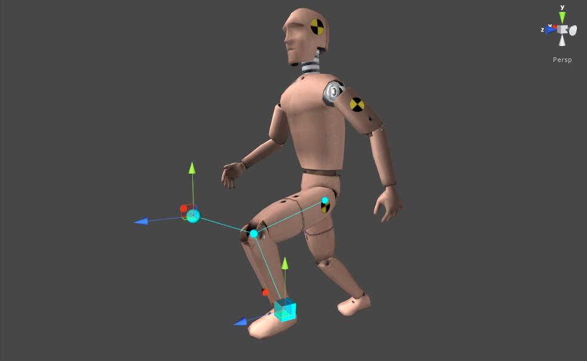
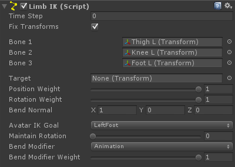

# Limb IK

LimbIK 扩展 TrigonometricIK，特定于 3-segmented hand 和 leg 角色的 limb 类型。

LimbIK 带有多个 Bend Modifiers：

- Animation：尝试当它动画过程中维持 bend 方向
- Target：使用 target IKRotation 旋转 bend 方向
- Parent：沿着 parent Transform（骨盆 pelvis 或锁骨 clavicle）旋转 bend 方向
- Arm：保持 arm 以生物学自然和放松的方式弯曲（相比于上面的 modifiers 最消耗资源）
- Goal：向着 Bend Goal Transform 弯曲 arm

Modifiers 就是在 TrigonometricIK 基础上进行修改的方法。

注意：Bend Modifiers 只在 Bend Modifiers Weight 大于 0 时才应用。

IKSolverLimb.maintainRotationWeight 属性允许维持最后一个 bone 的世界空间的 rotation 固定就好像它是 solving limb 之前的那样。

这在我们需要 reposition foot 时尤其有用，在它被 animated 时维持它的 rotation 以确保正确的对齐到地面。

## Getting started:

- 添加 LimbIK 组件到角色的 root（角色应该面向它的 forward 方向）
- 为 LimbIK 组件的 bone1，bone2，bone3 进行赋值（bones 可以被跳过，这意味着你还可以在一个 4-segment limb 上使用 LimbIK，应该是其中两个 bones 被固定，相对之间没有旋转，就好像是一个 bone 一样）
- 点击 Play

## Getting started with scripting:

```C#
public LimbIK limbIK;
void LateUpdate () {
    // Changing the target position, rotation and weights
    limbIK.solver.IKPosition = something;
    limbIK.solver.IKRotation = something;
    limbIK.solver.IKPositionWeight = something;
    limbIK.solver.IKRotationWeight = something;
    // Changing the automatic bend modifier
    limbIK.solver.bendModifier = IKSolverLimb.BendModifier.Animation; // Will maintain the bending direction as it is animated.
    limbIK.solver.bendModifier = IKSolverLimb.BendModifier.Target; // Will bend the limb with the target rotation
    limbIK.solver.bendModifier = IKSolverLimb.BendModifier.Parent; // Will bend the limb with the parent bone (pelvis or shoulder)
    // Will try to maintain the bend direction in the most biometrically relaxed way for the arms. 
    // Will not work for the legs.
    limbIK.solver.bendModifier = IKSolverLimb.BendModifier.Arm; 
}
```

Adding LimbIK in runtime:

- 通过脚本添加 LimbIK 组件
- 调用 LimbIK.solver.SetChain()



## Component variables:

- fixTransforms

## Solver variables:

- bone1
- bone2
- bone3
- target
- positionWeight
- rotationWeight
- bendNormal
- AvatarIKGoal：solver 的 AvatarIKGoal。这只被 Arm bend modifier 使用
- maintainRotationWeight：维持第三个 bone（末端）的 rotation 就像它在解析之前的状态的权重
- bendModifier：bend normal 的 automatic modifiers 的选择
- bendModifierWeight：bend modifier 的权重


