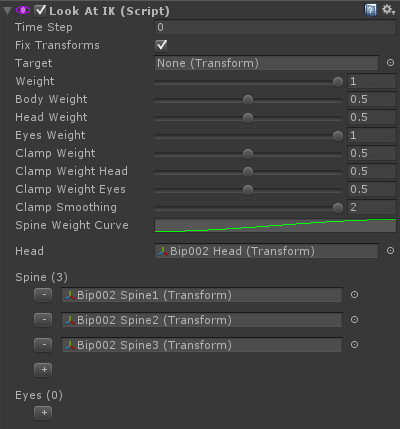

# Look At IK

LookAt IK 可以被用在任何 character 或其他 bones 的 hierarchy 来旋转一组 bones 来面向一个 target。

注意如果 LookAtIK 不满足你的需求，你还可以使用 AimIK，它们非常类似，但是提供一组不同的参数集合，来使 characters（尤其是 non-biped）look at targets。

## Getting started:

- 添加 LookAtIK 组件到 root GameObject。GameObject 的 forward axis 将会是 forward 方向
- Assing Spine，head，eye bones 到这个组件
- 点击 Play

## Getting started with scripting:

```C#
public LookAtIK lookAt;

void LateUpdate () {
    lookAt.solver.IKPositionWeight = 1f; // The master weight
    
    lookAt.solver.IKPosition = something; // Changing the look at target
    // Changing the weights of individual body parts
    lookAt.solver.bodyWeight = 1f;
    lookAt.solver.headWeight = 1f;
    lookAt.solver.eyesWeight = 1f;
    // Changing the clamp weight of individual body parts
    lookAt.solver.clampWeight = 1f;
    lookAt.solver.clampWeightHead = 1f;
    lookAt.solver.clampWeightEyes = 1f;
}
```

## Adding LookAtIK in runtime:

- 通过脚本添加 LookAtIK 组件
- 调用 LookAtIK.solver.SetChain()


## Component variables:

- fixTransforms

## Solver variables:

- target：target Transform。如果被赋值，solver IKPosition 将会被自动设置到 target 的 position
- weight：solver 的 master weight（被所有其他 weights 相乘）
- bodyWeight：旋转 spine bones 的权重
- headWeight：旋转 head bones 的权重
- eyesWeight：旋转 eye bones 的权重
- clampWeight：截取 clamping spine bones 的旋转。0 是自由 rotation，1 是完全 clamped 到 zero effect
- clampWeightHead：clamping head bone 的 rotation。
- clampWeightEyes
- clampSmoothing：应用到 clamping 的 sine 平滑迭代数量，以使它更平滑
- spineWeightCurve：spine bones 之间分配的 normalized weight。第一个 spine bone 是 time 0，最后一个 spine bone 在 time 1
- head：head bone
- spine：降序的 spine bones（parents first），bones 不可以被跳过
- eyes：eye bones


