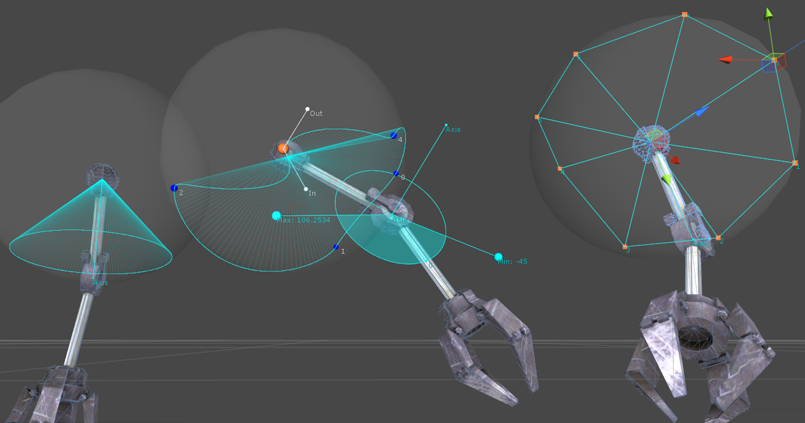
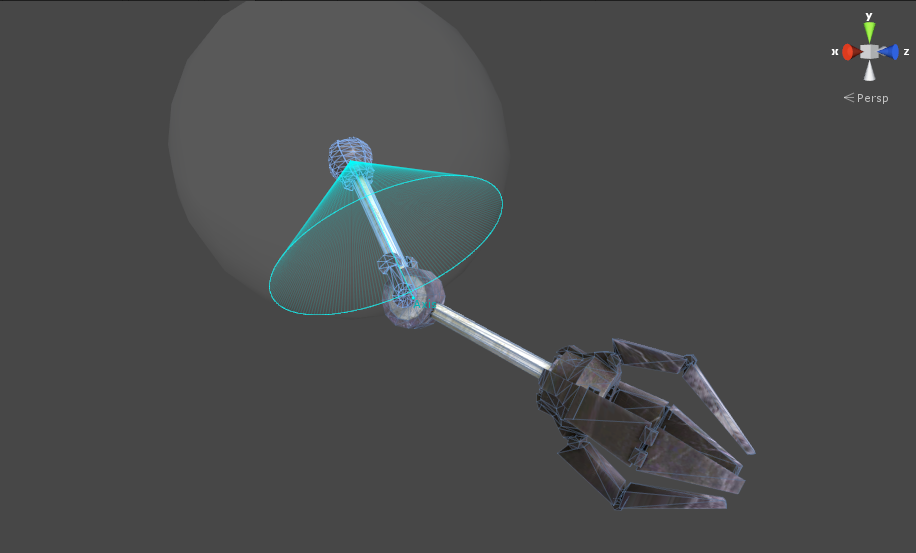
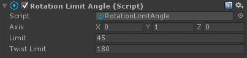
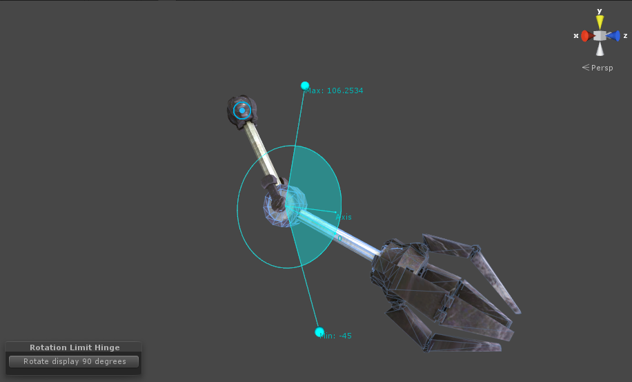
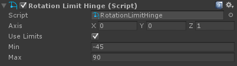
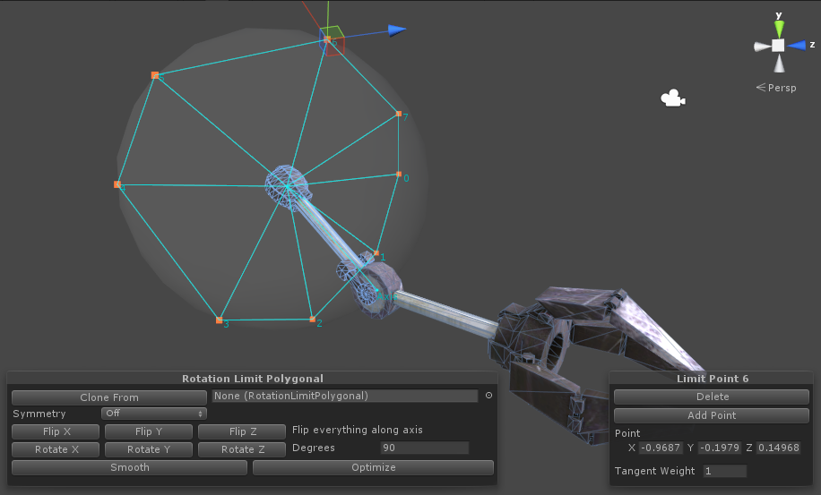
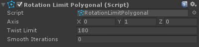
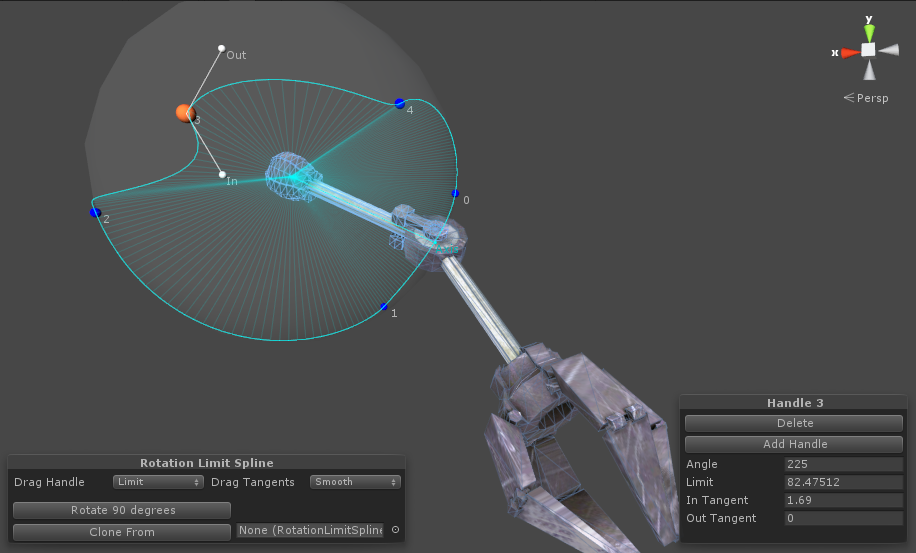
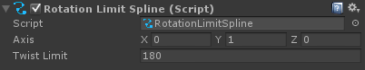

# Rotation Limits

所有 rotation limits 和其他 Final IK 组件都是基于 Quaternion 和 Axis-Angle 的，以确保一致性，连续性，和最小化奇异点问题。Final IK 不包含 Euler operation。

所有 rotation limits 都是基于 local rotations 并使用初始 local rotation 作为参考，就像 Physics joints 一样。这使它们是 axis 独立地，直观地设置。

所有 rotation limits 都有可撤销的 scene view editors。

所有 rotation limits 用于支持 rotation limits 的 IK solvers。

Rotation Limits

Simple angular swing and twist limit.

The anglular rotation limit

The RotationLimitAngle component

铰链 hinge rotation limit 限制 rotation 到一个围绕一个 axis 的 DOF（degree of freedom）。这个 rotation limit 是递增的 additive，意味着 hinge limits 可以超过 360 degree。

Adjusting hinge limits in the scene view

The RotationLimitHinge component

使用一个球面 polygon 在一个统一 universal 和 ball-and-socket joint 上限制 rotation 的 range。一个 reach cone（锥形体）被指定为一个 reach sphere 表面上的球面 polygon。

Twist limit 参数指定围绕 main axis 的最大 twist。

Polygonal rotation limit 被提供了方便的 scene view tools 用于快速编辑，复制，和修改 reach cone points。

Defining reach cone points on the polygonal rotation limit

RotationLimitPolygonal component

使用一个 spline（样条曲线）在 universal 和 ball-and-socket joint 上限制 rotation 的 range。

Reachable area 被定义为一个正交映射到一个 sphere 上的 AnimationCurve，其提供了一个非常平滑和快速的结果。

Twist limit 参数限制围绕 main axis 的最大 twist。

Spline rotation limit 被提供了非常方便的 scene view tools 用于快速 editing，cloning，modifying spline handles。

Adjusting spline handles on on the spline rotation limit

The RotationLimitSpline component
