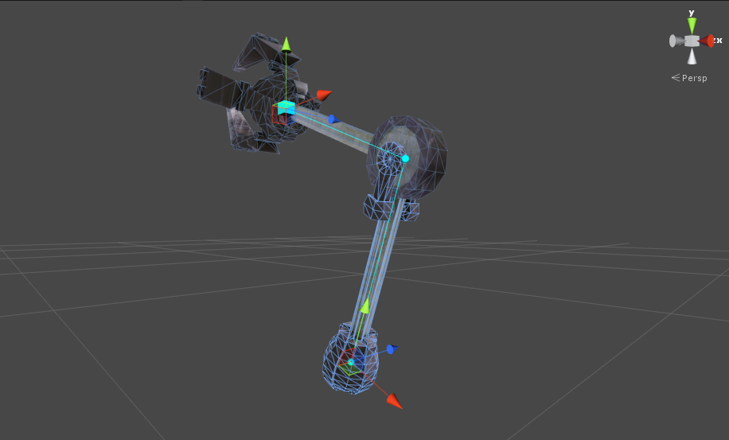
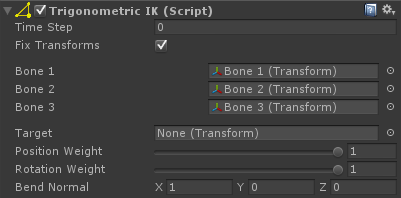

# Trigonometric IK

Trigonometric（三角函数）IK 是最简单的 IK solver，它基于余弦法则并解析一个 3-segmented bone hierarchy。IKSolverLimb 扩展 IKSolverTrigonometric，只添加了一组额外参数，例如 bend modifiers。

## Getting started:

- 添加 TrigonometricIK 组件到第一个骨骼
- 对 TrigonometricIK 组件中的 bone1，bone2，bone3 进行赋值
- 点击 Play

## Getting started with scripting:

```C#
public TrigonometricIK trig;
void LateUpdate () {
    // Changing the target position, rotation and weights
    trig.solver.IKPosition = something;
    trig.solver.IKRotation = something;
    trig.solver.IKPositionWeight = something;
    trig.solver.IKRotationWeight = something;
    trig.solver.SetBendGoalPosition(Vector goalPosition); // Sets the bend goal to a point in world space 
}
```

## Adding TrigonometricIK in runtime:

- 通过脚本添加 TrigonometricIK 组件
- 调用 TrigonometricIK.solver.SetChain()



图中有 3 个 bones（joints），末端 bone 没有进一步的 child

## Component variables:

- fixTransform：如果为 true，在每个 update 中，将 fix 被 solver 使用的所有 transforms 到它们的初始状态。这防止了 unanimated bones 和 animator culling 潜在可能出现的问题，但有一小部分性能代价

## Solver variables:

- bone1：第一个 bone（上臂或大腿）
- bone2：第二个骨骼 (前臂或小腿)
- bone3： 第三个骨骼 (手或足，FinalIK 中 bone chain 是按照递降顺序定义的)
- target：target transform。如果被赋值，solver IKPosition 和 IKRotation 将会被自动设置到 target 的 position 和 rotation
- positionWeight：解析到 target position 的权重（IKPosition）
- rotationWeight：解析到 target rotation 的权重（IKRotation）
- bendNormal：被 bones positions 定义的 plane 的 normal（3 个 bones 实际就是 3 个点 joint，它们定义了一个平面）。当 limb 完全时，第二个 bone 总是被放置在平面上的某个位置（pole）


